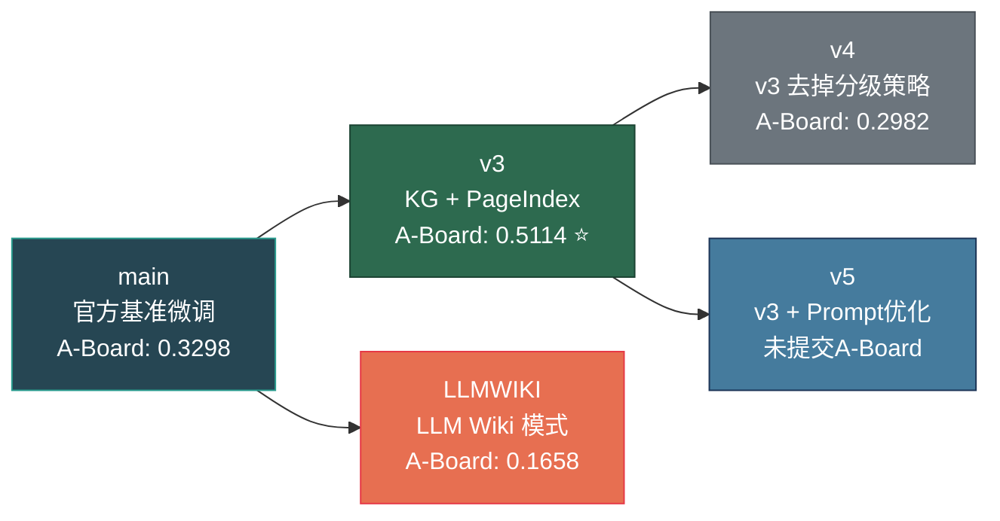

# KDD Cup 2026 Data Agents — Phase 1 完整报告

**队伍 ID**：team1121  
**报告日期**：2026-05-22  
**最终 A-Board 得分**：0.5114（v3）  
**B-Board 提交版本**：team1121:final（基于 v3 重新标记）

---

## 一、比赛概览

### 1.1 赛题简介

KDD Cup 2026 Data Agents 挑战赛要求参赛者构建一个全自动的数据分析 Agent，能够：
- 遍历 `/input` 下所有任务目录，读取 `task.json` 中的自然语言问题
- 自主探索 `context/` 下的多模态数据源（CSV、SQLite、JSON、Markdown 文档）
- 通过代码生成与执行（Python / SQL）完成数据分析
- 将最终结果写入 `/output/task_<id>/prediction.csv`

### 1.2 评测环境约束

| 约束项 | 规格 |
|:---|:---|
| 模型 | Qwen3.5-35B-A3B（统一部署，禁止自带 LLM） |
| CPU | 16 核 x86-64 |
| 内存 | 64 GB（超限 OOM Kill） |
| GPU | 无 |
| 网络 | 完全断网，仅可访问内部模型服务 |
| A-Board 时限 | 2 小时 / ~60 tasks |
| B-Board 时限 | 12 小时 / ~320 tasks |

### 1.3 评分机制

```
Score = Recall - λ · (Extra Columns / Predicted Columns)

Recall = Matched Columns / Gold Columns
λ = 0.5（官方默认）
```

- 基于**列级内容一致性匹配**，忽略列名和行顺序
- 数值归一化至 2 位小数，字符串大小写敏感
- 总分 = 所有任务得分的平均值

---

## 二、技术方案演进

### 2.1 架构总览

所有方案均基于 **ReAct（Reasoning + Acting）** 框架，核心循环为：

```
Thought → Action → Observation → ... → Answer
```

Agent 在每一步输出一个 JSON 对象，包含 `thought`（推理）、`action`（工具调用）、`action_input`（参数），系统执行工具后返回 `Observation`，循环直至调用 `answer` 工具提交结果。

### 2.2 分支策略

采用 **Git 分支隔离** 的控制变量实验法，每个分支代表一种独立的技术方案或优化策略：



---

## 三、各版本详细对比

### 3.1 成绩总览

| 版本 | 分支 | 公开测试集得分 | A-Board 得分 | 核心技术 | 提交状态 |
|:---|:---|:---|:---|:---|:---|
| **v3** | `v3` | 64.00% | **0.5114** ⭐ | Schema KG + PageIndex + Answer Interceptor | ✅ 已提交，最高分 |
| **v1** | `main` | 72.38% | **0.3298** | 官方 Starter Kit 微调 | ✅ 已提交 |
| **v5** | `v5` | 64.00% | **0.3184** | v3 + Prompt 边界检查 + 并发优化 | ✅ 已提交 |
| **v4** | `v4` | — | **0.2982** | v3 去掉分级策略 (即对所有难度任务采用统一的完整 Schema KG + PageIndex 架构，无 Easy 简化) | ✅ 已提交 |
| **v6** | `LLMWIKI` | **最高** | **0.1658** | LLM Wiki（Karpathy 模式）| ✅ 已提交 |
| exp/* | 实验分支 | 较低 | — | 向量检索 / GraphRAG / Embedding | ❌ 未提交 |

### 3.2 关键发现

> [!IMPORTANT]
> **公开测试集得分与 A-Board 隐藏集得分严重不相关。**
> 
> - v6（LLMWIKI）在公开测试集上得分最高，但 A-Board 仅 0.1658，排名最低
> - v3 在公开测试集上仅 64%，但 A-Board 高达 0.5114
> - main（v1）公开集 72.38%，A-Board 0.3298
> 
> 这表明公开测试集存在过拟合风险，隐藏集的任务分布和难度与公开集差异显著。

### 3.3 各版本技术方案详解

#### v1 / main — 官方基准微调（A-Board: 0.3298）

**核心思路**：在官方 Starter Kit 基础上进行轻量级微调。

- **数据导航**：简单的文件列表扫描，无 Schema 分析
- **工具集**：基础工具（`read_csv`、`execute_python`、`execute_context_sql`）
- **Prompt**：基础 ReAct 指令 + 简单输出格式约束
- **优势**：代码简洁，运行稳定，无额外依赖
- **劣势**：缺乏跨表关联感知，Agent 对数据结构理解有限

**System Prompt 原文（main 分支）**：

```text
You are a ReAct-style data agent.
You are solving a task from a public dataset. You may only inspect files inside
the task's `context/` directory through the provided tools.

Rules:
1. Use tools to inspect the available context before answering.
2. Base your answer only on information you can observe through the provided tools.
3. The task is complete only when you call the `answer` tool.
4. The `answer` tool must receive a table with `columns` and `rows`.
5. Always return exactly one JSON object with keys `thought`, `action`, `action_input`.
6. Always wrap that JSON object in exactly one fenced code block (```json ... ```).
7. Do not output any text before or after the fenced JSON block.
8. Strictly match tools with file types. Only use SQL tools for .db files.
9. If you encounter "no such table" error, stop using SQL and use execute_python.
10. When using execute_python, action_input must be a JSON object with key "code".
11. Never pass raw string directly to execute_python action_input.
12. WARNING: read_csv/read_json/read_doc ONLY return truncated previews (max 20 rows).
13. IMPORTANT: To process full datasets, you MUST use execute_python.
Keep reasoning concise and grounded in the observed data.
```

**关键代码：`react.py` 的 JSON 解析（main 分支）**

main 分支的解析函数只有基础的 strip + json.loads，没有任何容错处理：

```python
def _strip_markdown_code_blocks(text: str) -> str:
    text = text.strip()
    if text.startswith("```"):
        lines = text.splitlines()
        if len(lines) > 2 and lines[0].startswith("```") and lines[-1].startswith("```"):
            return "\n".join(lines[1:-1])
    return text

def parse_model_step(raw_response: str) -> dict[str, Any]:
    cleaned_text = _strip_markdown_code_blocks(raw_response)
    try:
        return json.loads(cleaned_text)
    except json.JSONDecodeError as e:
        raise ValueError(f"Failed to parse model response as JSON: {cleaned_text}") from e
```

一旦 Qwen 输出含有字面换行符（`\n` 未转义）或 JSON 被截断，整步直接报错，连续失败后触发熔断。

**main 分支无 Data Roadmap**：Agent 只看到任务问题，没有预先给定任何数据 Schema 信息，完全靠自身先用工具探索再推理。

#### v3 — Schema KG + PageIndex（A-Board: 0.5114 ⭐ 最高分）

**核心思路**：通过预计算的 Schema 知识图谱和文档索引树，让 Agent 在推理前就掌握数据全貌。

**关键技术栈**：

1. **Schema Knowledge Graph（db_navigator.py）**
   - 自动扫描所有 DB/CSV/JSON 数据源，提取完整的表结构、列名、外键
   - 跨文件同名字段关联（Shared Fields / JOIN Hints）：自动发现 `raceId` 同时出现在 `races.csv` 和 `results.db` 中
   - 注入 `row_count` 让 Agent 感知数据规模
   - 主动扫描并优先列出 `knowledge.md` / `doc/` 目录

2. **PageIndex 文档索引（pageindex_lite.py）**
   - 对 `doc/` 目录下的 Markdown 文档生成带行号的树状结构索引
   - Agent 可通过 `read_doc_lines` 精准读取特定行范围，避免全量加载
   - 适配 `hard` / `extreme` 难度的超长文档场景

3. **Answer Interceptor（answer 工具拦截器）**
   - Agent 首次调用 `answer` 时被拦截，返回 Final Review Checklist
   - 强制二次核查：格式、聚合逻辑、时间参考、知识规则
   - 通过后再次调用 `answer` 才真正提交

4. **历史压缩（History Compression）**
   - 连续失败的历史步骤被折叠，仅保留最后一条
   - 节省 Context Window，避免 Token 溢出

5. **JSON 鲁棒性**
   - Greedy Brace Fix：从截断的 JSON 响应中自动恢复
   - 字面换行符转义：处理 Qwen 输出中的非标准格式

**System Prompt 完整原文（v3 分支）**：

```text
You are an elite Data Agent. Your goal is to solve data extraction tasks with 100% precision.

### CORE OPERATING PRINCIPLES
1. Logic Audit (Mandatory): Before executing any code, you MUST state your formula in `thought`.
   - Example: "Logic: Unit_Price = Price / Amount. Target: Unit_Price > 29."
2. Exhaustive Search: Unless asked for "the only one", always assume multiple matches exist.
   Return ALL relevant rows.
3. Type-Safe Alignment: Always use `.astype(str)` when joining or filtering columns.
4. Knowledge Primacy: Always check `knowledge.md` for business definitions.
5. Large File Strategy: For files >1MB, use read_csv/read_doc only for schema sampling.
   To process full data, you MUST use execute_python.
6. No Laziness: Do not assume data based on previews. Always verify from full dataset.

### TOOL RULES
- SQL: Use ONLY for .db files.
- Python: Use execute_python with code_lines. Always print results clearly.
- answer: ONLY include columns specifically asked for. Extra columns = 50% score deduction.

### OUTPUT SPECIFICATION
- Return exactly one JSON object inside a ```json block.
- Fields: thought, reflection, data_sufficient, action, action_input.
- No text outside the JSON block.

### DATA ROADMAP
Below is the schema and relationship map. Use it to identify join paths.
```

与 main 分支相比，v3 的 System Prompt 新增了：
- `reflection` 字段（让 Agent 在每步显式进行自我审视）
- `data_sufficient` 字段（让 Agent 明确标记是否已有足够数据）
- 明确强调 "Extra columns = 50% score deduction"
- 接尾的 `### DATA ROADMAP` 标记，引导后续动态数据地图的拼接

**db_navigator.py 核心代码**：

```python
def get_data_roadmap(context_dir: Path, model=None):
    dbs = _scan_databases(context_dir)   # 扫描 .db: 表名、列名、外键、row_count
    csvs, jsons = _get_csv_json_schemas(context_dir)

    # 主动优先列出 knowledge 文档
    knowledge_docs = [
        str(f.relative_to(context_dir).as_posix())
        for f in sorted(context_dir.rglob("*.md"))
        if "knowledge" in f.name.lower()
    ]

    # 跨文件同名字段统计（不过滤、不分类，全量列出）
    all_columns = defaultdict(set)
    for db in dbs:
        for t_meta in db["tables"].values():
            for col in t_meta["columns"]:
                all_columns[col.lower()].add(db["path"])
    for csv_f in csvs:
        for col in csv_f["columns"]:
            all_columns[col.lower()].add(csv_f["path"])

    shared_fields = {
        k: sorted(v)
        for k, v in sorted(all_columns.items(), key=lambda x: -len(x[1]))
        if len(v) > 1   # 出现在 2+ 个文件中的才列出
    }

    roadmap = {
        "IMPORTANT": "READ knowledge_docs FIRST before writing any query or code. ...",
        "data_assets": {
            "knowledge_docs": knowledge_docs,
            "databases": dbs,      # 含 row_count, columns, foreign_keys
            "csv_files": csvs,
            "json_files": jsons
        },
        "relationships": {
            "shared_fields": shared_fields,
            "note": "Fields appearing in 2+ files — use as JOIN hints..."
        }
    }
    return "=== DATA ROADMAP (SCHEMA & RELATIONS ONLY) ===\n" + json.dumps(roadmap, indent=2)
```

实际注入给 Agent 的 Data Roadmap 示例（赛车题目场景）：

```json
=== DATA ROADMAP (SCHEMA & RELATIONS ONLY) ===
{
  "IMPORTANT": "READ knowledge_docs FIRST...",
  "data_assets": {
    "knowledge_docs": ["context/knowledge.md"],
    "databases": [{
      "path": "db/data.db",
      "tables": {
        "results": {
          "columns": ["resultId","raceId","driverId","points","position"],
          "foreign_keys": [{"from":"raceId","to_table":"races","to_column":"raceId"}],
          "row_count": 25840
        }
      }
    }],
    "csv_files": [{"path":"csv/races.csv","columns":["raceId","year","name"]}]
  },
  "relationships": {
    "shared_fields": {
      "raceid": ["csv/races.csv","db/data.db"],
      "driverid": ["db/data.db"]
    }
  }
}
```

**PageIndex 工作原理（pageindex_lite.py）**：

对 Markdown 文档按标题层级提取节点（逐行扫描，检测 `# ##` 等）并构建树，每个节点记录 `line_num`、`end_line`、`title`。超长节点（>300行）被自动拆分为 150 行的子 chunk，并在段落边界处断开。

最终注入给 Agent 的文档树形式：

```text
=== PAGEINDEX TREE STRUCTURES ===
Document: doc/knowledge.md
[0001] Business Definitions (lines 1-80)
  [0002] Scoring Rules (lines 10-40) - Describes how points are allocated per race position
  [0003] DNF Definition (lines 41-55) - DNF means Did Not Finish; counts as 0 points
[0004] Race Calendar (lines 81-200)
  ...
```

Agent 可精准调用 `read_doc_lines(file="doc/knowledge.md", start=41, end=55)` 直接取目标段落，无需读全文。

**Answer Interceptor 完整原文**：

```text
[SYSTEM INTERCEPT] FINAL VERIFICATION REQUIRED

You have called the `answer` tool. Before your answer is permanently submitted,
you MUST perform a final verification.

Please review your proposed answer against the following checklist:
1. Formatting: Does your final output exactly match the requested columns and rows?
   Do NOT include extra explanatory columns.
2. Aggregation: Did the question ask for SUM, AVG, or Percentage? Ensure math
   strictly follows business logic (percentages need to be multiplied by 100).
3. Time Reference: If calculating age or duration, use the current year 2026
   unless explicitly stated otherwise in the document.
4. Knowledge Rules: Did you consult knowledge.md to confirm exact thresholds
   (e.g., 'abnormal') before filtering the data?

If you find ANY errors, DO NOT call answer yet. Use Python to fix your data.
If you are 100% confident, call the answer tool AGAIN with the EXACT SAME data.
The system will accept it on the second attempt.
```

**JSON 鲁棒解析（v3 react.py，对比 main 的一行 json.loads）**：

```python
def _strip_json_fence(raw_response: str) -> str:
    text = raw_response.strip()
    # 优先匹配 ```json ... ```
    fence_match = re.search(r"```json\s*(.*?)\s*```", text, flags=re.IGNORECASE | re.DOTALL)
    if fence_match: return fence_match.group(1).strip()
    # 降级：匹配任意 ``` ... ```
    generic = re.search(r"```\s*(.*?)\s*```", text, flags=re.DOTALL)
    if generic: return generic.group(1).strip()
    # 最后兜底：从文本中提取最外层 { ... }
    brace = re.search(r"(\{.*\})", text, flags=re.DOTALL)
    if brace: return brace.group(1).strip()
    return text

def _escape_literal_newlines_in_strings(text: str) -> str:
    """逐字符扫描，将 JSON 字符串内的裸换行符转义为 \\n"""
    repaired: list[str] = []
    in_string = False
    escape = False
    for char in text:
        if in_string:
            if escape: repaired.append(char); escape = False; continue
            if char == "\\": repaired.append(char); escape = True; continue
            if char == '"': repaired.append(char); in_string = False; continue
            if char == "\n": repaired.append("\\n"); continue
            if char == "\r": repaired.append("\\r"); continue
        else:
            if char == '"': in_string = True
        repaired.append(char)
    return "".join(repaired)

def _load_json_object(text: str) -> dict:
    try:
        return json.loads(text)
    except json.JSONDecodeError:
        repaired = _escape_literal_newlines_in_strings(text)
        return json.loads(repaired)  # 二次尝试
```

**react.py 的难度分流策略（v3 独有）**：

```python
def run(self, task: PublicTask, task_output_dir=None) -> AgentRunResult:
    if task.difficulty == "easy":
        # easy 任务只给文件列表，避免 Token 过载
        context_tree = list_context_tree(task, max_depth=2)
        data_roadmap = "=== DATA ROADMAP (SIMPLIFIED) ===\n" + json.dumps(context_tree)
    elif task.difficulty in ("medium", "hard", "extreme"):
        # 中高难度：Schema KG + PageIndex 双层信息
        base_roadmap = get_data_roadmap(task.context_dir, model=self.model)
        pageindex_roadmap = get_pageindex_roadmap(task.context_dir, model_adapter=self.model)
        data_roadmap = f"{base_roadmap}\n\n{pageindex_roadmap}"
    # ... ReAct 主循环
```

**历史压缩代码（v3 独有，main 无此逻辑）**：

```python
# 只有当失败序列"尘埃落定"（即后面出现了成功步骤）时，才折叠
if j > i + 1 and j < len(state.steps):
    failure_count = j - i
    last_failure = state.steps[j-1]
    payload = json.loads(_strip_json_fence(last_failure.raw_response))
    payload["thought"] = f"[System: {failure_count-1} previous failed attempts omitted] " \
                         + payload.get("thought", "")
    new_raw = f"```json\n{json.dumps(payload, ensure_ascii=False, indent=2)}\n```"
    # 用修改后的最后一条替换整个失败序列
    compact_steps.append(StepRecord(..., raw_response=new_raw, ...))
    i = j  # 跳过整个失败段
```

**为什么 v3 得分最高**：
- Schema KG 让 Agent 从第一步就知道"数据在哪、怎么关联"，大幅减少盲目探索
- PageIndex 精准定位文档内容，避免大文件全量读取导致的 Token 浪费和超时
- Answer Interceptor 强制二次审核，减少粗心错误
- 整体方案**增强信息而不增加复杂度**，不引入额外的推理链路

#### v4 — v3 去掉分级策略（A-Board: 0.2982）

**核心思路**：v4 是从 v3 演化而来，核心差异在于**去掉了针对任务难度的分级策略（Difficulty Routing Strategy）**。在 v4 中，不论任务属于 `easy` 还是 `medium/hard/extreme`，均统一生成并注入完整的 Schema KG 和 PageIndex 树状文档索引，不进行任何分流简化。

**技术对比**：
- **v3 分流架构**：为了防范 Token 冗余及模型幻觉，v3 引入了难度分流。针对 `easy` 任务只提取最精简的文件结构，仅在遇到 `medium/hard/extreme` 等高难度任务时才启动高成本的 Schema KG + PageIndex 机制。
- **v4 统一架构**：去掉了分流逻辑，对全部任务一刀切地注入了高阶数据图谱和文档导航索引。

**得分差异原因分析**：
- v4 在 A-Board 上的得分（0.2982）相比 v3（0.5114）出现大幅滑坡，核心原因在于：
  1. **低难度任务受到信息噪音干扰**：Easy 任务（如简单查询）本可通过基础的文件名识别和简单的 SQL/Python 完成，而在 v4 下被强制注入了极长的 Schema KG 表关联和 PageIndex 树，导致 Prompt 中的噪音数据急剧增加，Qwen3.5-35B-A3B 在多余信息的干扰下产生了幻觉或误判，调用了不必要的复杂工具。
  2. **Token 超限与延迟增加**：冗余的 Schema 结构增大了 Context Window 负担，增加了单步推理的开销，进而增加了超时的概率。
  
> [!WARNING]
> v4 的实验结果有力地论证了**“难度分级策略 (Difficulty Routing)”的工程必要性**。数据智能体并非上下文注入越全越好，而是需要根据任务的物理复杂度进行动态剪裁与路由。量体裁衣才能达到最高的推理准确率与稳定性。

#### v5 — v3 + Prompt 优化（A-Board: 0.3184）

**核心思路**：在 v3 基础上，根据失败任务分析进一步优化 Prompt。

**新增改进**（相比 v3）：
1. **Boundary Inequality Checking**：在系统提示词中新增严格的"临界边界与不等式检查"规则
   - 例：遇到"less than 70"必须用 `< 70`，禁止用 `<= 70`
2. **环境自动检测**：`main.py` 自动区分官方评测环境和私有服务器测试
3. **PageIndex 并发控制**：添加 `asyncio.Semaphore` 限制摘要并发数（后因不稳定被 revert）

**得分反而下降的原因**：
- Prompt 变更虽然修复了部分边界案例，但可能**过度约束**了 Agent 的灵活性
- "改进后得分反降"现象在 LLM Agent 中常见：**局部优化可能破坏全局平衡**
- 公开测试集上 v5 和 v3 得分相同（64%），说明改进主要影响边缘案例

**v5 vs v3：System Prompt 精确差异（git diff）**

v5 在 v3 的 6 条原则基础上新增了 6 条（规则 7-12），以下为精确 diff：

```diff
 6. **No Laziness**: Do not assume data based on previews. Always verify counts and values from the full dataset via code.
+7. **No Truncation**: NEVER truncate or slice variables (e.g. `text[:100]`) in your Python
+   code if you intend to copy-paste or submit them in the final `answer` tool call.
+8. **SQL Flat-Join Semantics**: When a question asks for aggregates on "entity A in
+   molecules/groups containing B", this always maps to simple flat SQL filters where
+   filters are applied to rows before counting (e.g., WHERE bond_type = '#' AND element = 'p').
+9. **Bidirectional Deduplication**: Always check if relationship tables (e.g., connected.csv)
+   are bidirectional (A->B and B->A). Deduplicate them (e.g., atom_id < atom_id2).
+10. **NO MANUAL HARDCODING**: When extracting data from unstructured documents, do not
+    visually read and hardcode the data. Write regex or pandas scripts to parse programmatically.
+11. **Time/Numeric Sorting Safety**: Sorting string representations of times (e.g., '1:12.345')
+    alphabetically is forbidden. Parse them to float seconds before sorting.
+12. **Boundary Inequality Checking**: For "less than 70", use `< 70`, NEVER `<= 70`
+    unless explicitly authorized by knowledge.md.
```

这 6 条规则每条都来自具体的失败案例（见 `failed_tasks_analysis.md`）：
- 规则 7 → task_180（只提交了前 20 行）
- 规则 8 → task_86（选了错误的表）
- 规则 9 → task_200（未去重对称键）
- 规则 10 → task_396（正则地狱死循环）
- 规则 11 → task_89（时间字符串排序错）
- 规则 12 → task_344（用了医学常识范围而不是 knowledge.md）

**为何 v5 比 v3 得分低**：这 6 条规则过于针对特定数据集，使得 Prompt 总 Token 数增加约 15%（从约 2KB 增至约 2.3KB），且对 Qwen 产生了更严格的约束，可能限制了其在其他任务上的灵活推理。

#### v6 / LLMWIKI — LLM Wiki 模式（A-Board: 0.1658）

**核心思路**：受 Andrej Karpathy 的 LLM Wiki 思想启发，让 Agent 在执行前先通过 LLM 生成数据的 Wiki 式描述。

**关键技术**：
- **LLM Wiki 预处理**：在任务开始前，调用 LLM 对每个数据源生成结构化的 Wiki 描述
- 基于 `main` 分支构建，补充了 `use_flat_output` 和 `DualLogger` 合规性补丁

**LLM Wiki 架构详解**：

整个 LLMWIKI 方案分为三层：

```
任务启动
  │
  ▼
WikiIngestor.ingest_task(task)      ← 预处理阶段（最致命的时间消耗）
  │  - 扫描 context/ 下所有文件
  │  - 对每个 DB 表/CSV 调用 LLM 生成 Schema 摘要
  │  - 对每个 .md 文件调用 LLM 生成内容摘要
  │  - 写入 wiki/ 目录的 Markdown 文件（YAML frontmatter）
  │
  ▼
ReAct Agent 开始推理
  │  - 系统提示词额外注入 wiki 工具描述
  │  - Agent 可调用 wiki_search / wiki_get_page / wiki_list_index
  │
  ▼
提交答案
```

**Wiki Page 数据结构（engine.py）**：

```python
@dataclass
class WikiPage:
    title: str
    page_type: str  # entity, concept, source, synthesis, overview
    tags: list[str]
    sources: list[str]
    confidence: str = "EXTRACTED"  # EXTRACTED, INFERRED, AMBIGUOUS, UNVERIFIED
    content: str = ""
```

Wiki 页面以 YAML frontmatter + Markdown 正文格式存储，例如：

```markdown
---
title: results table
type: entity
tags:
  - database
  - structured
sources:
  - db/data.db
confidence: EXTRACTED
---

## Schema
| Column | Type | Notes |
|--------|------|-------|
| resultId | INTEGER | Primary key |
| raceId | INTEGER | FK -> races.raceId |
| points | REAL | Points scored |

## Sample Values
position: 1, 2, 3, DNF
```

**WikiIngestor 的两阶段知识提取（ingest.py）**：

```python
def ingest_task(self, task, run_result=None):
    knowledge = self._extract_knowledge(task, run_result)  # 阶段1: 提取
    # 阶段2: 写入 wiki 页面
    source_page = self._create_source_page(knowledge)
    for entity in knowledge.data_sources:
        # 每个数据表创建一个 entity 页面（upsert：已存在则合并）
        self.engine.upsert_page(entity_page)
    self.engine.rebuild_index()  # 重建全局索引
```

每次 `ingest_task` 会对 context/ 目录下的所有数据源调用 LLM 生成摘要，实测单任务耗时约 30-90 秒（取决于数据文件数量），导致 2 小时 / 60 任务的 A-Board 严重超时。

**在公开测试集上得分最高的原因**：
- Wiki 描述为 Agent 提供了丰富的语义上下文
- 公开测试集任务相对简单，额外的上下文信息正好帮助 Agent 理解数据

**在 A-Board 上得分最低的原因**：
- LLM Wiki 预处理**消耗大量 Token 和时间**
- A-Board 仅 2 小时时限 + ~60 任务，Wiki 生成的时间开销导致大量任务超时
- Wiki 描述引入了 LLM 的幻觉风险，在复杂任务中可能误导 Agent
- 整体架构复杂度增加，**收益不抵开销**

#### 实验分支（exp/*）— 未提交

| 分支 | 技术 | 未提交原因 |
|:---|:---|:---|
| `exp/pagerag` | 基础 PageRAG（RRF + BM25） | 效果不稳定，精度不如纯 KG |
| `exp/kg+pagerag` | KG + PageRAG v2.2 | 引入 Embedding 后镜像体积暴增，且精度未提升 |
| `exp/graphrag` | LLM 驱动的三元组抽取 | 预处理耗时过长，三元组质量不稳定 |
| `exp/kg+graphrag` | KG + GraphRAG | 融合后复杂度过高，得分反降 |
| `exp/schema-std` | Schema 预处理标准化 | 改进幅度有限，独立贡献不显著 |
| `feat/db-schema-only` | 纯 Schema KG | 已被 v3 完整吸收 |

> [!NOTE]
> **向量检索类方案（PageRAG、GraphRAG）在本赛题中效果均不理想。**
> 
> 核心原因：
> 1. 赛题的数据源以结构化数据（CSV/DB）为主，非结构化文档（doc/）占比较小
> 2. Embedding 模型需要 `sentence-transformers`，引入 PyTorch 和 CUDA 依赖，镜像体积从 ~260MB 暴增到 ~3GB
> 3. 向量检索的精度在小规模文档上不如基于行号的精准定位（PageIndex）
> 4. 额外的检索链路增加了系统复杂度和延迟，在严格时限下弊大于利

---

## 四、核心架构详解（v3 最终方案）

### 4.1 系统 Prompt 结构

```
[A] react_system_prompt.txt      ← 核心行为准则（6 条操作原则 + 工具规则 + 输出格式）
[B] Data Roadmap                 ← 动态数据地图（Schema KG + PageIndex，按难度生成）
[C] Tool Descriptions            ← 工具说明（registry.py 自动生成）
[D] response_examples.txt        ← 3 个输出格式示例（SQL / Python / 提交）
[E] 输出格式强制声明              ← 硬编码在 build_system_prompt() 末尾
```

### 4.2 Data Roadmap 生成策略

| 难度 | 策略 | 内容 |
|:---|:---|:---|
| `easy` | 精简模式 | 仅文件列表（`list_context_tree` depth=2），避免 Token 过载 |
| `medium` / `hard` / `extreme` | 全量模式 | Schema KG + PageIndex 文档树 |

### 4.3 工具集

| 工具 | 用途 |
|:---|:---|
| `list_context` | 列出 context 目录结构 |
| `read_csv` | 读取 CSV 预览 |
| `read_json` | 读取 JSON 预览 |
| `read_doc` | 按页读取文本文档 |
| `read_doc_lines` | 精准行读取，配合 PageIndex 行号 |
| `get_doc_structure` | 获取 Markdown 文档的树状结构 |
| `inspect_sqlite_schema` | 查看 DB 文件表结构 |
| `execute_context_sql` | 对 DB 执行只读 SQL |
| `execute_python` | 执行 Python 代码（60s 超时） |
| `answer` | 提交最终答案（带拦截器二次审核） |

### 4.4 防护机制

| 机制 | 描述 |
|:---|:---|
| Answer Interceptor | 首次提交被拦截，强制二次审核 |
| 死循环检测 | 连续 3 次相同 Action 触发警告 |
| 熔断保护 | 连续 6 次错误终止任务 |
| 反思提醒 | 连续 3 次错误注入 `[SYSTEM WARNING]` |
| 历史压缩 | 折叠连续失败步骤，节省 Token |
| JSON 自动修复 | Greedy Brace Fix + 换行符转义 |
| Python 超时 | 单脚本 60 秒超时保护 |
| 任务超时 | 单任务 1200 秒（20 分钟）超时 |

---

## 五、关键教训与反思

### 5.1 ✅ 成功经验

1. **"信息前置"优于"按需检索"**
   - Schema KG 在推理前一次性提供数据全貌，比让 Agent 自行探索高效得多
   - PageIndex 的带行号树状结构比全量 Embedding 检索更精准、更轻量

2. **"简单稳定"优于"复杂精巧"**
   - v3（KG + PageIndex）代码简洁、运行稳定，远胜复杂的 RAG 方案
   - 向量检索、图知识抽取等复杂组件在本赛题中 ROI 为负

3. **Answer Interceptor 显著提升精度**
   - 强制二次审核有效减少了格式错误和粗心计算错误

4. **镜像体积控制**
   - 移除 `sentence-transformers` 后，镜像从 ~3GB 降至 ~260MB
   - 构建时间从 20 分钟降至 1 分钟

### 5.2 ❌ 失败教训

1. **不要过度依赖公开测试集**
   - 公开集与隐藏集的分布差异极大，v6 的"公开最高、A-Board 最低"是惨痛教训

2. **Prompt 优化有双刃剑效应**
   - v5 的 Prompt 改进在公开集不变但 A-Board 下降，说明过度约束反而限制 Agent 灵活性

3. **LLM 推理的非确定性不可忽视**
   - v3 和 v4 代码相同但得分差 0.2+，提醒我们 LLM-based 系统的方差很大

4. **向量检索在结构化数据场景效果有限**
   - 本赛题以 CSV/DB 为主，Embedding 检索的优势场景（大规模非结构化文档）出现频率低

### 5.3 🔮 如果重来会怎么做

1. **更早放弃向量检索方向**，集中精力优化 Schema KG 和工具链
2. **在 A-Board 上多次验证同一版本**，评估得分方差
3. **增加对 A-Board 时限的敏感性测试**（2 小时 / 60 tasks ≈ 2 分钟/任务）
4. **对 Prompt 变更做 A/B 测试**，而非仅依赖公开集验证

---

## 六、B-Board 提交

### 6.1 最终决策

基于 A-Board 得分对比，选择 **v3** 作为 B-Board 最终提交版本。

**操作流程**：
1. 从现有 `team1121_v3.tar.gz` 加载 Docker 镜像
2. `docker tag team1121:v3 team1121:final` 重新标记
3. `docker save` + `gzip` 导出为 `team1121_final.tar.gz`（267.51 MB）
4. 镜像 SHA256 验证：`team1121:final` 与 `team1121:v3` 完全一致

### 6.2 验证结果

| 检查项 | 状态 |
|:---|:---|
| 镜像 ID 一致性 | ✅ SHA256 完全相同 |
| 容器正常启动 | ✅ exit code = 0 |
| 单任务测试（task_25） | ✅ 1/1 succeeded |
| 输出格式 | ✅ `/output/task_25/prediction.csv` 标准 CSV |
| 日志写入 | ✅ `/logs/runtime.log` 正常 |
| 文件大小 | ✅ 267.51 MB < 10 GB |

### 6.3 提交信息

- **镜像名**：`team1121:final`
- **压缩包**：`team1121_final.tar.gz`
- **邮件主题**：`[KDDCup2026 Data Agents] B-board Final Submission - team1121`
- **截止时间**：2026-05-23 19:59 北京时间

---

## 七、提交历史

| 序号 | 版本 | 分支 | 提交时间 | A-Board 得分 | 备注 |
|:---|:---|:---|:---|:---|:---|
| 1 | v1 | main | Phase 1 早期 | 0.3298 | 官方基准微调 |
| 2 | v3 | v3 | Phase 1 中期 | **0.5114** | Schema KG + PageIndex |
| 3 | v4 | v4 | Phase 1 中期 | 0.2982 | v3 同源，得分波动 |
| 4 | v5 | v5 | Phase 1 后期 | 0.3184 | Prompt 优化 |
| 5 | v6 | LLMWIKI | Phase 1 后期 | 0.1658 | LLM Wiki 模式 |
| **Final** | **final** | **v3** | **2026-05-22** | — | **B-Board 提交** |

---

*KDD Cup 2026 Data Agents Challenge — Team 1121 Phase 1 Report*
