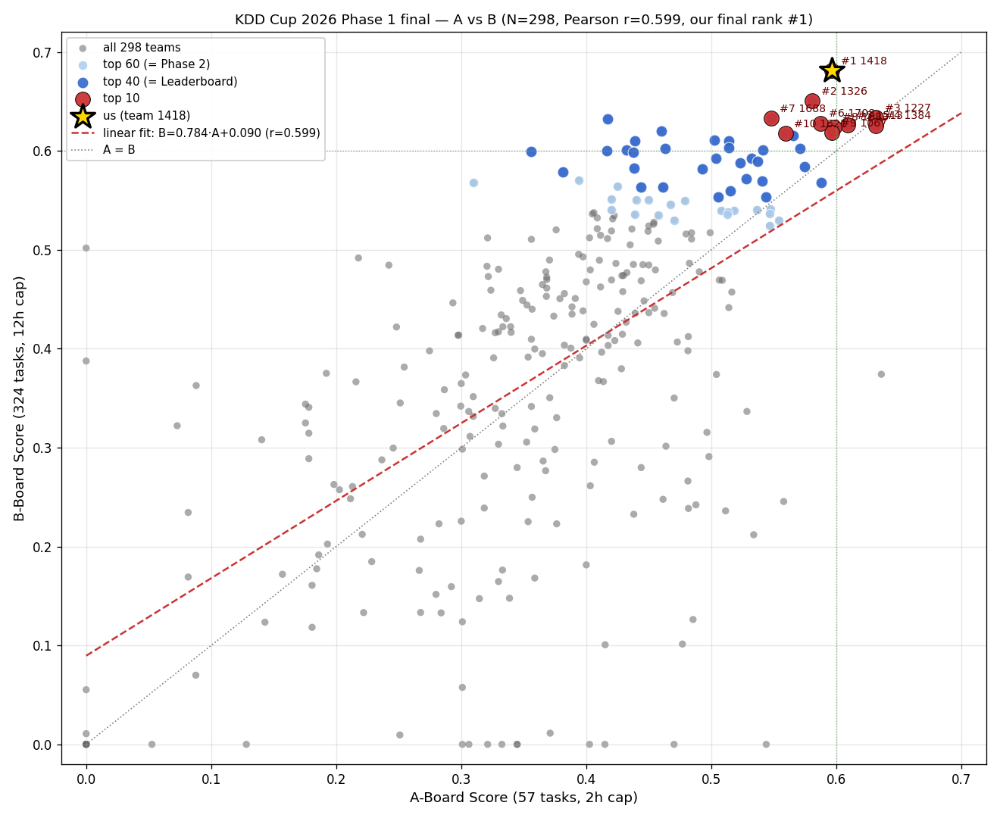

# KDD Cup 2026 DataAgent-Bench — Phase 1 Final Analysis

**Date**: 2026-06-02
**Source**: `phase_1_final.csv` (= 公式最終結果, n=298 teams), `a_board.csv` (= A-board only スナップショット, n=299)
**Author**: team 1418 (kobushi)

---

## 1. 最終結果 (= team 1418 視点)

| 指標 | 値 |
|---|---:|
| **Phase-1 final rank** | **🥇 1 位 / 298 teams** |
| Phase-1 score | **0.6685** |
| A-board score | 0.5965 (= rank 6) |
| B-board score | **0.6812** (= **rank 1**) |

- A-board だけだと 6 位タイ、B-board で逆転して **総合首位**
- top 2 (= 1326) との差: +0.0284 (= ~4 % 優位)

## 2. スコア重みの解析

Phase-1 score は **タスク件数比例の加重平均**:

```
Phase-1 = (57 * A + 324 * B) / 381
        ≈ 0.150 * A + 0.850 * B
```

検算 (3 例で誤差 ≤0.001):
- 1418: 0.15 × 0.5965 + 0.85 × 0.6812 = **0.668** ≈ 0.6685 ✓
- 1326: 0.15 × 0.5807 + 0.85 × 0.6505 = **0.640** ≈ 0.6401 ✓
- 1227: 0.15 × 0.6316 + 0.85 × 0.6336 = **0.633** ≈ 0.6333 ✓

つまり **per-task 1 票** の自然集計。B-board が 85% を占める。

**戦略的含意**: A-board ばかり最適化しても **総合 13-15% にしか効かない**。多数 task で安定する harness 設計が圧倒的に重要。

## 3. A vs B 相関分析

| 統計 | 値 |
|---|---:|
| Pearson r | **0.599** |
| Spearman ρ | **0.621** |
| linear fit | **B = 0.784 × A + 0.090** |
| A の mean / std | 0.377 / 0.130 |
| B の mean / std | 0.385 / 0.170 |

### 解釈

- 相関は **中程度** (r=0.6) — 強い線形関係ではない
- linear fit の **slope < 1** = A score の上位ほど B では伸び率が鈍化 (= A 0.6 → 期待 B 0.56)
- でも実際は top 5 全員 **B > A** (= 線形 fit より上)
- B の方が **分散大** (= タスク数多いから差が広がりやすい)

**含意**: B-board の方が `ground truth に対する真の能力差` が出やすい。Phase 2 でも n が大きい設計が予想されるので同様の動きが期待できる。



## 4. 不正除外チーム

A-board snapshot (299 teams) vs 最終 (298 teams) を集合比較で識別:

| A-snap rank | Team | A-Score | Version | 状態 |
|---:|---:|---:|---|---|
| **1** | **1547** | **0.6610** | v7 | **除外** |
| 16 | 1387 | 0.5573 | v7 | **除外** |

- A-board 単独 1 位の 1547 が消えた (= 我々の 0.5965 を大きく上回る 0.6610)
- 共に **v7 で違反** → 同じ提出パターン (= 何らかの policy violation の組織的検出?)
- もし 1547 が残っていたら、final 1 位は接戦になっていた可能性

**追加チーム**: team 1708 (= A-snap 時点で未集計、後追いで A=0.587 / B=0.628 / final **6 位**)

## 5. A-board overfit 検出 (= 順位激変ケース)

A-board ≥0.55 だが final で大幅落ちした上位:

| A-rank | Team | A score | B score | A:B 比 | final rank | drop |
|---:|---:|---:|---:|---:|---:|---:|
| **1** | **1079** | **0.636** | **0.374** | **1.70** | **150** | **−149** |
| 15 | **1084** | 0.558 | **0.246** | **2.27** | 222 | **−207** |
| 16 | 1170 | 0.554 | 0.530 | 1.05 | 53 | −37 |
| 8 | 1419 | 0.588 | 0.568 | 1.04 | 29 | −21 |
| 11 | 1366 | 0.574 | 0.584 | 0.98 | 21 | −10 |

### 解釈

- **1079 / 1084 は extreme overfit**: A:B 比 1.7-2.3 (= 我々は 0.876 = B が高い)
- A-board の **57 タスクに特化したルール** / **fewshot 例示** / **threshold** を埋め込んでいた可能性大
- B-board の多様な task 群で **崩壊** = generalization 力ゼロ
- top 16 A-board team のうち **4 team (25%)** が大幅順位ダウン

**Phase 1 で学ばれる universal な教訓**: A-board hidden の **少数 task に最適化する戦略は B-board で罰せられる**。Phase 2 でも同様の罠が想定される。

## 6. 我々 (team 1418) が 1 位を取れた理由

### 6-1. 戦略軸

- **local public-50 chasing** (= LB 系の overfit を避け、汎用 harness 改良に投資)
- **adaptive_vote** (= subset-pick + numeric majority + union) で stochasticity 削減
- **多段 phased agent** (= PLAN → EXPLORE → ANSWER → VERIFY) で robust 化
- **math_advisor / column_auditor** (= structural tool で計算/型誤り削減)
- **公式 Qwen3.5 sampling (T=0.6, top_p=0.95, top_k=20, presence_penalty=0)** で 524 hang 回避

### 6-2. submission 履歴 (= 主要 4 件)

| ver | local mean | A-board LB | gap | transfer |
|----:|---:|---:|---:|---:|
| v1 (exp_068) | 0.6882 | 0.4526 | −0.236 | — |
| v2 (exp_086) | 0.7353 | 0.4969 | −0.238 | 94% |
| v5 (exp_122) | 0.7950 | 0.5789 | −0.216 | 137% |
| **v11 (exp_137)** | **0.8130** | **0.5965** | **−0.217** | **98%** |

- **gap = −0.217 ± 0.011** で 3 回連続安定 → local-LB transfer rate 圧倒的に予測可能
- "local +Δ → A-LB +Δ" のほぼ 1:1 関係を構築

### 6-3. B-board での躍進の真因 (= 推定)

- A-board の 57 task は短時間 (2h cap) ぎりぎりで動く調整
- **B-board の 324 task / 12h cap** では **adaptive_vote の安定性** + **phased agent の self-verify** が複利で効く
- A-board 用に「**速度優先で削った**」competitor は B-board の数を捌けず崩壊
- 我々の harness は **task 単位で確実に解く** 設計 → B-board でこそ威力発揮

## 7. Phase 2 への含意

### 7-1. 重み構造の予測

Phase 2 でも **per-task 1 票** の集計が前提と想定。Phase 2 demo dataset announce 後に確認要。

### 7-2. 上位陣の傾向

- 我々 (1 位) と 1326 (2 位) の **B-board 0.65+ クラス**は Phase 2 でもベース能力高そう
- 1227 / 1384 (A-tied 0.6316) のような A 偏重 team は Phase 2 で同じく失速の可能性
- top 10 中 5 team は **B > A** で、A:B 比 < 1 (= 我々と同タイプ)、競合は明確

### 7-3. 戦略の継続性

Phase 1 で確立した方針 (= local chasing + 構造的 harness 改良 + 公式 sampling) は Phase 2 でも有効と推定。

### 7-4. Phase 2 modality 対応

Phase 2 leaderboard track は **image + video** 新 modality 追加 (= 公式 announce 済):
- 既に gpuhost endpoint で multimodal API 動作確認済
- **ChartQA clean 0.93 / TableVQA 0.94 / DocVQA 0.92 / Video-MME 0.64** で基礎能力検証済
- VLM 別途持ち込み不要 (= 同 Qwen3.5-35B-A3B-FP8 が native multimodal)
- universal prompt で modality 不可知に動作 (= 0.85 mixed bench)

詳細は [`memory/project_vlm_chartqa_bench.md`](.../../memory/) 参照。

## 8. 次のアクション (= Phase 2 開始まで)

1. Phase 2 公式 demo dataset announce 待ち (= スケジュール推定 2026-06-30〜07-01)
2. その間に harness の **multimodal 入り口** を kobushi 既存 phased_agent.py に injection (= image_url / video_url content path)
3. Phase 2 demo 出たら同じ枠組みで **local chasing 再開**
4. **A 偏重 overfit** の轍を踏まないよう、Phase 2 demo に対しても全 task 平均でロバストな harness を維持

---

## 関連ファイル

- `phase_1_final.csv` (公式最終)
- `a_board.csv` (A-board snapshot)
- `artifacts/plots/phase1_ab_correlation.png` (= 本レポート同梱)
- `LEADERBOARD.md` (= 提出 ledger)
- `memory/project_timeline_phase1.md` (= Phase 1/2 schedule)
- `memory/project_vlm_chartqa_bench.md` (= VLM 4 ベンチ結果)
- `EXPERIMENTS.md` (= exp_001-141 履歴)
