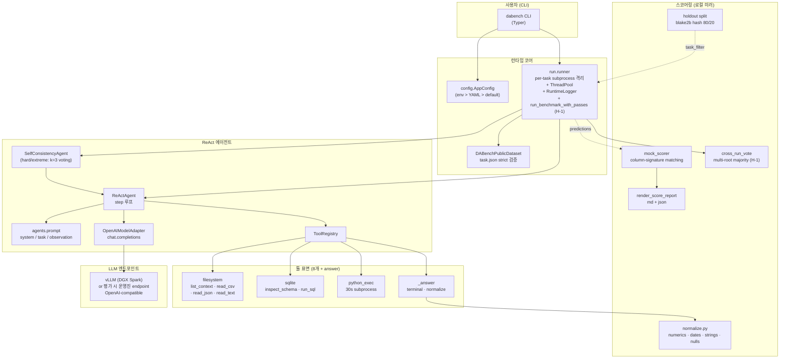
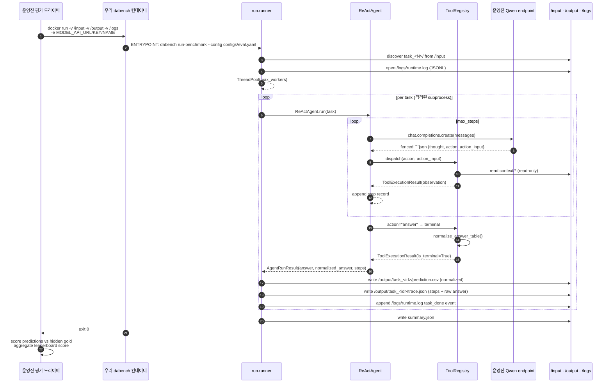

# DataAgent-Bench Baseline — 시스템 아키텍처 & 데이터 포맷

> 🌐 **Language**: [English](ARCHITECTURE.md) · **한국어** · [中文](ARCHITECTURE.zh.md)

> 마지막 갱신: 2026-05-11 (v3 라운드 — agent G/H/K/L + memory M + error N 패치 통합)

이 문서는 KDD Cup 2026 DataAgent-Bench 챌린지를 위한 ReAct 베이스라인의 전체 동작 방식을 한 번에 파악할 수 있도록 정리한 자료다. 처음 보는 팀원이 코드를 읽기 전에 이 문서를 먼저 읽으면 어디를 봐야 할지, 어떤 데이터를 다루는지, 운영진의 평가 환경에서 어떻게 동작하는지를 알 수 있다.

> CLAUDE.md는 AI 보조 도구용 운영 매뉴얼이고, 이 문서는 사람용 시스템 가이드다. 둘이 다루는 내용이 일부 겹치지만 시점과 깊이가 다르다. 한 장면 architecture는 [`SYSTEM_ARCHITECTURE.ko.md`](SYSTEM_ARCHITECTURE.ko.md), 라운드별 변경 이력 + 컴포넌트 graph는 [`HARNESS_STRUCTURE.ko.md`](HARNESS_STRUCTURE.ko.md).

---

## 1. 미션과 범위

**무엇을 만드는가.** 운영진이 비공개 hidden 태스크를 마운트한 Docker 컨테이너를 실행하면, 우리 컨테이너 안의 ReAct 에이전트가 각 태스크의 자연어 질문을 읽고 컨텍스트(CSV/SQLite/JSON/Markdown)를 분석해서 `prediction.csv`를 `/output/task_<id>/`에 떨어뜨린다.

**왜 ReAct인가.** 운영진이 **Qwen3.5-35B-A3B**를 강제하므로 모델은 우리가 못 바꾼다. 따라서 점수는 (a) 채점 함수와의 정합성 (b) 도구 사용 능력 (c) 12시간 컴퓨트 예산 분배에 의해 결정된다. 이 셋은 모두 ReAct 루프 위에서 풀 수 있는 문제다.

**범위.** Leaderboard 트랙만 노린다. Creative 트랙은 포기.

---

## 2. 시스템 구성도



---

## 3. 세 가지 실행 모드

같은 코드베이스가 세 가지 컨텍스트에서 돈다. 어느 모드에서 도는지에 따라 `config` 동작과 출력 경로가 달라진다.

| Mode | 트리거 | 출력 경로 | run_id wrapper | LLM endpoint |
|---|---|---|---|---|
| **로컬 개발** | `uv run dabench run-task ... --config configs/local.yaml` | `artifacts/runs/<run_id>/<task_id>/` | 있음 (`<run_id>/`) | DGX vLLM (LAN) |
| **로컬 Docker 스모크** | `bash scripts/local_eval.sh <ver> [task_set]` | `artifacts/sandbox/<ver>/output/<task_id>/` | 없음 (flat) | DGX vLLM via `MODEL_API_URL` |
| **운영진 평가** | 운영진이 우리 tar.gz를 `docker run`으로 실행 | `/output/<task_id>/` (mount) | 없음 (flat) | 운영진 Qwen endpoint |

**핵심 토글:** `flat_output_dir` 플래그. `False`이면 `<run_id>/` 래퍼가 생기고 `mkdir(exist_ok=False)`로 충돌을 거부한다. `True`이면 `output_root` 아래로 직접 쓰고 사전 존재 디렉터리를 허용한다 — 운영진이 `/output`을 빈 채로 마운트해도 동작해야 하기 때문.

`configs/eval.yaml`은 `flat_output_dir: true` + `log_file: /logs/runtime.log`로 wired되어 있다.

---

## 4. End-to-end 플로우 (운영진 평가 시점)



> Multi-pass 모드 (`repeat_max > 1`): 위 시퀀스의 "ENTRYPOINT" 단계가 `run_benchmark_with_passes`로 감싸진다. orchestrator는 같은 ThreadPool / Agent 흐름을 N번 실행해 `output/_runs/run_<i>/` 트리에 결과를 적재하고, 마지막에 `cross_run_vote` 가 column-multiset majority로 voting하여 운영진이 보는 flat layout `output/task_<id>/prediction.csv` 를 작성한다. 첫 pass는 항상 보존되어 voter 실패 / budget 초과 시에도 single-pass와 동일한 결과를 보장 (`_fallback_copy_pass`).

---

## 4b. Multi-pass 오케스트레이션 (H-1)

### 4b.1 왜 도입했나

Forensic으로 확인한 사실: **temperature=0인데도 run-to-run perfect 변동 ±3-5건**. 같은 코드/같은 prompt로 hidden 분포가 같아도 매 run마다 다른 task 2-5개가 max_steps에 빠지거나 hallucinate한다. SelfConsistencyAgent (G-2)는 task 단위 self-consistency지만 **easy/medium tier에는 적용되지 않아** 그 영역의 분산을 흡수하지 못했다.

**H-1의 답**: 컨테이너가 같은 task set을 N번 풀고 task 별로 cross-run majority vote. Per-pass에서는 SC가 task 안에서 sample을 voting하고, H-1은 그 위에 task 자체를 N번 voting한다. 두 층이 합쳐져 **easy/medium의 무작위 max_steps도 흡수**.

### 4b.2 알고리즘

```python
# runner.py:run_benchmark_with_passes (요약)
master_run_id, master_output_dir = create_run_output_dir(
    config.run.output_dir,
    run_id=config.run.run_id,
    flat=config.run.flat_output_dir,
)
pass_outputs = []
multi_pass_started = perf_counter()

for pass_idx in range(config.run.repeat_max):
    pass_dir = master_output_dir / "_runs" / f"run_{pass_idx}"
    pass_config = replace(config, run=replace(
        config.run,
        output_dir=pass_dir,
        run_id=None,
        flat_output_dir=True,
        repeat_max=1,           # prevent recursion
    ))
    pass_started = perf_counter()
    run_benchmark(config=pass_config, ...)
    last_pass_duration = perf_counter() - pass_started
    pass_outputs.append(pass_dir)

    if pass_idx + 1 >= config.run.repeat_max: break
    if config.run.wall_clock_budget_seconds is None: continue
    elapsed_total = perf_counter() - multi_pass_started
    if (budget − elapsed_total) < last_pass_duration × pass_safety_margin:
        log multi_pass_early_stop; break

try:
    vote_across_runs(prediction_roots=pass_outputs, output_dir=master_output_dir)
except Exception:
    _fallback_copy_pass(pass_outputs[0], master_output_dir)
```

### 4b.3 Voting key

`scoring.cross_run_vote._signature`:
```
columns_signatures = [column_signature(col_values) for col in prediction.columns]
key = frozenset(Counter(columns_signatures).items())
```

`column_signature` (multiset of normalized values, 컬럼 이름·row 순서 무시) 는 채점기와 **정확히 같은** 기준. 같은 signature → 같은 점수가 나오는 답으로 간주. tie-break는 **가장 이른 pass** — 결정적이고, 모든 pass가 다른 답이면 pass 0 그대로 유지된다 (single-pass로의 graceful degrade).

### 4b.4 Budget guard와 회귀 안전성

| 시나리오 | 결과 |
|---|---|
| Hidden ≈ public 50 task, 평소 페이스 (1 pass ≈ 1.5h) | 3 pass 완료 (≈ 4.5h) → voted output |
| Hidden 매우 크거나 무거움 (1 pass ≈ 6h) | 1 pass 완료 후 budget guard → single-pass 결과 |
| Pass 도중 governor 발동 | governor cascade (v6: 최대 3회 halving, 5 task마다 재평가). 다음 pass 안 시작. single-pass 결과 유지 |
| Voter 자체에서 예외 발생 | `_fallback_copy_pass`가 pass 0을 master에 복사 → single-pass 결과 |

따라서 **어떤 hidden set / 어떤 실패 패턴에서도 multi-pass orchestrator는 single-pass와 같거나 그보다 좋다**. 회귀 불가 보장.

### 4b.5 새 runtime.log 이벤트

```
multi_pass_start          { repeat_max, pass_safety_margin, wall_clock_budget_seconds }
benchmark_start           { run_id (per pass), ... }     ← N번 반복
task_done                 { task_id, succeeded, ... }
multi_pass_iteration_done { pass_index, pass_duration_seconds, elapsed_total_seconds }
multi_pass_early_stop     { completed_passes, last_pass_duration, remaining_budget, safety_margin }
multi_pass_vote_failed    { error, fallback_pass }
multi_pass_end            { completed_passes, voted_tasks, unanimous_tasks, split_tasks, missing_in_all }
```

### 4b.6 환경변수 / 옵트아웃

| Env | 효과 |
|---|---|
| `DABENCH_REPEAT_MAX=1` | multi-pass 비활성 (legacy 단일 pass) |
| `DABENCH_PASS_SAFETY_MARGIN=2.0` | 더 보수적인 budget guard (다음 pass 시작 기준 강화) |
| `DABENCH_DISABLE_SELF_CONSISTENCY=1` | per-task SC도 비활성 (k=1로 강제) |

---

## 5. ReAct 에이전트 루프 (한 태스크 내부)

```mermaid
flowchart TD
    start([태스크 시작]) --> build_prompt[system + task prompt 구성<br/>난이도, 컨텍스트 트리, 툴 카탈로그]
    build_prompt --> step{step ≤ max_steps?}
    step -- no --> fail([failure: max_steps 초과])
    step -- yes --> call_llm[chat.completions.create]
    call_llm --> parse[parse_model_step<br/>fenced ```json 추출]
    parse -- ParseError --> err_obs[observation = __error__<br/>raw_response 저장]
    err_obs --> step
    parse -- ok --> dispatch{action 종류?}
    dispatch -- 정상 툴 --> exec[ToolRegistry.execute]
    exec -- ok --> append[StepRecord 추가<br/>observation을 다음 user message로]
    exec -- 툴 에러 --> err_tool[observation에 error 기록]
    err_tool --> append
    append --> step
    dispatch -- answer --> normalize[normalize_answer_table]
    normalize --> terminal([terminal: AgentRunResult<br/>raw + normalized 둘 다 보존])
    terminal --> write_csv[runner: prediction.csv 작성<br/>(normalized 사용)]
    write_csv --> write_trace[trace.json 작성]
```

**핵심 불변식:**
- 모델 응답은 **반드시** ` ```json {"thought":..., "action":..., "action_input":{...}} ``` ` 단일 fenced block. 이 컨트랙트는 `agents/prompt.py`의 시스템 프롬프트와 `agents/react.py:parse_model_step` 둘이 lockstep으로 유지.
- 모든 툴 입력 경로는 `context/` **하위의 상대경로**여야 한다. `tools/filesystem.resolve_context_path`가 absolute / `..` escape를 거부.
- `_answer`만 terminal. 다른 툴은 무조건 `is_terminal=False`.
- 파싱 실패는 fatal이 아니라 `__error__` step record로 살린다 — 모델이 자기 실수를 보고 회복할 기회를 준다.
- `execute_python`은 30초 wall-clock + subprocess 격리. `task.context_dir`로 chdir.

---

## 6. 컴포넌트 책임 매트릭스

| 모듈 | 파일 | 책임 |
|---|---|---|
| CLI | `cli.py` | Typer 4 서브커맨드 (`status`, `inspect-task`, `run-task`, `run-benchmark`). 진행 UI. |
| Config | `config.py` | YAML 로드 + env 오버레이. `DatasetConfig` / `AgentConfig` / `RunConfig` (frozen dataclass). |
| Dataset | `benchmark/dataset.py` + `schema.py` | `task_<N>/` 디렉토리 발견, `task.json` 키 strict 검증 (`{task_id, difficulty, question}`만 허용). |
| Agent | `agents/react.py` | step 루프. `parse_model_step`. 에러 회복. `max_steps` 거버너. |
| Agent | `agents/self_consistency.py` | **G-2** SelfConsistencyAgent — hard/extreme tier에서 k=3 ReActAgent를 새 OpenAIModelAdapter로 인스턴스화 (temperature=0.5)하고 `column_signature` multiset majority로 vote. tie-break는 가장 이른 sample. |
| Prompts | `agents/prompt.py` | system / task / observation 프롬프트 빌더. JSON 컨트랙트의 단일 진실 원천. **G-3** knowledge.md 5000자 cap + question keyword H2/H3 reorder. |
| Model | `agents/model.py` | `OpenAIModelAdapter` (실 모델), `ScriptedModelAdapter` (테스트). |
| Runtime | `agents/runtime.py` | `StepRecord`, `AgentRuntimeState`, `AgentRunResult` 데이터클래스 (trace.json 직렬화). |
| Tools | `tools/registry.py` | 툴 카탈로그 + `describe_for_prompt()`. 새 툴 추가 시 단일 진입점. |
| Tools | `tools/filesystem.py` | `list_context`, `read_csv`, `read_json`, `read_text`, `read_csv_preview`. 경로 sandbox. |
| Tools | `tools/sqlite.py` | 읽기 전용 SQL. `inspect_sqlite_schema`, `run_sql`. |
| Tools | `tools/python_exec.py` | 30s 격리 서브프로세스. stdout/stderr fd-level 캡처. |
| Runner | `run/runner.py` | run 디렉토리 관리, per-task 타임아웃 격리, ThreadPool, `RuntimeLogger` (JSONL), **F-5/G-1** first-step transient retry, **H-1** `run_benchmark_with_passes` multi-pass orchestrator + adaptive budget guard + `_fallback_copy_pass`. |
| Scoring | `scoring/normalize.py` | `normalize_answer_table` (numerics→2dp, dates→ISO, nulls→"", strings→trim). 컬럼 시그니처 함수. |
| Scoring | `scoring/mock_scorer.py` | `Score = Recall − λ·(Extra/Pred)` 공식 채점 미러. greedy bipartite 매칭. |
| Scoring | `scoring/cross_run_vote.py` | **H-1** column-multiset majority across N benchmark roots. tie-break to earliest pass. CLI + library. 단위 테스트 9건. |
| Scoring | `scoring/holdout.py` | 결정적 80/20 hash 분할 (`blake2b(salt+task_id)`). |

---

## 7. 데이터 포맷 카탈로그

### 7.1 입력: `task.json`

각 태스크 디렉토리에 정확히 하나 있다. 키 집합이 **정확히 `{task_id, difficulty, question}`** — 추가 키가 들어오면 `DABenchPublicDataset`가 raise.

```json
{
  "task_id": "task_269",
  "difficulty": "medium",
  "question": "What are the names of the superheroes with the power of death touch?"
}
```

`difficulty ∈ {"easy", "medium", "hard", "extreme"}`. 질문은 자연어 (현재 공개셋은 영어, 평균 90자).

### 7.2 입력: `context/` 트리

태스크 디렉토리 하위 `context/`는 다음 5가지 종류의 콘텐츠를 가질 수 있다 (모두 선택적, 동적 감지 필요):

```
data/public/input/task_<id>/
├── task.json
└── context/
    ├── csv/                # 0..N개 .csv 파일
    │   └── *.csv
    ├── db/                 # 0..N개 .db (SQLite) 파일
    │   └── *.db
    ├── json/               # 0..N개 .json 파일
    │   └── *.json
    ├── doc/                # 보조 문서 (현재는 .md만)
    │   └── *.md
    └── knowledge.md        # 도메인 지식 — 거의 항상 존재
```

**중요:** 모든 툴은 `context/`를 루트로 한 **상대경로**만 받는다. 예를 들어 `read_csv(path="csv/sales.csv")`는 OK, `read_csv(path="/input/task_269/context/csv/sales.csv")`는 거부.

### 7.3 출력: `prediction.csv`

표 데이터 한 장. 첫 행은 컬럼 헤더, 이후 행은 값. **컬럼명은 채점 시 무시되고**, 정규화된 값-시그니처만 매칭에 사용된다 (그래도 행/열 일관성을 위해 헤더는 의미있게 쓰는 게 좋다).

```
superhero_name
Black Flash
Blackwulf
Hela
```

작성 시점:
- 에이전트가 `_answer` 툴을 호출하면 `_answer`가 `normalize_answer_table()`을 통과시켜 raw + normalized 두 버전을 모두 trace에 저장
- `runner._write_task_outputs(prefer_normalized=True)`가 normalized 버전을 `prediction.csv`로 기록

### 7.4 출력: `trace.json`

진단·분석용. 매 step의 thought, action, action_input, raw_response, observation을 보존.

```json
{
  "task_id": "task_269",
  "succeeded": true,
  "answer": {"columns": [...], "rows": [...]},
  "normalized_answer": {"columns": [...], "rows": [...]},
  "failure_reason": null,
  "e2e_elapsed_seconds": 28.4,
  "steps": [
    {
      "step_index": 1,
      "thought": "...",
      "action": "list_context",
      "action_input": {"max_depth": 4},
      "raw_response": "```json\n{...}\n```",
      "observation": {"ok": true, "tool": "list_context", "content": {...}}
    },
    ...
  ]
}
```

`__error__` step은 LLM 출력 파싱 실패시 기록된다 — 추후 프롬프트 디버깅에 필수.

### 7.5 출력: `summary.json`

`run-benchmark`만 작성. 벤치마크 단위 통계.

```json
{
  "run_id": "20260427T103905Z",
  "task_count": 5,
  "succeeded_task_count": 5,
  "max_workers": 4,
  "flat_output_dir": false,
  "tasks": [{"task_id": "task_74", "succeeded": true, ...}, ...]
}
```

### 7.6 출력: `/logs/runtime.log` (JSON Lines)

운영진 요구. 매 라인이 한 이벤트:

```json
{"ts":"2026-04-27T10:39:05Z","run_id":"...","event":"benchmark_start"}
{"ts":"...","run_id":"...","event":"task_done","task_id":"task_74","succeeded":true,"elapsed_seconds":12.3,"failure_reason":null,"wrote_prediction":true}
{"ts":"...","run_id":"...","event":"benchmark_end","run_id":"...","task_count":5,"succeeded_task_count":5}
```

### 7.7 채점 입력: `gold.csv`

`data/public/output/task_<id>/gold.csv`에 위치 (히든 셋에는 없음). `prediction.csv`와 같은 구조.

---

## 8. 채점 함수

```
Score = Recall − λ · (ExtraCols / PredictedCols)

Recall   = MatchedCols / GoldCols
ExtraCols = max(PredictedCols − MatchedCols, 0)
PredictedCols, GoldCols = 우리 답·gold의 컬럼 수
```

**컬럼 매칭은 이름·순서를 무시.** 각 컬럼을 정규화된 값들의 frozenset(다중집합)으로 시그니처 만들어, 시그니처가 같으면 매칭된 것으로 본다 (greedy 1:1 bipartite).

**정규화 규칙 (`normalize_answer_table`):**
| 입력 | 출력 |
|---|---|
| `null`, `None`, `nan`, `""` | `""` |
| 숫자 (parseable) | `f"{x:.2f}"` (단, 명백한 정수형은 그대로) |
| 날짜 (parseable) | `YYYY-MM-DD` (ISO-8601) |
| 그 외 문자열 | `str.strip()` (대소문자 보존) |

**λ:** 비공개. 우리 mock_scorer 기본값 0.10. Phase 3 column-ablation은 `{0.05, 0.10, 0.20}` 모두에서 drop이 우월할 때만 컬럼 제거.

**점수 범위:** per-task `[0, 1]` (음수는 0으로 clip).

---

## 9. 공개 데이터셋 분석 (50개 태스크 실측)

이 섹션은 `data/public/input/` 직접 분석 결과. **Phase 2 hidden test set은 다를 수 있다** — 분포가 바뀌면 leaderboard score가 holdout score를 예측 못하므로 제출 #1, #2, #3에서 갭 측정 필수.

### 9.1 난이도 분포

| Difficulty | n | 비중 |
|---|---|---|
| easy | 15 | 30% |
| medium | 23 | 46% |
| hard | 11 | 22% |
| extreme | 1 | 2% |

extreme이 1개뿐이지만 hidden 셋에서 비중이 늘 수 있으므로 무시 못함.

### 9.2 컨텍스트 서브트리 존재 빈도 (50개 중)

| 서브트리 | 존재 빈도 |
|---|---|
| `csv/` | 36 / 50 |
| `db/` (SQLite) | 27 / 50 |
| `json/` | 30 / 50 |
| `doc/` | 12 / 50 |
| **`knowledge.md`** | **50 / 50** ← 항상 존재 |

**시사점:** `knowledge.md` 자동 인젝션은 plan Phase 1의 핵심 — 50/50이므로 손실 없음. 한 번 깔면 모든 태스크에서 도메인 컨텍스트 제공.

### 9.3 파일 확장자 (전체 합계)

| 확장자 | 파일 수 |
|---|---|
| `.md` | 64 (knowledge.md 50 + doc/*.md 14) |
| `.csv` | 40 |
| `.json` | 37 |
| `.db` | 27 |
| **그 외 (.pdf, .xlsx, .parquet 등) — 0개** |

**Phase 1 dataset 한정**으로는 PDF/Excel/Parquet 리더가 불필요 — 그러나 Phase 2 hidden 셋에서 등장 가능성이 있으므로 plan대로 추가는 해두는 게 안전.

### 9.4 컨텍스트 크기 분포 (난이도별 바이트 수)

| Difficulty | n | min | median | max |
|---|---|---|---|---|
| easy | 15 | 17 KB | 287 KB | **58 MB** |
| medium | 23 | 38 KB | 1.4 MB | **441 MB** |
| hard | 11 | 41 KB | 256 KB | **267 MB** |
| extreme | 1 | 376 KB | 376 KB | 376 KB |

**대형 컨텍스트 (≥50MB) 8개:**

| task_id | difficulty | 크기 |
|---|---|---|
| task_257 | medium | 441 MB |
| task_250 | medium | 384 MB |
| task_330 | hard | 267 MB |
| task_259 | medium | 182 MB |
| task_249 | medium | 166 MB |
| task_243 | medium | 137 MB |
| task_420 | hard | 59 MB |
| task_38 | easy | 58 MB |

**시사점:**
- 32K 컨텍스트 윈도우(현 vLLM)에 **원본 그대로 적재 불가**. `dataframe_describe`/`dataframe_head` 같은 압축 prepass 필수 (Phase 1).
- task_257처럼 0.5GB짜리 CSV는 매번 `read_csv`로 다시 읽으면 IO만 시간 다 잡아먹음 → persistent IPython kernel (Phase 1)이 직접 ROI.

### 9.5 Gold 답안 형태

| 형태 | 빈도 |
|---|---|
| 컬럼 1개 | 40 / 50 (80%) |
| 컬럼 2개 | 7 / 50 |
| 컬럼 3개 | 3 / 50 |
| 행 수: min=1, **median=1**, p90=7, max=140 | |

**시사점:**
- 답이 단일 값(1행 1컬럼)인 케이스가 가장 흔함 → easy 태스크의 lookup-style 질문
- 다중 행은 exception, 그러나 task_180 (9행)·140행 같은 long-list도 존재
- column-ablation (Phase 3)은 컬럼 6+개일 때만 발동하므로 공개셋에서는 거의 안 굴러감 → hidden 셋에서 등장하는 케이스에 대비

### 9.6 질문 길이

| 통계 | 값 |
|---|---|
| min | 30자 |
| median | 90자 |
| max | 144자 |
| mean | 88자 |

질문은 짧다. 시스템 프롬프트가 답변 형식을 명확히 안내해야 한다 (모델이 짧은 질문에서 의도 추론).

### 9.7 Train / Holdout split

`scoring/holdout.py`로 `blake2b(salt + task_id)` 결정적 분할:

| Split | n |
|---|---|
| train (`data/public/train_ids.txt`) | 40 |
| holdout (`data/public/holdout_ids.txt`) | 10 |

**원칙:**
- holdout 10개는 프롬프트 튜닝에 **절대 사용 금지** (제출 직전 검증용)
- 일상 이터레이션은 train 40개에서 일부 샘플링
- 스모크는 `data/public/smoke_ids.txt` (5개 sub-sample, seed=20260427)

---

## 10. 설정 시스템

`load_app_config(config_path: Path)`의 우선순위:

```
env var > YAML > dataclass default
```

| dataclass | 필드 | 우선 env | 설명 |
|---|---|---|---|
| `AgentConfig` | `model` | `MODEL_NAME` | 운영진 주입. `qwen3.5-35b-a3b`. |
| `AgentConfig` | `api_base` | `MODEL_API_URL` | 운영진 주입. |
| `AgentConfig` | `api_key` | `MODEL_API_KEY` | 운영진 주입. |
| `DatasetConfig` | `root_path` | `DABENCH_INPUT_DIR` | 운영진 `/input`. |
| `RunConfig` | `output_dir` | `DABENCH_OUTPUT_DIR` | 운영진 `/output`. |
| `RunConfig` | `run_id` | `DABENCH_RUN_ID` | UTC timestamp. |
| `RunConfig` | `max_workers` | `DABENCH_MAX_WORKERS` | ThreadPool 크기. |
| `RunConfig` | `task_timeout_seconds` | `DABENCH_TASK_TIMEOUT` | per-task subprocess wall-clock. |
| `RunConfig` | `flat_output_dir` | `DABENCH_FLAT_OUTPUT` | `1/true/yes` → True. |
| `RunConfig` | `log_file` | `DABENCH_LOG_FILE` | `/logs/runtime.log` 같은 경로. |

추가 (스코어링 측):
- `DABENCH_LAMBDA` — mock_scorer 기본 λ
- `DABENCH_LAMBDAS` — `local_eval.sh`의 다중 λ (공백 구분)

---

## 11. 우리 환경 vs 평가 환경 — 같이 봐야 하는 차이

| 항목 | 우리 (DGX vLLM 기반) | 운영진 평가 |
|---|---|---|
| LLM | DGX의 `Qwen/Qwen3-30B-A3B-Instruct-2507`을 `qwen3.5-35b-a3b` alias로 노출 | 진짜 `qwen3.5-35b-a3b` 가중치 |
| Max context | 32K (YaRN 미적용) | 미상 (질의 필요) |
| 네트워크 | LAN 자유 | `MODEL_API_URL`만 |
| 컴퓨트 | M-series Mac + DGX (편의상) | 16 vCPU / 64GB / 12h 합계 |
| `/input` 데이터 | 50개 공개셋 | 비공개 hidden 셋 |
| `/output` 마운트 | `artifacts/sandbox/<v>/output` | 평가 서버의 빈 디렉토리 |
| `flat_output_dir` | `local_eval.sh`는 `False` (run_id 래퍼) — 사실 우리 도커도 `eval.yaml` 사용해서 True | True |

**가장 큰 미지수:**
1. 운영진 endpoint가 `response_format={"type":"json_object"}` 지원 여부 (우리 vLLM은 OK)
2. Max context (우리는 32K)
3. λ 정확값 (우리 추정 0.10)

---

## 12. 자주 쓰는 명령 cheatsheet

```bash
# 데이터 / 환경 점검
uv run dabench status --config configs/local.yaml
uv run dabench inspect-task task_269 --config configs/local.yaml

# 단일 태스크 (디버깅용)
uv run dabench run-task task_269 --config configs/local.yaml

# 벤치마크 (전체 50개)
uv run dabench run-benchmark --config configs/local.yaml

# 벤치마크 (홀드아웃 10개만)
uv run dabench run-benchmark --config configs/local.yaml --task-set data/public/holdout_ids.txt

# 빠른 스모크 (5개)
uv run dabench run-benchmark --config configs/local.yaml --limit 5

# Holdout 분할 재생성 (보통 한 번만)
uv run python -m data_agent_baseline.scoring.holdout \
    --dataset-root data/public/input --output-dir data/public

# 로컬 채점 (단일 λ)
uv run python -m data_agent_baseline.scoring.mock_scorer \
    --predictions artifacts/runs/<run_id> \
    --gold data/public/output \
    --input data/public/input

# 로컬 채점 (λ 민감도 sweep)
uv run python -m data_agent_baseline.scoring.mock_scorer \
    --predictions artifacts/runs/<run_id> \
    --gold data/public/output \
    --input data/public/input \
    --lambda-values 0.05 0.10 0.20

# 제출 컨테이너 빌드
bash scripts/build_submission.sh v1

# 제출 e2e (홀드아웃)
export MODEL_API_URL=http://<dgx-ip>:8000/v1
export DABENCH_LAMBDAS="0.05 0.10 0.20"
bash scripts/local_eval.sh v1 data/public/holdout_ids.txt

# DGX 서빙 (DGX에서 실행)
bash scripts/serve_qwen_docker.sh         # 시작
bash scripts/serve_qwen_docker.sh --probe-only
bash scripts/serve_qwen_docker.sh --stop

# 터미널 chat (Mac에서 DGX 가리키기)
export MODEL_API_URL=http://<dgx-ip>:8000/v1
uv run python scripts/chat.py "list 5 cities"        # one-shot
uv run python scripts/chat.py                          # REPL
```

---

## 13. 자주 깨지는 지점 (gotchas)

1. **`set -euo pipefail` + macOS의 없는 `ip` 명령** — `local_eval.sh`가 침묵 종료. 이미 가드 추가됨 (`a3b42f2`).
2. **Dockerfile + `uv sync`** — pyproject가 `readme = "README.md"`를 요구. 이미 fix.
3. **`task.json`에 추가 키** — `DABenchPublicDataset`가 strict raise. 의도된 동작.
4. **`flat_output_dir` 누락** — eval container가 `<run_id>/` 래퍼를 만들면 운영진 채점기는 `/output/task_<id>/prediction.csv`를 못 찾음. `configs/eval.yaml`이 책임.
5. **Nested multiprocessing** — `task_timeout_seconds > 0` × `execute_python` = process-in-process. 디버거가 못 따라감.
6. **`_answer` raw vs normalized** — `prediction.csv`는 항상 normalized (공식 채점기와 일치). raw는 `trace.json.answer`에서만.
7. **컨텍스트 ≥ 50MB 8개 태스크** — 32K 윈도우에 못 들어감. Phase 1의 압축 툴 없으면 0점.
8. **Submission tarball 10GB 한도** — `build_submission.sh`가 빌드 후 사이즈 fail 처리.

---

## 14. 다음 단계 요약

- **Phase 0 ship gate (지금):** v1 제출로 플로어 + leaderboard↔holdout 갭 측정
- **Phase 1 (Day 8–13):** persistent IPython kernel + 신규 파일 리더 + `knowledge.md` auto-injection
- **Phase 2 (Day 14–19):** plan-then-execute 프롬프트 + JSON parse-retry + 12h wall-clock governor
- **Phase 3 (Day 20–24):** answer_validator + conditional terminal `_answer` + column-ablation
- **Phase 4 게이트 (Day 25–27, 조건부):** column-signature self-consistency 투표

