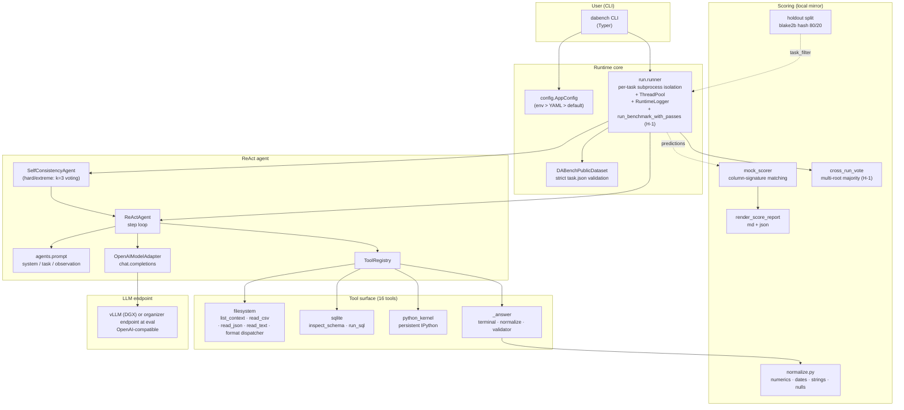
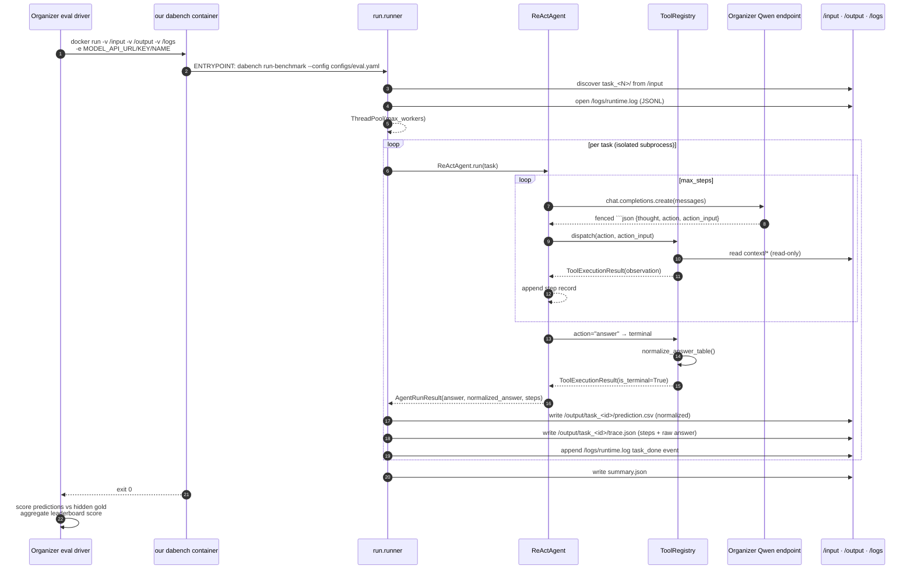

# DataAgent-Bench Baseline — System Architecture & Data Formats

> 🌐 **Language**: **English** · [한국어](ARCHITECTURE.ko.md) · [中文](ARCHITECTURE.zh.md)

> Last updated: 2026-05-11 (v3 round — agent G/H/K/L + memory M + error N patches consolidated)

This document is the human-facing system guide for the ReAct baseline that targets the KDD Cup 2026 DataAgent-Bench challenge. Read this before diving into the code: it tells you where to look, what data we handle, and how things behave inside the eval container.

> `CLAUDE.md` is the operating manual for AI assistants; this doc targets humans. Some overlap, but the depth and POV differ. For a one-screen architecture see [`SYSTEM_ARCHITECTURE.md`](SYSTEM_ARCHITECTURE.md); for round-by-round change history + component graph see [`HARNESS_STRUCTURE.md`](HARNESS_STRUCTURE.md).

---

## 1. Mission & scope

**What we build.** The organizers will run a Docker container we provide, mounting hidden tasks. Inside, our ReAct agent reads each task's natural-language question, examines the context (CSV/SQLite/JSON/Markdown), and drops a `prediction.csv` into `/output/task_<id>/`.

**Why ReAct.** The organizer mandates `qwen3.5-35b-a3b`; we cannot pick a different model. Score therefore comes from (a) consistency with the scoring function, (b) tool-use ability, (c) how we allocate the 12-hour compute budget. All three are tractable on top of a ReAct loop.

**Scope.** Leaderboard track only — we drop the Creative track.

---

## 2. System diagram



---

## 3. Three execution modes

The same codebase runs in three contexts, each with different `config` behaviour and output layout.

| Mode | Trigger | Output path | run_id wrapper | LLM endpoint |
|---|---|---|---|---|
| **Local dev** | `uv run dabench run-task ... --config configs/local.yaml` | `artifacts/runs/<run_id>/<task_id>/` | yes (`<run_id>/`) | DGX vLLM (LAN) |
| **Local Docker smoke** | `bash scripts/local_eval.sh <ver> [task_set]` | `artifacts/sandbox/<ver>/output/<task_id>/` | no (flat) | DGX vLLM via `MODEL_API_URL` |
| **Organizer eval** | Organizers `docker run` our tar.gz | `/output/<task_id>/` (mount) | no (flat) | Organizer Qwen endpoint |

**Key toggle:** the `flat_output_dir` flag. `False` wraps `<run_id>/` and uses `mkdir(exist_ok=False)` to reject collisions. `True` writes directly under `output_root` and accepts a pre-existing dir — needed because the eval mount may be empty.

`configs/eval.yaml` is wired with `flat_output_dir: true` + `log_file: /logs/runtime.log`.

---

## 4. End-to-end flow (organizer eval moment)



> Multi-pass mode (`repeat_max > 1`): the "ENTRYPOINT" step above is wrapped by `run_benchmark_with_passes`. The orchestrator runs the same ThreadPool / Agent flow N times into `output/_runs/run_<i>/` and `cross_run_vote` writes the voted final into `output/task_<id>/prediction.csv`. The first pass is always preserved → on voter failure or budget overrun, the system never regresses below single-pass (`_fallback_copy_pass`).

---

## 4b. Multi-pass orchestration (H-1)

### 4b.1 Why we added it

Forensics confirmed: even at temperature=0 we see ±3-5 perfect-task variance per run. The same code/prompt with the same hidden distribution still loses 2-5 different tasks each run to max_steps or hallucination. SelfConsistencyAgent (G-2) handles per-task self-consistency on hard/extreme tier, but **easy/medium variance was uncovered**.

**H-1's answer**: have the container run the same task set N times and majority-vote across runs per task. Per-pass SC votes within a task; H-1 votes across tasks at the run level. The two layers stack and **absorb random easy/medium max_steps as well**.

### 4b.2 Algorithm

```python
# runner.py:run_benchmark_with_passes (sketch)
master_run_id, master_output_dir = create_run_output_dir(
    config.run.output_dir,
    run_id=config.run.run_id,
    flat=config.run.flat_output_dir,
)
pass_outputs = []
multi_pass_started = perf_counter()

for pass_idx in range(config.run.repeat_max):
    pass_dir = master_output_dir / "_runs" / f"run_{pass_idx}"
    pass_config = replace(config, run=replace(
        config.run,
        output_dir=pass_dir,
        run_id=None,
        flat_output_dir=True,
        repeat_max=1,           # prevent recursion
    ))
    pass_started = perf_counter()
    run_benchmark(config=pass_config, ...)
    last_pass_duration = perf_counter() - pass_started
    pass_outputs.append(pass_dir)

    if pass_idx + 1 >= config.run.repeat_max: break
    if config.run.wall_clock_budget_seconds is None: continue
    elapsed_total = perf_counter() - multi_pass_started
    if (budget − elapsed_total) < last_pass_duration × pass_safety_margin:
        log multi_pass_early_stop; break

try:
    vote_across_runs(prediction_roots=pass_outputs, output_dir=master_output_dir)
except Exception:
    _fallback_copy_pass(pass_outputs[0], master_output_dir)
```

### 4b.3 Voting key

`scoring.cross_run_vote._signature`:
```
columns_signatures = [column_signature(col_values) for col in prediction.columns]
key = frozenset(Counter(columns_signatures).items())
```

`column_signature` (multiset of normalized values, ignoring column NAME and row ORDER) is **identical** to the official scorer's criterion. Same signature → same scoring outcome. Tie-break is **earliest pass** — deterministic, and "all passes disagree → pass 0 stays" guarantees graceful degradation.

### 4b.4 Budget guard and regression safety

| Scenario | Result |
|---|---|
| Hidden ≈ public 50 tasks, normal pace (1 pass ≈ 1.5h) | 3 passes complete (≈ 4.5h) → voted output |
| Hidden very large or heavy (1 pass ≈ 6h) | 1 pass complete then budget guard → single-pass result |
| Governor fires mid-pass | governor cascades (v6: up to 3 halvings, re-evaluated every 5 tasks); next pass not started; single-pass output preserved |
| Voter itself raises | `_fallback_copy_pass` copies pass 0 into master → single-pass result |

So **for any hidden set / any failure pattern, the multi-pass orchestrator is at least as good as single-pass**. Regression-proof.

### 4b.5 New runtime.log events

```
multi_pass_start          { repeat_max, pass_safety_margin, wall_clock_budget_seconds }
benchmark_start           { run_id (per pass), ... }     ← repeated N times
task_done                 { task_id, succeeded, ... }
multi_pass_iteration_done { pass_index, pass_duration_seconds, elapsed_total_seconds }
multi_pass_early_stop     { completed_passes, last_pass_duration, remaining_budget, safety_margin }
multi_pass_vote_failed    { error, fallback_pass }
multi_pass_end            { completed_passes, voted_tasks, unanimous_tasks, split_tasks, missing_in_all }
```

### 4b.6 Environment / opt-out

| Env | Effect |
|---|---|
| `DABENCH_REPEAT_MAX=1` | disable multi-pass (legacy single pass) |
| `DABENCH_PASS_SAFETY_MARGIN=2.0` | more conservative budget guard (raises bar to start a new pass) |
| `DABENCH_DISABLE_SELF_CONSISTENCY=1` | also disable per-task SC (force k=1) |

---

## 5. ReAct agent loop (inside one task)

```mermaid
flowchart TD
    start([Task start]) --> build_prompt[build system + task prompt<br/>difficulty, context tree, tool catalog]
    build_prompt --> step{step ≤ max_steps?}
    step -- no --> fail([failure: max_steps exceeded])
    step -- yes --> call_llm[chat.completions.create]
    call_llm --> parse[parse_model_step<br/>extract fenced ```json]
    parse -- ParseError --> err_obs[observation = __error__<br/>raw_response saved]
    err_obs --> step
    parse -- ok --> dispatch{action type?}
    dispatch -- normal tool --> exec[ToolRegistry.execute]
    exec -- ok --> append[StepRecord appended<br/>observation becomes next user message]
    exec -- tool error --> err_tool[observation captures error]
    err_tool --> append
    append --> step
    dispatch -- answer --> normalize[normalize_answer_table]
    normalize --> terminal([terminal: AgentRunResult<br/>raw + normalized both kept])
    terminal --> write_csv[runner: write prediction.csv<br/>(uses normalized)]
    write_csv --> write_trace[write trace.json]
```

**Key invariants:**
- The model response **must** be a single ` ```json {"thought":..., "action":..., "action_input":{...}} ``` ` fenced block. The `agents/prompt.py` system prompt and `agents/react.py:parse_model_step` keep this contract in lock-step.
- All tool input paths are *relative paths under `context/`*. `tools/filesystem.resolve_context_path` rejects absolute paths and `..` escape.
- Only `_answer` is terminal. All other tools always return `is_terminal=False`.
- Parse failures are not fatal — they surface as `__error__` step records so the agent can recover.
- `execute_python` runs in a 30-second wall-clock subprocess, `chdir` into `task.context_dir`.

---

## 6. Component responsibility matrix

| Module | File | Responsibility |
|---|---|---|
| CLI | `cli.py` | Typer 4 sub-commands (`status`, `inspect-task`, `run-task`, `run-benchmark`). Progress UI. |
| Config | `config.py` | YAML load + env overlay. `DatasetConfig` / `AgentConfig` / `RunConfig` (frozen dataclass). |
| Dataset | `benchmark/dataset.py` + `schema.py` | Discovers `task_<N>/` directories; strictly validates `task.json` keys (only `{task_id, difficulty, question}`). |
| Agent | `agents/react.py` | Step loop. `parse_model_step`. Error recovery. `max_steps` governor. |
| Agent | `agents/self_consistency.py` | **G-2** SelfConsistencyAgent — k=3 ReActAgents on hard/extreme tier, fresh OpenAIModelAdapter per sample (temperature=0.5), majority vote on `column_signature` multiset. Tie-break to earliest sample. |
| Prompts | `agents/prompt.py` | system / task / observation prompt builders. Single source of truth for the JSON contract. **G-3** knowledge.md cap 5000 chars + question-keyword H2/H3 reorder. |
| Model | `agents/model.py` | `OpenAIModelAdapter` (real model), `ScriptedModelAdapter` (tests). |
| Runtime | `agents/runtime.py` | `StepRecord`, `AgentRuntimeState`, `AgentRunResult` dataclasses (trace.json serialization). |
| Tools | `tools/registry.py` | Tool catalog + `describe_for_prompt()`. Single entry point for adding new tools. |
| Tools | `tools/filesystem.py` | `list_context`, `read_csv`, `read_json`, `read_text`, format dispatcher (PDF/Excel/Parquet/Image), `dataframe_describe/head`, `inspect_file` hierarchical catalog. Path sandbox. |
| Tools | `tools/sqlite.py` | Read-only SQL. `inspect_sqlite_schema`, `run_sql`. |
| Tools | `tools/python_exec.py` + `tools/python_kernel.py` | 30s isolated subprocess (ephemeral) and persistent IPython kernel (default). stdout/stderr fd-level capture. |
| Runner | `run/runner.py` | Run-dir management, per-task timeout isolation, ThreadPool, `RuntimeLogger` (JSONL), **F-5/G-1** first-step transient retry, **H-1** `run_benchmark_with_passes` multi-pass orchestrator + adaptive budget guard + `_fallback_copy_pass`. |
| Scoring | `scoring/normalize.py` | `normalize_answer_table` (numerics→2dp HALF_UP, dates→ISO, nulls→"", strings→trim). Column-signature function. |
| Scoring | `scoring/mock_scorer.py` | `Score = Recall − λ·(Extra/Pred)`, official scorer mirror. Greedy bipartite matching. 3-phase name-equivalence. |
| Scoring | `scoring/cross_run_vote.py` | **H-1** column-multiset majority across N benchmark roots. Tie-break to earliest pass. CLI + library. 9 unit tests. |
| Scoring | `scoring/holdout.py` | Deterministic 80/20 hash split (`blake2b(salt+task_id)`). |

---

## 7. Data format catalog

### 7.1 Input: `task.json`

Exactly one per task directory. Keys must be **exactly `{task_id, difficulty, question}`** — extra keys cause `DABenchPublicDataset` to raise.

```json
{
  "task_id": "task_42",
  "difficulty": "hard",
  "question": "What is the average donation amount for sponsors in 2024?"
}
```

### 7.2 Input: `context/` subtree

Per-task. Tool inputs are paths relative to this directory.

```
task_42/context/
  knowledge.md          # always present — domain glossary
  csv/donations.csv
  db/sponsors.db        # SQLite (read-only)
  json/...
  doc/*.md              # supplementary docs (optional)
```

### 7.3 Output: `prediction.csv`

One per task. UTF-8, single header row, column order irrelevant. Numerical columns normalized to 2 decimal places (HALF_UP), dates to ISO 8601, nulls to empty string, strings trimmed (case-sensitive).

### 7.4 Output: `trace.json`

One per task. Full `AgentRunResult` (steps + answer + failure_reason).

### 7.5 Output: `summary.json` (benchmark only)

Per-run aggregate (task counts, succeeded counts, governor state, etc.).

---

## 8. Scoring path

The official rule: `Score = Recall − λ·(ExtraCols/PredictedCols)` with column-signature matching ignoring column names and row order, after normalization.

`mock_scorer.py` is the local mirror — uses the same matching logic. 3-phase name-equivalence:
1. Direct one-to-one
2. Gold single ↔ pred pair join (e.g. gold `full_name` vs pred `first_name` + `last_name`)
3. Pred single ↔ gold pair join

`column_ablation.py` is a diagnostic that proposes column drops favorable across `λ ∈ {0.05, 0.10, 0.20}` — only triggers at 6+ predicted columns.

`cross_run_vote.py` (H-1) — majority-vote across N benchmark output roots using the same column-signature semantics as the scorer.

---

## 9. Configuration

### 9.1 YAML structure

```yaml
dataset:
  root_path: /input
agent:
  model: ""               # env-injected
  api_base: ""            # env-injected
  api_key: ""             # env-injected
  max_steps: 16
  temperature: 0.0
  python_kernel_mode: persistent
  max_steps_by_difficulty:
    easy: 8
    medium: 12
    hard: 24
    extreme: 32
  self_consistency_k: 3
  self_consistency_temperature: 0.5
  self_consistency_difficulties: ["hard", "extreme"]
run:
  output_dir: /output
  run_id: null
  max_workers: 4
  task_timeout_seconds: 300
  task_timeout_by_difficulty:    # v6: tightened for B-board (324 task / 12h); v7 cuts further for A-board (57 task / 2h)
    easy: 180
    medium: 360
    hard: 900
    extreme: 1200
  flat_output_dir: true
  log_file: /logs/runtime.log
  wall_clock_budget_seconds: 43200
  repeat_max: 1                  # v5 S-4: deterministic seed makes voting redundant
  pass_safety_margin: 1.1
```

### 9.2 Environment overrides (`env > YAML > default`)

| Env var | Maps to | Note |
|---|---|---|
| `MODEL_API_URL` | `agent.api_base` | eval injects |
| `MODEL_API_KEY` | `agent.api_key` | eval injects |
| `MODEL_NAME` | `agent.model` | eval injects |
| `DABENCH_INPUT_DIR` | `dataset.root_path` | |
| `DABENCH_OUTPUT_DIR` | `run.output_dir` | |
| `DABENCH_RUN_ID` | `run.run_id` | |
| `DABENCH_MAX_WORKERS` | `run.max_workers` | |
| `DABENCH_TASK_TIMEOUT` | `run.task_timeout_seconds` | |
| `DABENCH_FLAT_OUTPUT` | `run.flat_output_dir` | "1"/"true"/"yes" → True |
| `DABENCH_LOG_FILE` | `run.log_file` | |
| `DABENCH_WALL_CLOCK_BUDGET` | `run.wall_clock_budget_seconds` | "0" disables |
| `DABENCH_PYTHON_KERNEL_MODE` | `agent.python_kernel_mode` | |
| `DABENCH_SC_K` | `agent.self_consistency_k` | |
| `DABENCH_SC_TEMP` | `agent.self_consistency_temperature` | |
| `DABENCH_DISABLE_SELF_CONSISTENCY` | force k=1 | "1" / true |
| `DABENCH_REPEAT_MAX` | `run.repeat_max` | H-1 |
| `DABENCH_PASS_SAFETY_MARGIN` | `run.pass_safety_margin` | H-1 |

---

## 10. Dependency / runtime list

- Python ≥ 3.10 (uv installs 3.10/3.11)
- Docker 24+ + buildx (linux/amd64 cross-build)
- (optional) NVIDIA GPU + Docker compose — for self-hosted vLLM

Headline deps in `pyproject.toml` `[project.dependencies]`: pandas, numpy, openai, polars, pyarrow, pypdf, openpyxl, Pillow, IPython.

For the Korean / Chinese full historical narrative on architecture decisions, see [`ARCHITECTURE.ko.md`](ARCHITECTURE.ko.md) / [`ARCHITECTURE.zh.md`](ARCHITECTURE.zh.md).
