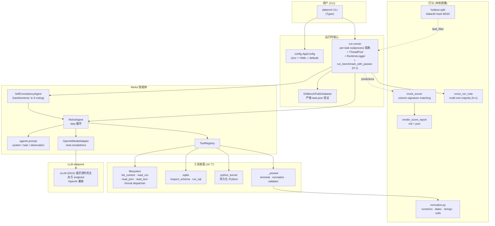
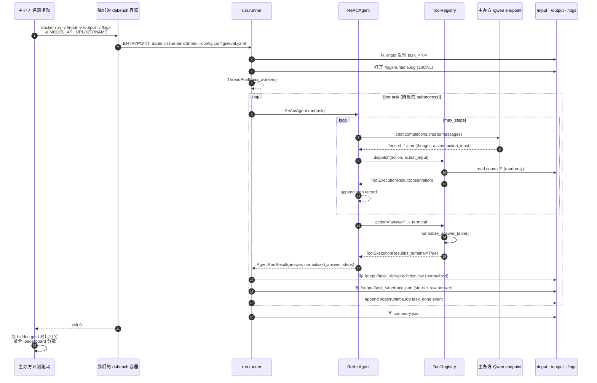

# DataAgent-Bench Baseline — 系统架构 & 数据格式

> 🌐 **Language**: [English](ARCHITECTURE.md) · [한국어](ARCHITECTURE.ko.md) · **中文**

> 最近更新: 2026-05-11 (v3 轮次 — agent G/H/K/L + memory M + error N 修补集成)

本文档是面向人的系统指南,介绍 KDD Cup 2026 DataAgent-Bench 挑战 ReAct baseline 的整体运作。新人在读代码之前先读这个能知道在哪儿看、处理什么数据、在评测容器里如何运行。

> `CLAUDE.md` 是面向 AI 助手的运维手册;本文档面向人。两者部分重叠但视角和深度不同。一图概览见 [`SYSTEM_ARCHITECTURE.zh.md`](SYSTEM_ARCHITECTURE.zh.md);轮次变更日志 + 组件依赖图见 [`HARNESS_STRUCTURE.zh.md`](HARNESS_STRUCTURE.zh.md)。

---

## 1. 任务与范围

**做什么。** 主办方运行我们提供的 Docker 容器,挂载 hidden 任务。容器内 ReAct 智能体读取每个任务的自然语言问题,审视上下文 (CSV/SQLite/JSON/Markdown),把 `prediction.csv` 写到 `/output/task_<id>/`。

**为什么 ReAct。** 主办方强制 `qwen3.5-35b-a3b`,我们不能换模型。所以分数来自 (a) 与评分函数的一致性, (b) 工具使用能力, (c) 12 小时计算预算的分配。这三者在 ReAct 循环之上都可处理。

**范围。** 仅 Leaderboard 赛道 — 放弃 Creative 赛道。

---

## 2. 系统图



---

## 3. 三种执行模式

同一份代码在三种环境下运行,每种 `config` 行为和输出布局不同。

| 模式 | 触发 | 输出路径 | run_id wrapper | LLM endpoint |
|---|---|---|---|---|
| **本地开发** | `uv run dabench run-task ... --config configs/local.yaml` | `artifacts/runs/<run_id>/<task_id>/` | 有 (`<run_id>/`) | DGX vLLM (LAN) |
| **本地 Docker smoke** | `bash scripts/local_eval.sh <ver> [task_set]` | `artifacts/sandbox/<ver>/output/<task_id>/` | 无 (flat) | DGX vLLM via `MODEL_API_URL` |
| **主办方评测** | 主办方 `docker run` 我们的 tar.gz | `/output/<task_id>/` (mount) | 无 (flat) | 主办方 Qwen endpoint |

**关键开关:** `flat_output_dir` flag。`False` 用 `<run_id>/` wrap + `mkdir(exist_ok=False)` 拒绝冲突。`True` 直接写到 `output_root` 下,接受预先存在 dir — 评测挂载可能为空,需要这个。

`configs/eval.yaml` 配为 `flat_output_dir: true` + `log_file: /logs/runtime.log`。

---

## 4. 端到端流 (评测时点)



> Multi-pass 模式 (`repeat_max > 1`): 上图的 "ENTRYPOINT" 步被 `run_benchmark_with_passes` 包装。orchestrator 把同一 ThreadPool / Agent 流程跑 N 次到 `output/_runs/run_<i>/`,最后 `cross_run_vote` 把 voted final 写到 `output/task_<id>/prediction.csv`。第一个 pass 始终保留 → voter 失败 / budget 用完时,系统永不退化到 single-pass 以下 (`_fallback_copy_pass`)。

---

## 4b. Multi-pass 编排 (H-1)

### 4b.1 为何加入

法医确认: 即使 temperature=0,我们仍看到每次 run ±3-5 个 perfect 任务的方差。同一份代码/同一份 prompt 在同一份 hidden 分布上,每次仍会以不同方式失去 2-5 个任务在 max_steps 或 hallucination。SelfConsistencyAgent (G-2) 处理 hard/extreme 上的 per-task self-consistency,但 **easy/medium 的 variance 没遮挡**。

**H-1 答案**: 让容器把同一个 task set 跑 N 次,按 task 跨 run 多数投票。Per-pass SC 在 task 内投票;H-1 在 run 层面跨 task 投票。两层叠加,**也吸收 easy/medium 的随机 max_steps**。

### 4b.2 算法

```python
# runner.py:run_benchmark_with_passes (示意)
master_run_id, master_output_dir = create_run_output_dir(
    config.run.output_dir,
    run_id=config.run.run_id,
    flat=config.run.flat_output_dir,
)
pass_outputs = []
multi_pass_started = perf_counter()

for pass_idx in range(config.run.repeat_max):
    pass_dir = master_output_dir / "_runs" / f"run_{pass_idx}"
    pass_config = replace(config, run=replace(
        config.run,
        output_dir=pass_dir,
        run_id=None,
        flat_output_dir=True,
        repeat_max=1,           # 防止递归
    ))
    pass_started = perf_counter()
    run_benchmark(config=pass_config, ...)
    last_pass_duration = perf_counter() - pass_started
    pass_outputs.append(pass_dir)

    if pass_idx + 1 >= config.run.repeat_max: break
    if config.run.wall_clock_budget_seconds is None: continue
    elapsed_total = perf_counter() - multi_pass_started
    if (budget − elapsed_total) < last_pass_duration × pass_safety_margin:
        log multi_pass_early_stop; break

try:
    vote_across_runs(prediction_roots=pass_outputs, output_dir=master_output_dir)
except Exception:
    _fallback_copy_pass(pass_outputs[0], master_output_dir)
```

### 4b.3 投票键

`scoring.cross_run_vote._signature`:
```
columns_signatures = [column_signature(col_values) for col in prediction.columns]
key = frozenset(Counter(columns_signatures).items())
```

`column_signature` (归一化值的 multiset, 忽略列 NAME 和行 ORDER) 与官方评分器的判据 **完全一致**。同一 signature → 同一打分结果。Tie-break 是 **最早的 pass** — 确定性,且 "所有 pass 都不同 → pass 0 留下" 保证优雅降级。

### 4b.4 预算 guard 与回归安全

| 场景 | 结果 |
|---|---|
| Hidden ≈ 50 tasks 公开,正常步速 (1 pass ≈ 1.5h) | 3 passes 完成 (≈ 4.5h) → voted output |
| Hidden 非常重 (1 pass ≈ 6h) | 1 pass 完成后预算 guard → single-pass 结果 |
| 中途 governor 触发 | governor 级联触发 (v6: 最多 3 次减半, 每 5 task 重新评估);不开始下一 pass;single-pass 输出保留 |
| voter 自身抛错 | `_fallback_copy_pass` 把 pass 0 复制到 master → single-pass 结果 |

所以 **任何 hidden set / 任何失败模式下,multi-pass orchestrator 都至少与 single-pass 一样好**。回归不可能。

### 4b.5 新增 runtime.log 事件

```
multi_pass_start          { repeat_max, pass_safety_margin, wall_clock_budget_seconds }
benchmark_start           { run_id (per pass), ... }     ← 重复 N 次
task_done                 { task_id, succeeded, ... }
multi_pass_iteration_done { pass_index, pass_duration_seconds, elapsed_total_seconds }
multi_pass_early_stop     { completed_passes, last_pass_duration, remaining_budget, safety_margin }
multi_pass_vote_failed    { error, fallback_pass }
multi_pass_end            { completed_passes, voted_tasks, unanimous_tasks, split_tasks, missing_in_all }
```

### 4b.6 环境 / opt-out

| Env | 效果 |
|---|---|
| `DABENCH_REPEAT_MAX=1` | 关闭 multi-pass (legacy 单 pass) |
| `DABENCH_PASS_SAFETY_MARGIN=2.0` | 更保守的预算 guard (提高启动新 pass 的门槛) |
| `DABENCH_DISABLE_SELF_CONSISTENCY=1` | 也关闭 per-task SC (强制 k=1) |

---

## 5. ReAct 智能体循环 (单一 task 内)

```mermaid
flowchart TD
    start([Task 开始]) --> build_prompt[构建 system + task prompt<br/>难度, context tree, 工具目录]
    build_prompt --> step{step ≤ max_steps?}
    step -- 否 --> fail([failure: 超过 max_steps])
    step -- 是 --> call_llm[chat.completions.create]
    call_llm --> parse[parse_model_step<br/>提取 fenced ```json]
    parse -- ParseError --> err_obs[observation = __error__<br/>保存 raw_response]
    err_obs --> step
    parse -- ok --> dispatch{action 类型?}
    dispatch -- 普通工具 --> exec[ToolRegistry.execute]
    exec -- ok --> append[append StepRecord<br/>observation 作为下一条 user message]
    exec -- 工具错误 --> err_tool[observation 捕获错误]
    err_tool --> append
    append --> step
    dispatch -- answer --> normalize[normalize_answer_table]
    normalize --> terminal([terminal: AgentRunResult<br/>raw + normalized 都保留])
    terminal --> write_csv[runner: 写 prediction.csv<br/>(用 normalized)]
    write_csv --> write_trace[写 trace.json]
```

**关键不变量:**
- 模型响应 **必须** 是单一 ` ```json {"thought":..., "action":..., "action_input":{...}} ``` ` fenced block。`agents/prompt.py` 系统 prompt 与 `agents/react.py:parse_model_step` lock-step 维护此 contract。
- 所有工具输入 path 都是 *`context/` 下的相对路径*。`tools/filesystem.resolve_context_path` 拒绝 absolute path 和 `..` 逃逸。
- 只有 `_answer` 是 terminal。其它工具始终返回 `is_terminal=False`。
- 解析失败不致命 — 以 `__error__` step record 浮现,让 agent 自我恢复。
- `execute_python` 在 30 秒 wall-clock subprocess 中运行,`chdir` 到 `task.context_dir`。

---

## 6. 组件职责矩阵

| 模块 | 文件 | 职责 |
|---|---|---|
| CLI | `cli.py` | Typer 4 子命令 (`status`, `inspect-task`, `run-task`, `run-benchmark`)。Progress UI。 |
| Config | `config.py` | YAML 加载 + env 叠加。`DatasetConfig` / `AgentConfig` / `RunConfig` (frozen dataclass)。 |
| Dataset | `benchmark/dataset.py` + `schema.py` | 发现 `task_<N>/` 目录;严格验证 `task.json` 键 (只 `{task_id, difficulty, question}`)。 |
| Agent | `agents/react.py` | Step 循环。`parse_model_step`。错误恢复。`max_steps` governor。 |
| Agent | `agents/self_consistency.py` | **G-2** SelfConsistencyAgent — hard/extreme tier 上 k=3 ReActAgent,每 sample 用新 OpenAIModelAdapter (temperature=0.5),按 `column_signature` multiset 多数投票。tie-break 取最早 sample。 |
| Prompts | `agents/prompt.py` | system / task / observation prompt builder。JSON contract 的唯一真理来源。**G-3** knowledge.md cap 5000 字符 + question-keyword H2/H3 reorder。 |
| Model | `agents/model.py` | `OpenAIModelAdapter` (真实模型),`ScriptedModelAdapter` (测试)。 |
| Runtime | `agents/runtime.py` | `StepRecord`、`AgentRuntimeState`、`AgentRunResult` dataclass (trace.json 序列化)。 |
| Tools | `tools/registry.py` | 工具目录 + `describe_for_prompt()`。新增工具的单一入口。 |
| Tools | `tools/filesystem.py` | `list_context`, `read_csv`, `read_json`, `read_text`, format dispatcher (PDF/Excel/Parquet/Image), `dataframe_describe/head`, `inspect_file` 层级 catalog。Path sandbox。 |
| Tools | `tools/sqlite.py` | 只读 SQL。`inspect_sqlite_schema`, `run_sql`。 |
| Tools | `tools/python_exec.py` + `tools/python_kernel.py` | 30s 隔离 subprocess (临时) 与持久化 IPython kernel (默认)。stdout/stderr fd 级捕获。 |
| Runner | `run/runner.py` | Run-dir 管理、per-task timeout 隔离、ThreadPool、`RuntimeLogger` (JSONL)、**F-5/G-1** first-step transient retry、**H-1** `run_benchmark_with_passes` multi-pass orchestrator + 自适应预算 guard + `_fallback_copy_pass`。 |
| Scoring | `scoring/normalize.py` | `normalize_answer_table` (numerics→2dp HALF_UP, dates→ISO, nulls→"", strings→trim)。Column-signature 函数。 |
| Scoring | `scoring/mock_scorer.py` | `Score = Recall − λ·(Extra/Pred)` 官方打分镜像。Greedy bipartite matching。3-phase name-equivalence。 |
| Scoring | `scoring/cross_run_vote.py` | **H-1** N 个 benchmark root 之间的 column-multiset majority。tie-break 取最早 pass。CLI + library。9 个单测。 |
| Scoring | `scoring/holdout.py` | 确定性 80/20 hash 拆分 (`blake2b(salt+task_id)`)。 |

---

## 7. 数据格式目录

### 7.1 输入: `task.json`

每个 task 目录恰好一个。键必须 **精确为 `{task_id, difficulty, question}`** — 多余的键导致 `DABenchPublicDataset` raise。

```json
{
  "task_id": "task_42",
  "difficulty": "hard",
  "question": "What is the average donation amount for sponsors in 2024?"
}
```

### 7.2 输入: `context/` 子树

每 task 一份。工具输入是相对此目录的路径。

```
task_42/context/
  knowledge.md          # 始终存在 — 领域字典
  csv/donations.csv
  db/sponsors.db        # SQLite (只读)
  json/...
  doc/*.md              # 辅助文档 (可选)
```

### 7.3 输出: `prediction.csv`

每 task 一份。UTF-8, 单行表头, 列序无关。数值列归一化到 2 位小数 (HALF_UP), 日期到 ISO 8601, null 到空字符串, 字符串 trim (大小写敏感)。

### 7.4 输出: `trace.json`

每 task 一份。完整 `AgentRunResult` (steps + answer + failure_reason)。

### 7.5 输出: `summary.json` (仅 benchmark)

Per-run 聚合 (task 数、succeeded 数、governor 状态等)。

---

## 8. 打分路径

官方规则: `Score = Recall − λ·(ExtraCols/PredictedCols)`,column-signature matching 忽略列名与行序,归一化后比较。

`mock_scorer.py` 是本地镜像 — 用相同 matching 逻辑。3-phase name-equivalence:
1. 直接一对一
2. Gold 单 ↔ pred 配对 (例如 gold `full_name` vs pred `first_name` + `last_name`)
3. Pred 单 ↔ gold 配对

`column_ablation.py` 是诊断工具,提议在 `λ ∈ {0.05, 0.10, 0.20}` 上有利的列删除 — 仅在 6+ 预测列时触发。

`cross_run_vote.py` (H-1) — N 个 benchmark output root 之间的多数投票,使用与评分器相同的 column-signature 语义。

---

## 9. 配置

### 9.1 YAML 结构

```yaml
dataset:
  root_path: /input
agent:
  model: ""               # env 注入
  api_base: ""            # env 注入
  api_key: ""             # env 注入
  max_steps: 16
  temperature: 0.0
  python_kernel_mode: persistent
  max_steps_by_difficulty:
    easy: 8
    medium: 12
    hard: 24
    extreme: 32
  self_consistency_k: 3
  self_consistency_temperature: 0.5
  self_consistency_difficulties: ["hard", "extreme"]
run:
  output_dir: /output
  run_id: null
  max_workers: 4
  task_timeout_seconds: 300
  task_timeout_by_difficulty:    # v6: 为 B-board (324 task / 12h) 收紧;v7 进一步为 A-board (57 task / 2h) 削减
    easy: 180
    medium: 360
    hard: 900
    extreme: 1200
  flat_output_dir: true
  log_file: /logs/runtime.log
  wall_clock_budget_seconds: 43200
  repeat_max: 1                  # v5 S-4: deterministic seed 使 voting 失效
  pass_safety_margin: 1.1
```

### 9.2 环境变量覆盖 (`env > YAML > default`)

| Env | 映射到 | 备注 |
|---|---|---|
| `MODEL_API_URL` | `agent.api_base` | 评测注入 |
| `MODEL_API_KEY` | `agent.api_key` | 评测注入 |
| `MODEL_NAME` | `agent.model` | 评测注入 |
| `DABENCH_INPUT_DIR` | `dataset.root_path` | |
| `DABENCH_OUTPUT_DIR` | `run.output_dir` | |
| `DABENCH_RUN_ID` | `run.run_id` | |
| `DABENCH_MAX_WORKERS` | `run.max_workers` | |
| `DABENCH_TASK_TIMEOUT` | `run.task_timeout_seconds` | |
| `DABENCH_FLAT_OUTPUT` | `run.flat_output_dir` | "1"/"true"/"yes" → True |
| `DABENCH_LOG_FILE` | `run.log_file` | |
| `DABENCH_WALL_CLOCK_BUDGET` | `run.wall_clock_budget_seconds` | "0" 关闭 |
| `DABENCH_PYTHON_KERNEL_MODE` | `agent.python_kernel_mode` | |
| `DABENCH_SC_K` | `agent.self_consistency_k` | |
| `DABENCH_SC_TEMP` | `agent.self_consistency_temperature` | |
| `DABENCH_DISABLE_SELF_CONSISTENCY` | 强制 k=1 | "1" / true |
| `DABENCH_REPEAT_MAX` | `run.repeat_max` | H-1 |
| `DABENCH_PASS_SAFETY_MARGIN` | `run.pass_safety_margin` | H-1 |

---

## 10. 依赖 / 运行时清单

- Python ≥ 3.10 (uv 安装 3.10/3.11)
- Docker 24+ + buildx (linux/amd64 cross-build)
- (可选) NVIDIA GPU + Docker compose — 自托管 vLLM 时

`pyproject.toml` `[project.dependencies]` 中的代表 deps: pandas, numpy, openai, polars, pyarrow, pypdf, openpyxl, Pillow, IPython。

韩文 / 英文完整历史叙述见 [`ARCHITECTURE.ko.md`](ARCHITECTURE.ko.md) / [`ARCHITECTURE.md`](ARCHITECTURE.md)。
