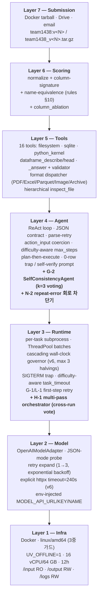
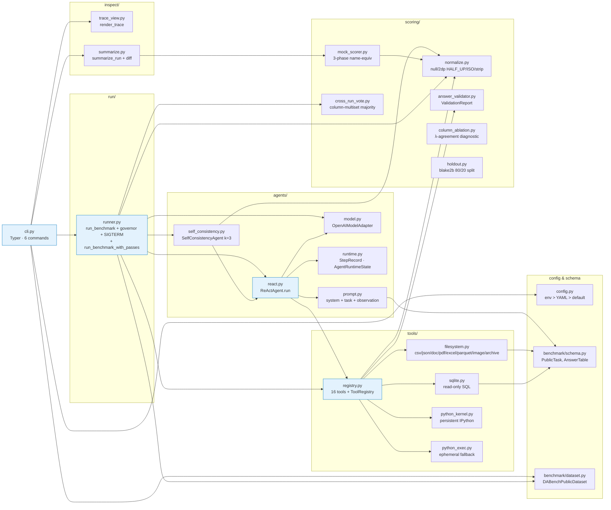
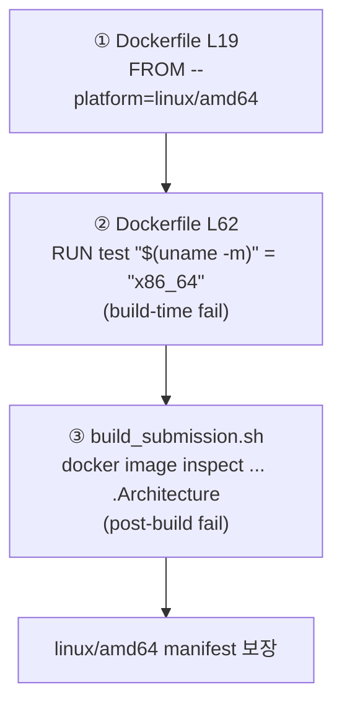
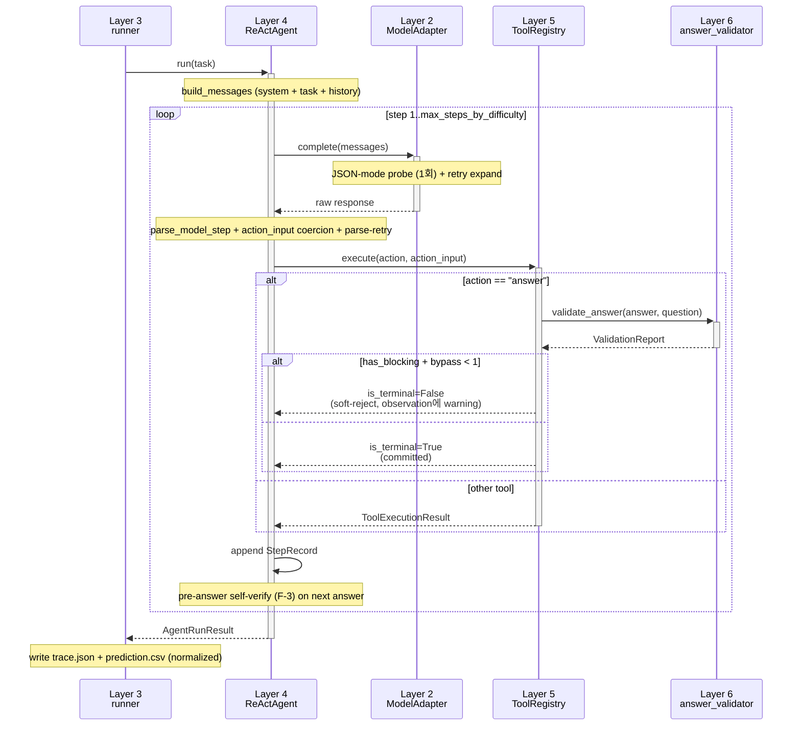
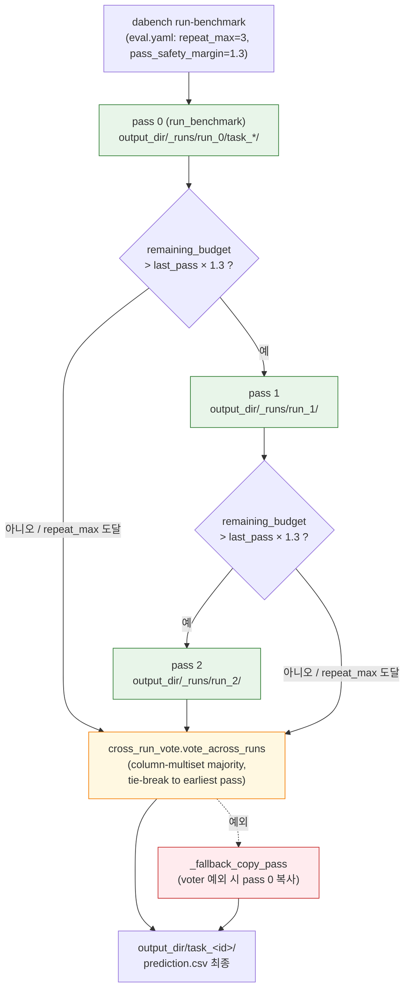

# Harness Structure — `data_agent_baseline`

> 🌐 **Language**: [English](HARNESS_STRUCTURE.md) · **한국어** · [中文](HARNESS_STRUCTURE.zh.md)

> 살아있는 문서. 코드/패치 라운드가 추가될 때마다 이 문서를 함께 갱신.
> 마지막 갱신: 2026-05-11 (v3 — v2 baseline 위에 통합 라운드: 메모리 레이어 M-1~M-5, multi-pass voting H-1, streaming JSON H-3, error pattern 메모리 N-1, repeat-error guard N-2, pre-flight task brief N-3, 그리고 G-1~G-3 / K-1 / L-1 런타임 정비)

KDD Cup 2026 DataAgent-Bench 도전을 위한 ReAct 에이전트 하네스. 7개 레이어로 분리된 구조 + 빌드/평가 자동화 + 가시성 도구. 각 레이어는 위 레이어를 모르고 아래 레이어만 의존(단방향).

데이터 흐름·실행 시퀀스는 [`SYSTEM_FLOW.ko.md`](SYSTEM_FLOW.ko.md). 본 문서는 **구조(component graph + responsibility boundaries)** 에 집중한다.

---

## 1. 7-Layer 구조 (논리적 분리)



### 각 레이어 진입점 한 줄 매핑

| Layer | 핵심 진입점 |
|---|---|
| 7 | `scripts/build_submission.sh`, `submissions/team1438_v<N>.tar.gz` |
| 6 | `src/data_agent_baseline/scoring/{normalize,mock_scorer,answer_validator,column_ablation,holdout,cross_run_vote}.py` |
| 5 | `src/data_agent_baseline/tools/{registry,filesystem,sqlite,python_exec,python_kernel}.py` |
| 4 | `src/data_agent_baseline/agents/{react,prompt,model,runtime,self_consistency}.py` |
| 3 | `src/data_agent_baseline/run/runner.py` (`run_benchmark` + `run_benchmark_with_passes`) |
| 2 | `src/data_agent_baseline/agents/model.py:OpenAIModelAdapter` |
| 1 | `Dockerfile`, `configs/eval.yaml` (multi-pass enabled), `scripts/build_submission.sh` |

---

## 2. Component dependency graph (모듈 단위)



---

## 3. 외부 통신 — 단일 채널 정책

```mermaid
flowchart LR
    container["v3 컨테이너<br/>(team1438:v3)"]
    qwen["MODEL_API_URL<br/>(운영진 qwen3.5-35b-a3b)"]
    pypi["pypi.org<br/>~~uv 부수효과~~"]
    other["다른 LLM API<br/>(OpenAI/Anthropic/HF)"]

    container -->|허용 (룰 §runtime §4)| qwen
    container -.->|<b>UV_OFFLINE=1로 차단</b>| pypi
    container -.->|<b>코드 grep 0건</b>| other

    classDef allowed fill:#c8e6c9,stroke:#2e7d32;
    classDef blocked fill:#ffcdd2,stroke:#c62828;
    class qwen allowed;
    class pypi,other blocked;
```

검증 grep:
- `requests` / `urllib` / `httpx` / `aiohttp` 직접 import → **0건**
- `anthropic` / `cohere` / `together` / 외부 LLM SDK → **0건**
- socket / curl / wget subprocess → **0건**
- 외부 도메인 hardcoded URL → **0건**
- `os.environ[MODEL_*] = …` env 변조 → **0건**
- 합법 호출: `openai` SDK 1곳 (`agents/model.py`) — `MODEL_API_URL`로만

---

## 4. 빌드 + 검증 + 제출 파이프라인

```mermaid
flowchart LR
    src[src/<br/>+ configs/eval.yaml]
    build["bash scripts/build_submission.sh v&lt;N&gt;<br/>docker buildx --platform linux/amd64"]
    img[(team1438:v&lt;N&gt;<br/>linux/amd64<br/>UV_OFFLINE=1)]
    tar[(submissions/team1438_v&lt;N&gt;.tar.gz<br/>≤ 10 GB)]
    eval["docker run --rm --platform linux/amd64<br/>(local_eval.sh 또는 직접)"]
    out[artifacts/eval_full_v&lt;N&gt;/output/<br/>task_&lt;id&gt;/{prediction.csv, trace.json}]
    score["mock_scorer<br/>(λ ∈ {0.05, 0.10, 0.20})"]
    inspect["dabench inspect-trace<br/>dabench summarize-traces --diff"]
    drive[Google Drive<br/>+ 운영진 메일]

    src --> build
    build --> img
    img --> tar
    img --> eval
    eval --> out
    out --> score
    out --> inspect
    tar --> drive
    score -->|ship gate 통과 시| drive
```

### 3중 arch 가드



---

## 5. ReAct 에이전트 한 task 처리 흐름



---

## 5b. Multi-pass 오케스트레이션 (H-1)

`repeat_max > 1`일 때 `run_benchmark_with_passes`가 같은 task set을 N번 풀고 cross-run vote로 최종 답을 결정한다. 첫 pass는 항상 보존되어 voter 실패 / budget 초과 시에도 single-pass와 동일한 결과를 보장한다.



**Voting key.** 각 task의 `prediction.csv`에서 column당 `scoring.normalize.column_signature`(값 multiset)를 계산하고, 그 signature들의 multiset을 `frozenset(Counter(...).items())` 으로 동결해 hashable bucket key로 사용. 채점기와 **정확히 같은** column-multiset 의미.

**Tie-break.** bucket size가 같으면 가장 이른 pass의 prediction 채택. 따라서 **모든 pass가 다른 답이면 pass 0 채택** = 최악의 경우에도 single-pass 결과로 회귀.

**Budget guard.** 각 pass 종료 시:
- `repeat_max`에 도달했으면 종료
- `wall_clock_budget_seconds`가 None이거나 <= 0이면 무제한 (모든 configured pass 실행)
- 그 외: `(budget − elapsed_total) < last_pass_duration × pass_safety_margin` 이면 다음 pass 시작 안 함 → 첫 pass 보존됨

**runtime.log 이벤트** (가시성 도구에서 분석 가능):
- `multi_pass_start` — repeat_max / margin / budget 기록
- `multi_pass_iteration_done` — pass_index + duration + elapsed_total
- `multi_pass_early_stop` — 사유 (남은 budget / margin 등)
- `multi_pass_vote_failed` — fallback 발동 알림
- `multi_pass_end` — completed_passes / unanimous_tasks / split_tasks / missing_in_all

---

## 6. 가시성 도구 — 사후 분석 흐름

```mermaid
flowchart LR
    subgraph artifacts [artifacts/eval_full_v&lt;N&gt;/]
        traces[output/task_&lt;id&gt;/trace.json]
        preds[output/task_&lt;id&gt;/prediction.csv]
        log[logs/runtime.log JSONL]
    end

    insp["dabench inspect-trace &lt;task_id&gt;<br/>(단일 trace 컬러 step view)"]
    summ["dabench summarize-traces<br/>(50-task 카테고리화)"]

    traces --> insp
    traces --> summ
    preds --> summ

    insp --> single[Rich console panel:<br/>step-by-step thought/action/obs<br/>+ gold 비교]
    summ --> report[failure bucket<br/>+ soft-reject codes<br/>+ tool freq<br/>+ score by difficulty<br/>+ recovered/regressed (--diff)]

    classDef tool fill:#fff8e1,stroke:#f57c00;
    class insp,summ tool;
```

---

## 7. 룰 컴플라이언스 — 단일 매트릭스

각 레이어가 어떤 룰을 어떻게 만족하는지 한눈에. (verbatim 매트릭스는 [`../README.ko.md`](../README.ko.md) §3.)

| 룰 카테고리 (skill) | 만족하는 레이어 |
|---|---|
| `kddcup-rules-runtime` (마운트, env, 네트워크) | Layer 1 (Dockerfile, configs/eval.yaml) |
| `kddcup-rules-compute` (CPU/RAM/12h/SIGTERM/amd64) | Layer 1 + Layer 3 (governor + SIGTERM trap) |
| `kddcup-rules-model` (qwen 강제, hardcode 금지) | Layer 2 (env > YAML > default 빈 문자열) |
| `kddcup-rules-submission` (이미지 네이밍 / 10 GB / 1일 1회) | Layer 7 (build_submission.sh + SUBMISSION_LOG.ko.md) |
| `kddcup-rules-output` (CSV / 정규화 / name-equiv) | Layer 6 (normalize + mock_scorer) + Layer 5 (`_answer` handler) |
| `kddcup-rules-prohibitions` (외부 호출 / probing 금지) | 전 레이어 (코드 grep 검증 + 30회 모두 진짜 개선용) |

---

## 8. 변경 이력 (라운드별)

| 라운드 | 변경 | sha256 (tarball) |
|---|---|---|
| Phase 0 | normalize + mock_scorer + holdout (starter-kit 재작성) | — |
| Phase 1.0 | knowledge.md inject, persistent IPython kernel, dataframe prepass | — |
| Phase 2.0 | JSON-mode probe, difficulty max_steps, governor, parse-retry, plan-then-execute | — |
| Phase 3 | answer_validator, conditional terminal, name-equiv, column_ablation, doc auto-inject | — |
| §3.1-§3.5 | format dispatcher (PDF/Excel/Parquet/Image/Archive), size-aware streaming, hierarchical inspect_file, domain sanity | — |
| **v1** (제출) | 첫 제출 — arm64 manifest issue로 평가 fail | (폐기) |
| **v2** (제출) | linux/amd64 cross-build 후 첫 성공 평가 | leaderboard **0.3386** |
| **v3** (제출) | v2 위 통합 라운드: **G-1** transient retry hint, **G-2** SelfConsistencyAgent k=3 (hard/extreme), **G-3** knowledge.md 5000자 + question-keyword H2/H3 reorder, **H-1** multi-pass orchestrator + cross-run vote (`repeat_max=3`, `pass_safety_margin=1.1`), **H-3** streaming JSON tools, **K-1** size-aware reader chunking, **L-1** tier-aware retry skip, **메모리 레이어 M-1~M-5** (TaskShape + ShapePolicy + learnings.json + recorder + `dabench update-learnings`), **N-1** 에러 패턴 메모리 (`error_patterns.json`), **N-2** in-loop repeat-error 회로 차단기, **N-3** pre-flight task brief | tarball `team1438_v3.tar.gz` sha256 `1bb11bac62010faf21ef16a5163d8bbdb258f7344a55c47ea42a80747db64a09` (mock 0.7254 single-pass, 49 task 부분집합에서 31 perfect; production에는 multi-pass voting) |

---

## 9. 미완성 / 후순위

| 후보 | 효과 | 보류 사유 |
|---|---|---|
| H-2 SC를 medium tier 확장 | medium tier variance도 흡수 | H-1 cross-run vote가 같은 효과를 더 안전하게 제공 |
| H-3 long-tail extreme task fix (task_352/396/418) | 매 run consistently fail | streaming JSON parser + execute_python helper 필요 (effort medium) |
| Plan §C steps.jsonl streaming | 평가 진행 중 task별 진행 추적 | inspect-trace로 사후 분석 가능 |
| Plan §D token/latency metrics | LLM 비용 가시성 | 점수 영향 0 |
| OneDrive subprocess hang fix (task_418) | SIGKILL 안 듣는 D-state 회피 | 평가 환경에선 OneDrive 마운트 X — 영향 없을 가능성 |

---

## 10. 갱신 정책

이 문서는 **하네스 구조의 단일 진실** 역할. 변경 시점:
- 새 라운드 패치 머지 후 (§8 표 + 해당 레이어 다이어그램 라벨 갱신)
- 신규 레이어 / 모듈 추가 (§2 dependency graph 업데이트)
- 컴플라이언스 매트릭스 변경 (§7)
- leaderboard 점수 수신 (§8 sha256 / 점수 컬럼)

연관 문서 (한국어):
- [`../README.ko.md`](../README.ko.md) — 프로젝트 overview + 룰 컴플라이언스 verbatim
- [`SYSTEM_ARCHITECTURE.ko.md`](SYSTEM_ARCHITECTURE.ko.md) — 7-Layer + multi-pass + voting 통합 한 장면
- [`SYSTEM_FLOW.ko.md`](SYSTEM_FLOW.ko.md) — 데이터 흐름·실행 시퀀스 (mermaid 8개+)
- [`ARCHITECTURE.ko.md`](ARCHITECTURE.ko.md) — 코드 가이드 (사람용)
- [`DATA_ANALYSIS.ko.md`](DATA_ANALYSIS.ko.md) — 50-task 통계 + 실패 모드
- [`SUBMISSION_LOG.ko.md`](SUBMISSION_LOG.ko.md) — 제출 이력 + budget tracker
- `.claude/skills/kddcup-*` — 12 KDD Cup vocabulary
