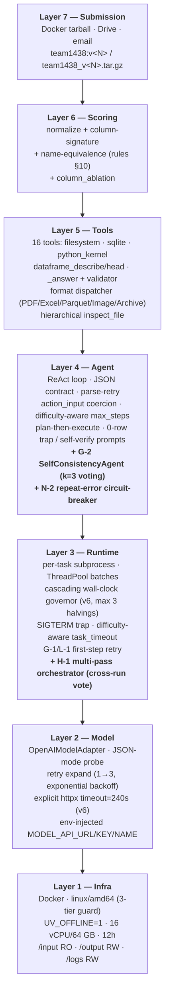
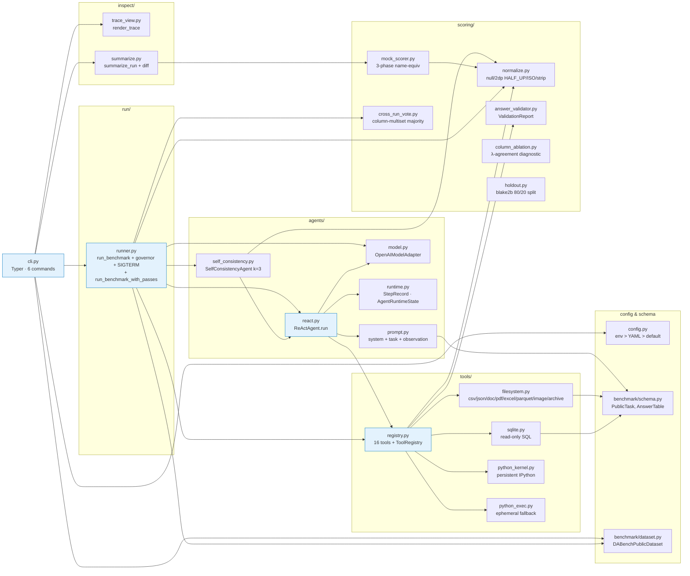
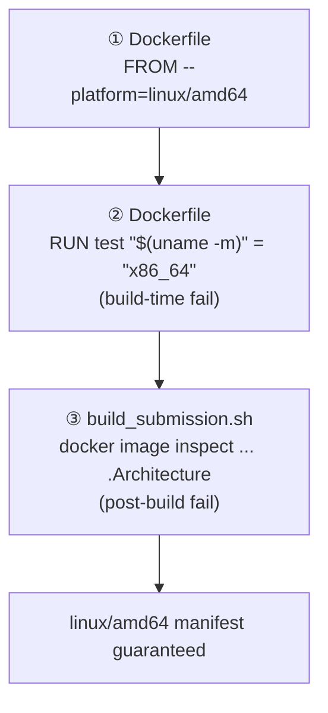
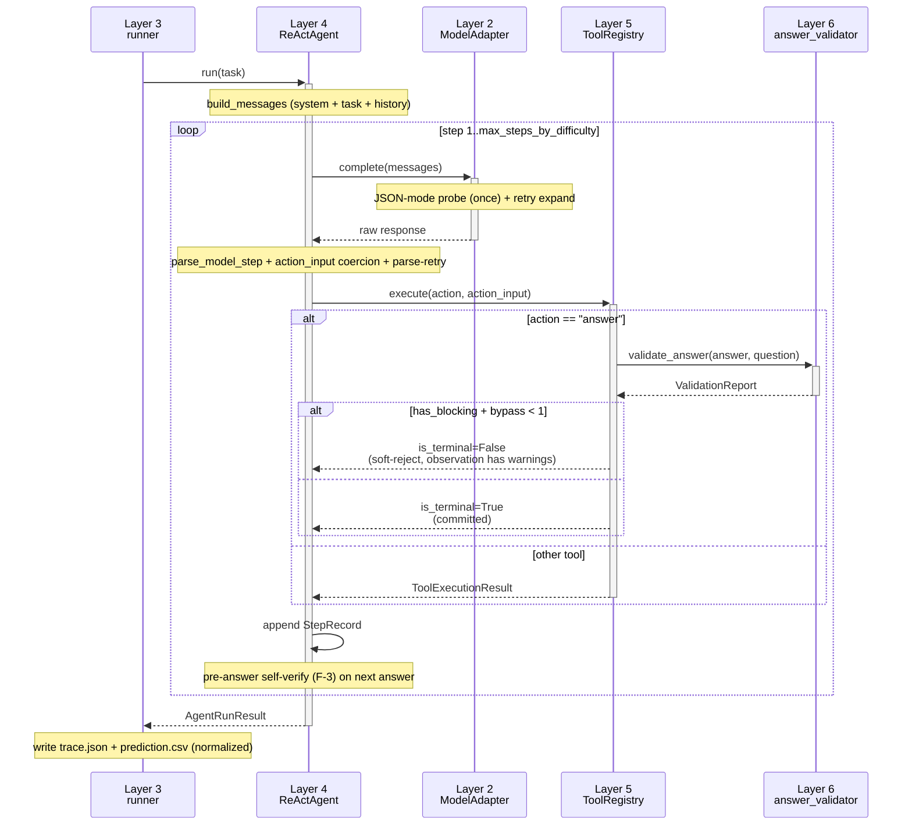

# Harness Structure — `data_agent_baseline`

> 🌐 **Language**: **English** · [한국어](HARNESS_STRUCTURE.ko.md) · [中文](HARNESS_STRUCTURE.zh.md)

> Living document — keep this in lock-step with the codebase; bump it whenever a patch round lands.
> Last updated: 2026-05-11 (v3 — consolidated round on top of v2: memory layer M-1~M-5, multi-pass voting H-1, streaming JSON H-3, error pattern memory N-1, repeat-error guard N-2, pre-flight task brief N-3, plus G-1~G-3 / K-1 / L-1 runtime polish)

ReAct agent harness for the KDD Cup 2026 DataAgent-Bench challenge. Seven logical layers + build/eval automation + visibility tools. Each layer is unaware of layers above it and depends only on layers below (single-direction dependency).

For data and execution sequence diagrams see [`SYSTEM_FLOW.md`](SYSTEM_FLOW.md). This document focuses on **structure (component graph + responsibility boundaries)**.

---

## 1. 7-Layer view (logical separation)



### Per-layer entry points

| Layer | Entry point |
|---|---|
| 7 | `scripts/build_submission.sh`, `submissions/team1438_v<N>.tar.gz` |
| 6 | `src/data_agent_baseline/scoring/{normalize,mock_scorer,answer_validator,column_ablation,holdout,cross_run_vote}.py` |
| 5 | `src/data_agent_baseline/tools/{registry,filesystem,sqlite,python_exec,python_kernel,streaming_json}.py` |
| 4 | `src/data_agent_baseline/agents/{react,prompt,model,runtime,self_consistency}.py` |
| 4m | `src/data_agent_baseline/memory/{task_shape,policies,learnings,recorder,error_patterns,task_brief}.py` (memory layer M-1~M-5 + error pattern N-1~N-3 + pre-flight brief) |
| 3 | `src/data_agent_baseline/run/runner.py` (`run_benchmark` + `run_benchmark_with_passes`) |
| 2 | `src/data_agent_baseline/agents/model.py:OpenAIModelAdapter` |
| 1 | `Dockerfile`, `configs/eval.yaml` (multi-pass enabled), `scripts/build_submission.sh` |

---

## 2. Component dependency graph (module level)



---

## 3. External communication — single-channel policy

```mermaid
flowchart LR
    container["v3 container<br/>(team1438:v3)"]
    qwen["MODEL_API_URL<br/>(organizer's qwen3.5-35b-a3b)"]
    pypi["pypi.org<br/>~~uv side-effect~~"]
    other["Other LLM APIs<br/>(OpenAI/Anthropic/HF)"]

    container -->|allowed (rule §runtime §4)| qwen
    container -.->|<b>blocked by UV_OFFLINE=1</b>| pypi
    container -.->|<b>0 grep hits in src/</b>| other

    classDef allowed fill:#c8e6c9,stroke:#2e7d32;
    classDef blocked fill:#ffcdd2,stroke:#c62828;
    class qwen allowed;
    class pypi,other blocked;
```

Verification grep:
- direct imports of `requests` / `urllib` / `httpx` / `aiohttp` → **0 hits**
- `anthropic` / `cohere` / `together` / external LLM SDK → **0 hits**
- socket / curl / wget subprocess → **0 hits**
- hardcoded external domain URLs → **0 hits**
- `os.environ[MODEL_*] = …` env mutation → **0 hits**
- legitimate call: `openai` SDK in one location (`agents/model.py`) — only to `MODEL_API_URL`

---

## 4. Build + verify + submit pipeline

```mermaid
flowchart LR
    src[src/<br/>+ configs/eval.yaml]
    build["bash scripts/build_submission.sh v&lt;N&gt;<br/>docker buildx --platform linux/amd64"]
    img[(team1438:v&lt;N&gt;<br/>linux/amd64<br/>UV_OFFLINE=1)]
    tar[(submissions/team1438_v&lt;N&gt;.tar.gz<br/>≤ 10 GB)]
    eval["docker run --rm --platform linux/amd64<br/>(local_eval.sh or direct)"]
    out[artifacts/eval_full_v&lt;N&gt;/output/<br/>task_&lt;id&gt;/{prediction.csv, trace.json}]
    score["mock_scorer<br/>(λ ∈ {0.05, 0.10, 0.20})"]
    inspect["dabench inspect-trace<br/>dabench summarize-traces --diff"]
    drive[Google Drive<br/>+ organizer email]

    src --> build
    build --> img
    img --> tar
    img --> eval
    eval --> out
    out --> score
    out --> inspect
    tar --> drive
    score -->|on ship-gate pass| drive
```

### 3-tier arch guard



---

## 5. ReAct agent: per-task processing flow



---

## 5b. Multi-pass orchestration (H-1)

When `repeat_max > 1`, `run_benchmark_with_passes` runs the same task set N times and uses cross-run vote to decide the final answer per task. The first pass is always preserved → even if the voter fails or budget runs out, the system never regresses below single-pass.

```mermaid
flowchart TB
    start["dabench run-benchmark<br/>(eval.yaml: repeat_max=3, pass_safety_margin=1.3)"]
    pass0["pass 0 (run_benchmark)<br/>output_dir/_runs/run_0/task_*/"]
    chk0{"remaining_budget<br/>&gt; last_pass × 1.3 ?"}
    pass1["pass 1<br/>output_dir/_runs/run_1/"]
    chk1{"remaining_budget<br/>&gt; last_pass × 1.3 ?"}
    pass2["pass 2<br/>output_dir/_runs/run_2/"]
    vote["cross_run_vote.vote_across_runs<br/>(column-multiset majority,<br/>tie-break to earliest pass)"]
    fallback["_fallback_copy_pass<br/>(copies pass 0 if voter raises)"]
    final[output_dir/task_&lt;id&gt;/<br/>prediction.csv (final)]

    start --> pass0 --> chk0
    chk0 -->|yes| pass1 --> chk1
    chk0 -->|no / repeat_max reached| vote
    chk1 -->|yes| pass2 --> vote
    chk1 -->|no / repeat_max reached| vote
    vote --> final
    vote -.exception.-> fallback --> final

    classDef pass fill:#e8f5e9,stroke:#2e7d32;
    classDef vote fill:#fff8e1,stroke:#f57c00;
    classDef safe fill:#ffebee,stroke:#c62828;
    class pass0,pass1,pass2 pass;
    class vote vote;
    class fallback safe;
```

**Voting key.** For each task's `prediction.csv`, compute per-column `scoring.normalize.column_signature` (a value multiset), then freeze the multiset of signatures via `frozenset(Counter(...).items())` for use as a hashable bucket key. This is **identical** to the column-multiset semantics the scorer uses.

**Tie-break.** When buckets have equal size, the bucket containing the earliest pass wins. Therefore **if every pass disagrees, pass 0 wins** = worst case degrades to single-pass behaviour.

**Budget guard.** At the end of each pass:
- If `repeat_max` reached → stop.
- If `wall_clock_budget_seconds` is None or ≤ 0 → unlimited (run all configured passes).
- Otherwise: if `(budget − elapsed_total) < last_pass_duration × pass_safety_margin` → don't start the next pass → first pass preserved.

**runtime.log events** (analyzable by visibility tools):
- `multi_pass_start` — repeat_max / margin / budget recorded
- `multi_pass_iteration_done` — pass_index + duration + elapsed_total
- `multi_pass_early_stop` — reason (remaining budget / margin etc.)
- `multi_pass_vote_failed` — fallback fired
- `multi_pass_end` — completed_passes / unanimous_tasks / split_tasks / missing_in_all

---

## 6. Visibility tools — post-mortem flow

```mermaid
flowchart LR
    subgraph artifacts [artifacts/eval_full_v&lt;N&gt;/]
        traces[output/task_&lt;id&gt;/trace.json]
        preds[output/task_&lt;id&gt;/prediction.csv]
        log[logs/runtime.log JSONL]
    end

    insp["dabench inspect-trace &lt;task_id&gt;<br/>(single-trace colored step view)"]
    summ["dabench summarize-traces<br/>(50-task categorization)"]

    traces --> insp
    traces --> summ
    preds --> summ

    insp --> single[Rich console panel:<br/>step-by-step thought/action/obs<br/>+ gold comparison]
    summ --> report[failure bucket<br/>+ soft-reject codes<br/>+ tool freq<br/>+ score by difficulty<br/>+ recovered/regressed (--diff)]

    classDef tool fill:#fff8e1,stroke:#f57c00;
    class insp,summ tool;
```

---

## 7. Rules compliance — single matrix

A bird's-eye view of which rule each layer satisfies. (Verbatim matrix is in [`../README.md`](../README.md) §3.)

| Rule category (skill) | Satisfying layer |
|---|---|
| `kddcup-rules-runtime` (mounts, env, network) | Layer 1 (Dockerfile, configs/eval.yaml) |
| `kddcup-rules-compute` (CPU/RAM/12h/SIGTERM/amd64) | Layer 1 + Layer 3 (governor + SIGTERM trap) |
| `kddcup-rules-model` (qwen mandated, no hardcode) | Layer 2 (env > YAML > default empty string) |
| `kddcup-rules-submission` (image naming / 10 GB / 1/day) | Layer 7 (build_submission.sh + SUBMISSION_LOG.md) |
| `kddcup-rules-output` (CSV / normalization / name-equiv) | Layer 6 (normalize + mock_scorer) + Layer 5 (`_answer` handler) |
| `kddcup-rules-prohibitions` (no external calls / no probing) | All layers (code grep + every submission a real improvement) |

---

## 8. Change log (per round)

| Round | Change | sha256 (tarball) |
|---|---|---|
| Phase 0 | normalize + mock_scorer + holdout (starter-kit rewrite) | — |
| Phase 1.0 | knowledge.md inject, persistent IPython kernel, dataframe prepass | — |
| Phase 2.0 | JSON-mode probe, difficulty max_steps, governor, parse-retry, plan-then-execute | — |
| Phase 3 substrate | answer_validator, conditional terminal, name-equiv, column_ablation, doc auto-inject | — |
| §3.1-§3.5 | format dispatcher (PDF/Excel/Parquet/Image/Archive), size-aware streaming, hierarchical inspect_file, domain sanity | — |
| **v1** (submitted) | First submission — eval failed due to arm64 manifest issue | (discarded) |
| **v2** (submitted) | First successful eval after linux/amd64 cross-build | leaderboard **0.3386** |
| **v3** (submitted) | Consolidated round on top of v2: **G-1** transient retry hint, **G-2** SelfConsistencyAgent k=3 (hard/extreme), **G-3** knowledge.md 5000-char + question-keyword H2/H3 reorder, **H-1** multi-pass orchestrator + cross-run vote (`repeat_max=3`, `pass_safety_margin=1.1`), **H-3** streaming JSON tools, **K-1** size-aware reader chunking, **L-1** tier-aware retry skip, **memory layer M-1~M-5** (TaskShape + ShapePolicy + learnings.json + recorder + `dabench update-learnings`), **N-1** error pattern memory (`error_patterns.json`), **N-2** in-loop repeat-error circuit-breaker, **N-3** pre-flight task brief | tarball `team1438_v3.tar.gz` sha256 `1bb11bac62010faf21ef16a5163d8bbdb258f7344a55c47ea42a80747db64a09` (mock 0.7254 single-pass, 31 perfect on the 49-task subset; multi-pass voting in production) |

---

## 9. Backlog / deferred

| Candidate | Effect | Why deferred |
|---|---|---|
| H-2 extend SC to medium tier | absorb medium-tier variance | H-1 cross-run vote provides equivalent effect more safely |
| H-3 long-tail extreme task fix (task_352/396/418) | consistently fail every run | needs streaming JSON parser + execute_python helper (medium effort) |
| Plan §C steps.jsonl streaming | per-task progress during eval | inspect-trace handles post-mortem |
| Plan §D token/latency metrics | LLM cost visibility | no score impact |
| OneDrive subprocess hang fix (task_418) | dodge SIGKILL-resistant D-state | likely irrelevant in eval env (no OneDrive mount) |

---

## 10. Update policy

This document is the **single source of truth for harness structure**. Update points:
- After a new round merges (update §8 table + relevant layer-diagram labels)
- New layer / module added (update §2 dependency graph)
- Compliance matrix changes (§7)
- Leaderboard score arrives (§8 sha256 / score columns)

Related docs (English):
- [`../README.md`](../README.md) — Project overview + verbatim rules-compliance matrix
- [`SYSTEM_ARCHITECTURE.md`](SYSTEM_ARCHITECTURE.md) — 7-Layer + multi-pass + voting unified one-screen view (v3 round)
- [`SYSTEM_FLOW.md`](SYSTEM_FLOW.md) — data flow / execution sequence (8+ mermaid)
- [`ARCHITECTURE.md`](ARCHITECTURE.md) — Code walkthrough (human-oriented)
- [`DATA_ANALYSIS.md`](DATA_ANALYSIS.md) — 50-task statistics + failure modes
- [`SUBMISSION_LOG.md`](SUBMISSION_LOG.md) — Submission history + budget tracker
- `.claude/skills/kddcup-*` — 12 KDD Cup skill packs
