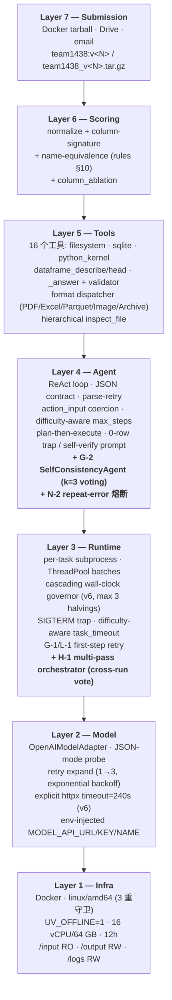
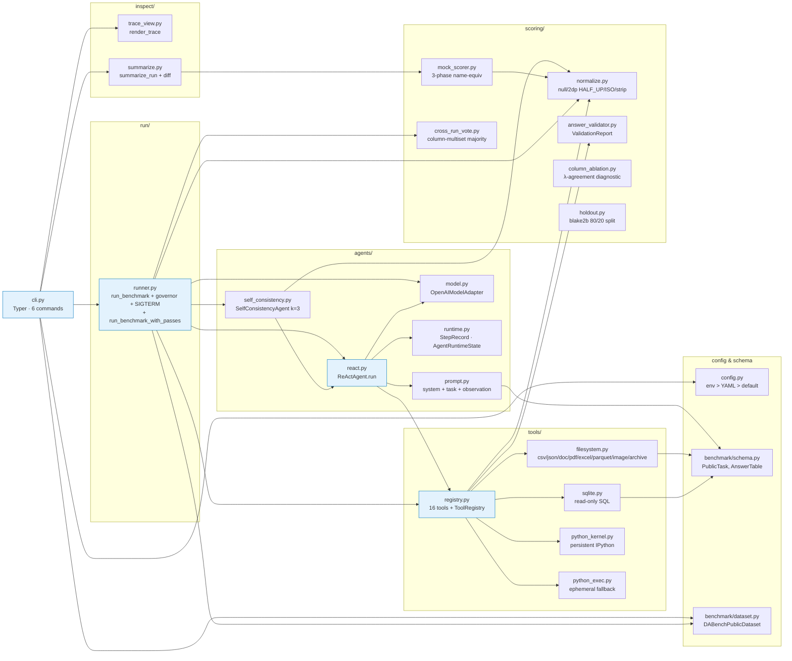
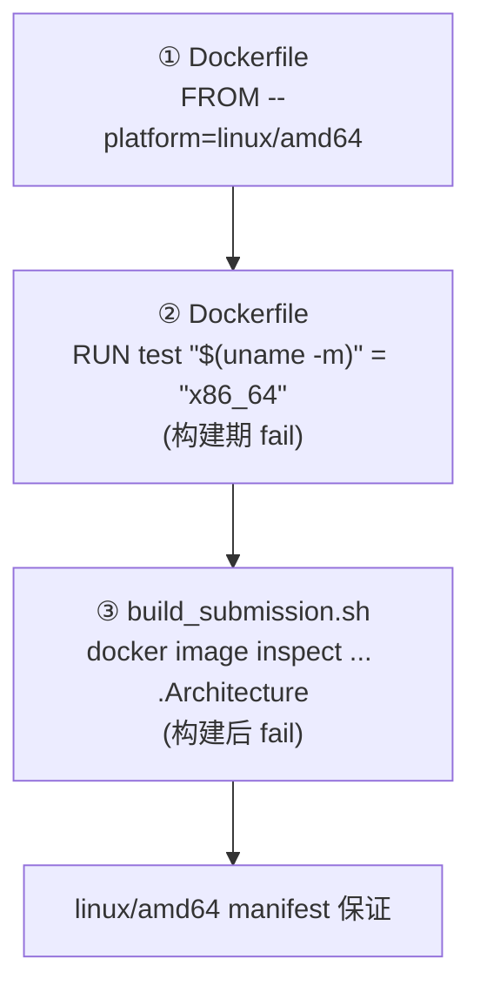
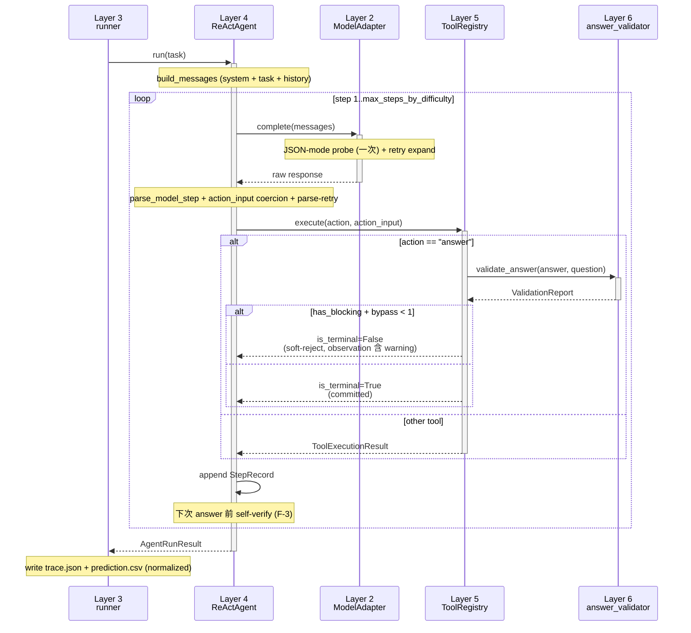

# Harness 结构 — `data_agent_baseline`

> 🌐 **Language**: [English](HARNESS_STRUCTURE.md) · [한국어](HARNESS_STRUCTURE.ko.md) · **中文**

> 活文档 — 与代码库保持锁步;每个 patch 轮次合并时同步更新。
> 最近更新: 2026-05-11 (v3 — 在 v2 baseline 上的合并轮次:记忆层 M-1~M-5, multi-pass voting H-1, streaming JSON H-3, error pattern 记忆 N-1, repeat-error guard N-2, pre-flight task brief N-3,以及 G-1~G-3 / K-1 / L-1 运行时润色)

KDD Cup 2026 DataAgent-Bench 挑战的 ReAct 智能体框架。7 个逻辑层 + 构建/评测自动化 + 可观测工具。每层不知上层、只依赖下层 (单向依赖)。

数据流与执行时序图见 [`SYSTEM_FLOW.zh.md`](SYSTEM_FLOW.zh.md)。本文专注于 **结构 (组件依赖图 + 职责边界)**。

---

## 1. 7-Layer 视图 (逻辑分离)



### 各层入口点

| Layer | 入口点 |
|---|---|
| 7 | `scripts/build_submission.sh`, `submissions/team1438_v<N>.tar.gz` |
| 6 | `src/data_agent_baseline/scoring/{normalize,mock_scorer,answer_validator,column_ablation,holdout,cross_run_vote}.py` |
| 5 | `src/data_agent_baseline/tools/{registry,filesystem,sqlite,python_exec,python_kernel}.py` |
| 4 | `src/data_agent_baseline/agents/{react,prompt,model,runtime,self_consistency}.py` |
| 3 | `src/data_agent_baseline/run/runner.py` (`run_benchmark` + `run_benchmark_with_passes`) |
| 2 | `src/data_agent_baseline/agents/model.py:OpenAIModelAdapter` |
| 1 | `Dockerfile`, `configs/eval.yaml` (multi-pass enabled), `scripts/build_submission.sh` |

---

## 2. 组件依赖图 (模块级)



---

## 3. 外部通信 — 单通道策略

```mermaid
flowchart LR
    container["v3 容器<br/>(team1438:v3)"]
    qwen["MODEL_API_URL<br/>(主办方 qwen3.5-35b-a3b)"]
    pypi["pypi.org<br/>~~uv 副作用~~"]
    other["其他 LLM API<br/>(OpenAI/Anthropic/HF)"]

    container -->|允许 (规则 §runtime §4)| qwen
    container -.->|<b>UV_OFFLINE=1 阻断</b>| pypi
    container -.->|<b>src/ 中 grep 命中=0</b>| other

    classDef allowed fill:#c8e6c9,stroke:#2e7d32;
    classDef blocked fill:#ffcdd2,stroke:#c62828;
    class qwen allowed;
    class pypi,other blocked;
```

验证 grep:
- 直接 import `requests` / `urllib` / `httpx` / `aiohttp` → **0 命中**
- `anthropic` / `cohere` / `together` / 外部 LLM SDK → **0 命中**
- socket / curl / wget subprocess → **0 命中**
- 硬编码外部域名 URL → **0 命中**
- `os.environ[MODEL_*] = …` env 篡改 → **0 命中**
- 合法调用: `agents/model.py` 中 `openai` SDK 一处 — 仅向 `MODEL_API_URL`

---

## 4. 构建 + 验证 + 提交流水线

```mermaid
flowchart LR
    src[src/<br/>+ configs/eval.yaml]
    build["bash scripts/build_submission.sh v&lt;N&gt;<br/>docker buildx --platform linux/amd64"]
    img[(team1438:v&lt;N&gt;<br/>linux/amd64<br/>UV_OFFLINE=1)]
    tar[(submissions/team1438_v&lt;N&gt;.tar.gz<br/>≤ 10 GB)]
    eval["docker run --rm --platform linux/amd64<br/>(local_eval.sh 或直接)"]
    out[artifacts/eval_full_v&lt;N&gt;/output/<br/>task_&lt;id&gt;/{prediction.csv, trace.json}]
    score["mock_scorer<br/>(λ ∈ {0.05, 0.10, 0.20})"]
    inspect["dabench inspect-trace<br/>dabench summarize-traces --diff"]
    drive[Google Drive<br/>+ 主办方邮件]

    src --> build
    build --> img
    img --> tar
    img --> eval
    eval --> out
    out --> score
    out --> inspect
    tar --> drive
    score -->|ship gate 通过时| drive
```

### 3 重 arch 守卫



---

## 5. ReAct 智能体: per-task 处理流



---

## 5b. Multi-pass 编排 (H-1)

当 `repeat_max > 1` 时,`run_benchmark_with_passes` 把同一 task set 跑 N 次并通过 cross-run vote 决定每个 task 的最终答案。第一个 pass 始终保留 → 即使 voter 失败或 budget 用完,系统也不会退化到比 single-pass 更差。

```mermaid
flowchart TB
    start["dabench run-benchmark<br/>(eval.yaml: repeat_max=3, pass_safety_margin=1.3)"]
    pass0["pass 0 (run_benchmark)<br/>output_dir/_runs/run_0/task_*/"]
    chk0{"剩余 budget<br/>&gt; last_pass × 1.3 ?"}
    pass1["pass 1<br/>output_dir/_runs/run_1/"]
    chk1{"剩余 budget<br/>&gt; last_pass × 1.3 ?"}
    pass2["pass 2<br/>output_dir/_runs/run_2/"]
    vote["cross_run_vote.vote_across_runs<br/>(column-multiset majority,<br/>tie-break to earliest pass)"]
    fallback["_fallback_copy_pass<br/>(voter 异常时复制 pass 0)"]
    final[output_dir/task_&lt;id&gt;/<br/>prediction.csv (最终)]

    start --> pass0 --> chk0
    chk0 -->|是| pass1 --> chk1
    chk0 -->|否 / 已达 repeat_max| vote
    chk1 -->|是| pass2 --> vote
    chk1 -->|否 / 已达 repeat_max| vote
    vote --> final
    vote -.异常.-> fallback --> final

    classDef pass fill:#e8f5e9,stroke:#2e7d32;
    classDef vote fill:#fff8e1,stroke:#f57c00;
    classDef safe fill:#ffebee,stroke:#c62828;
    class pass0,pass1,pass2 pass;
    class vote vote;
    class fallback safe;
```

**Voting key.** 对每个 task 的 `prediction.csv`,按列计算 `scoring.normalize.column_signature` (值的 multiset),然后用 `frozenset(Counter(...).items())` 把 signature 集合冻结为可哈希的 bucket key。这与评分器使用的 column-multiset 语义 **完全一致**。

**Tie-break.** bucket 大小相同时,包含最早 pass 的 bucket 胜。因此 **若每个 pass 都不同,pass 0 胜** = 最坏情况降级到 single-pass。

**Budget guard.** 每个 pass 结束时:
- 已达 `repeat_max` → 停止
- `wall_clock_budget_seconds` 为 None 或 ≤ 0 → 无限 (执行所有 configured passes)
- 否则: 若 `(budget − elapsed_total) < last_pass_duration × pass_safety_margin` → 不开始下一 pass → 第一个 pass 保留

**runtime.log 事件** (可观测工具可分析):
- `multi_pass_start` — 记录 repeat_max / margin / budget
- `multi_pass_iteration_done` — pass_index + duration + elapsed_total
- `multi_pass_early_stop` — 原因 (剩余 budget / margin 等)
- `multi_pass_vote_failed` — fallback 触发
- `multi_pass_end` — completed_passes / unanimous_tasks / split_tasks / missing_in_all

---

## 6. 可观测工具 — 事后分析流

```mermaid
flowchart LR
    subgraph artifacts [artifacts/eval_full_v&lt;N&gt;/]
        traces[output/task_&lt;id&gt;/trace.json]
        preds[output/task_&lt;id&gt;/prediction.csv]
        log[logs/runtime.log JSONL]
    end

    insp["dabench inspect-trace &lt;task_id&gt;<br/>(单一 trace 彩色 step view)"]
    summ["dabench summarize-traces<br/>(50-task 分类)"]

    traces --> insp
    traces --> summ
    preds --> summ

    insp --> single[Rich console panel:<br/>step-by-step thought/action/obs<br/>+ gold 对比]
    summ --> report[failure bucket<br/>+ soft-reject codes<br/>+ tool freq<br/>+ score by difficulty<br/>+ recovered/regressed (--diff)]

    classDef tool fill:#fff8e1,stroke:#f57c00;
    class insp,summ tool;
```

---

## 7. 规则合规 — 单一矩阵

各层满足哪条规则的鸟瞰。(verbatim 矩阵在 [`../README.zh.md`](../README.zh.md) §3。)

| 规则类别 (skill) | 满足层 |
|---|---|
| `kddcup-rules-runtime` (mounts, env, network) | Layer 1 (Dockerfile, configs/eval.yaml) |
| `kddcup-rules-compute` (CPU/RAM/12h/SIGTERM/amd64) | Layer 1 + Layer 3 (governor + SIGTERM trap) |
| `kddcup-rules-model` (强制 qwen, 禁硬编码) | Layer 2 (env > YAML > default 空字符串) |
| `kddcup-rules-submission` (镜像命名 / 10 GB / 1 次/天) | Layer 7 (build_submission.sh + SUBMISSION_LOG.md) |
| `kddcup-rules-output` (CSV / 归一化 / name-equiv) | Layer 6 (normalize + mock_scorer) + Layer 5 (`_answer` handler) |
| `kddcup-rules-prohibitions` (禁外部调用 / 禁探测) | 所有层 (代码 grep + 每次提交都是真实改进) |

---

## 8. 变更日志 (按轮次)

| 轮次 | 变更 | sha256 (tarball) |
|---|---|---|
| Phase 0 | normalize + mock_scorer + holdout (starter-kit 重写) | — |
| Phase 1.0 | knowledge.md inject, persistent IPython kernel, dataframe prepass | — |
| Phase 2.0 | JSON-mode probe, difficulty max_steps, governor, parse-retry, plan-then-execute | — |
| Phase 3 | answer_validator, conditional terminal, name-equiv, column_ablation, doc auto-inject | — |
| §3.1-§3.5 | format dispatcher (PDF/Excel/Parquet/Image/Archive), size-aware streaming, hierarchical inspect_file, domain sanity | — |
| **v1** (已提交) | 首次提交 — arm64 manifest 问题导致评测失败 | (废弃) |
| **v2** (已提交) | linux/amd64 cross-build 后首次成功评测 | leaderboard **0.3386** |
| **v3** (已提交) | v2 上的合并轮次:**G-1** transient retry hint, **G-2** SelfConsistencyAgent k=3 (hard/extreme), **G-3** knowledge.md 5000 字符 + question-keyword H2/H3 重排, **H-1** multi-pass orchestrator + cross-run vote (`repeat_max=3`, `pass_safety_margin=1.1`), **H-3** streaming JSON 工具, **K-1** size-aware reader chunking, **L-1** tier-aware retry skip, **记忆层 M-1~M-5** (TaskShape + ShapePolicy + learnings.json + recorder + `dabench update-learnings`), **N-1** 错误模式记忆 (`error_patterns.json`), **N-2** in-loop 重复错误熔断, **N-3** pre-flight task brief | tarball `team1438_v3.tar.gz` sha256 `1bb11bac62010faf21ef16a5163d8bbdb258f7344a55c47ea42a80747db64a09` (mock 0.7254 single-pass,49 task 子集 31 perfect;production 使用 multi-pass voting) |

---

## 9. 待办 / 推迟

| 候选 | 效果 | 推迟原因 |
|---|---|---|
| H-2 SC 扩展到 medium tier | 吸收 medium tier variance | H-1 cross-run vote 提供等效但更安全的方案 |
| H-3 long-tail extreme task fix (task_352/396/418) | 每次 run 都失败 | 需要 streaming JSON parser + execute_python helper (中等工作量) |
| Plan §C steps.jsonl streaming | 评测期间 per-task 进度追踪 | inspect-trace 处理事后分析 |
| Plan §D token/latency metrics | LLM 成本可见性 | 无分数影响 |
| OneDrive subprocess hang fix (task_418) | 规避 SIGKILL 不响应的 D-state | 评测环境无 OneDrive 挂载,可能无关 |

---

## 10. 更新政策

本文是 **harness 结构的唯一真理来源**。更新时机:
- 新轮次合并后 (更新 §8 表 + 相应层的图标签)
- 新增 layer / 模块 (更新 §2 依赖图)
- 合规矩阵变化 (§7)
- 收到 leaderboard 分数 (§8 sha256 / 分数列)

相关文档 (中文):
- [`../README.zh.md`](../README.zh.md) — 项目概览 + verbatim 规则合规矩阵
- [`SYSTEM_ARCHITECTURE.zh.md`](SYSTEM_ARCHITECTURE.zh.md) — 7-Layer + multi-pass + voting 一图概览 (v3 轮次)
- [`SYSTEM_FLOW.zh.md`](SYSTEM_FLOW.zh.md) — 数据流 / 执行时序 (8+ mermaid)
- [`ARCHITECTURE.zh.md`](ARCHITECTURE.zh.md) — 代码走读 (面向人)
- [`DATA_ANALYSIS.zh.md`](DATA_ANALYSIS.zh.md) — 50-task 统计 + 失败模式
- [`SUBMISSION_LOG.zh.md`](SUBMISSION_LOG.zh.md) — 提交历史 + 预算追踪
- `.claude/skills/kddcup-*` — 12 个 KDD Cup skill 包
