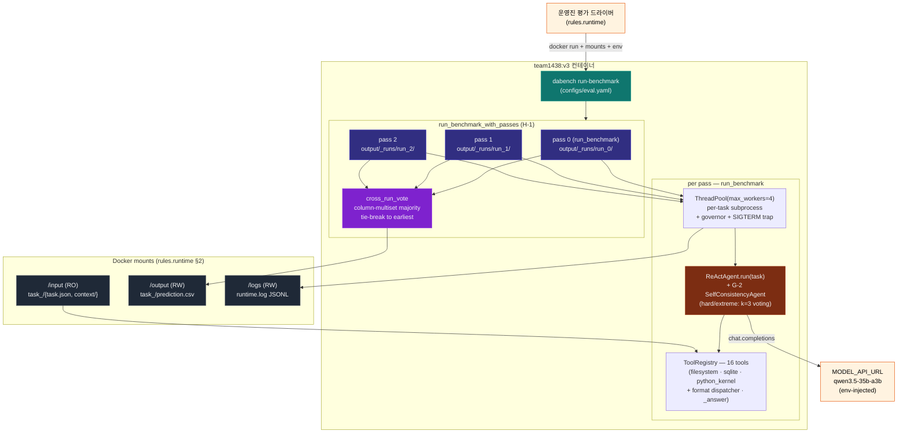
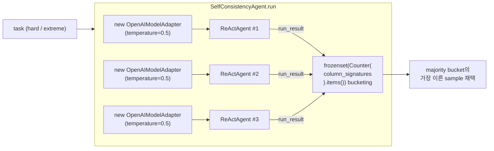

# DataAgent-Bench (team1438) — 시스템 아키텍처

> 🌐 **Language**: [English](SYSTEM_ARCHITECTURE.md) · **한국어** · [中文](SYSTEM_ARCHITECTURE.zh.md)

> 한 장면으로 시스템 전체를 설명. v3 라운드 (agent G/H/K/L + memory M + error N 패치 통합) 시점.
> 마지막 갱신: 2026-05-11 — 메모리 레이어 심화 포함: N-1 cross-run 에러 패턴 메모리, N-2 in-loop repeat-error 회로 차단기, N-3 결정적 pre-flight task brief.
>
> 자세한 코드는 `[ARCHITECTURE.ko.md](ARCHITECTURE.ko.md)`, mermaid 시퀀스 다이어그램 모음은 `[SYSTEM_FLOW.ko.md](SYSTEM_FLOW.ko.md)`, 레이어별 컴포넌트 graph는 `[HARNESS_STRUCTURE.ko.md](HARNESS_STRUCTURE.ko.md)`.

---

## 1. 한눈에




흐름 한 줄 요약: **운영진 → 우리 컨테이너 ENTRYPOINT → multi-pass orchestrator (3 pass × 50 task ReAct) → cross-run vote → /output flat layout**.

---

## 2. 7-Layer 단위 (단방향 의존)

```
Layer 7  Submission   tarball ≤ 10 GB · Drive · 운영진 메일
Layer 6  Scoring      normalize · column-signature · name-equiv · cross_run_vote
Layer 5  Tools        16 tools (filesystem/sqlite/python_kernel/_answer + format dispatcher)
Layer 4  Agent        ReAct loop · prompt · parse-retry · SelfConsistencyAgent (G-2)
Layer 3  Runtime      subprocess 격리 · ThreadPool · governor · SIGTERM · multi-pass orchestrator (H-1)
Layer 2  Model        OpenAIModelAdapter · JSON-mode probe · transient retry (G-1)
Layer 1  Infra        Docker linux/amd64 · UV_OFFLINE=1 · 16 vCPU/64 GB/12h
```

각 레이어는 위 레이어를 모르고 아래 레이어만 의존. 변경 시 인접 레이어만 lockstep으로 갱신. 자세한 매핑은 `[HARNESS_STRUCTURE.ko.md](HARNESS_STRUCTURE.ko.md)` §1.

---

## 3. v3 핵심 신규 컴포넌트

### 3.1 SelfConsistencyAgent (Layer 4 / G-2)

`agents/self_consistency.py`. hard / extreme 난이도 task에서 **task 단위 self-consistency**:




- **Voting key**: `column_signature` (`scoring/normalize.py`) — 채점기와 동일한 column-multiset 의미
- **Sample 격리**: pass별로 **별도 OpenAIModelAdapter 인스턴스** 생성 (queue position reset, JSON-mode probe state 새로고침)
- **k=1 collapse**: `repeat_max <= 1` 또는 `DABENCH_DISABLE_SELF_CONSISTENCY=1`로 단일 ReActAgent로 강제 가능 (테스트 / opt-out)
- **Tie-break**: 동일 size bucket이 여럿이면 가장 이른 sample 채택 → 결정적

### 3.2 Multi-pass Orchestrator (Layer 3 / H-1)

`run/runner.py:run_benchmark_with_passes`. 같은 task set을 N회 풀고 cross-run vote:

```
master_output_dir = /output (flat)
├── _runs/
│   ├── run_0/task_<id>/{prediction.csv, trace.json}
│   ├── run_1/...
│   └── run_2/...
└── task_<id>/prediction.csv  ← 채점기가 보는 voted final
```

#### 적응형 budget guard

```
for pass_idx in range(repeat_max):
    pass_started = perf_counter()
    run_benchmark(pass_config)
    last_pass_duration = perf_counter() - pass_started

    if pass_idx + 1 >= repeat_max: break
    if budget is None: continue
    elapsed_total = perf_counter() - multi_pass_started
    if (budget − elapsed_total) < last_pass_duration × pass_safety_margin:
        log multi_pass_early_stop; break
```

- 첫 pass는 **항상** 완료. 따라서 single-pass 대비 **회귀 불가**.
- `pass_safety_margin = 1.3`: 다음 pass가 30% 더 걸려도 안전한 여유.
- `repeat_max = 3` (eval.yaml). 12h budget 안에서 평소 3 pass 완주, hidden set이 매우 무거우면 자동 1-2 pass.

#### Voter fallback

`vote_across_runs`가 예외를 raise하면 `_fallback_copy_pass(pass_outputs[0], master_output_dir)`이 첫 pass의 prediction.csv를 master에 그대로 복사. → **voter 버그도 single-pass로 graceful degrade**.

### 3.3 cross_run_vote 모듈 (Layer 6)

`scoring/cross_run_vote.py`. 둘 이상의 prediction tree를 입력받아:

1. 각 task에 대해 모든 root에서 prediction.csv 로드
2. Column 단위 `column_signature` 계산 → `Counter(col_sigs)` → `frozenset` bucket key
3. 가장 큰 bucket 선택 (tie → bucket의 가장 이른 sample)
4. 채택된 prediction을 output_dir에 flat-copy
5. 모든 root에서 prediction 없는 task는 voted 결과에서도 missing

CLI로도 사용 가능 (host-side ensemble 측정용):

```bash
uv run python -m data_agent_baseline.scoring.cross_run_vote \
    --predictions-roots run_A/output run_B/output run_C/output \
    --output-dir voted/output
```

---

## 4. 외부 통신 — 단일 채널 정책 (변동 없음)

```mermaid
flowchart LR
    container["team1438:v3"]
    qwen["MODEL_API_URL<br/>(qwen3.5-35b-a3b)"]
    pypi["pypi.org<br/>~~UV_OFFLINE=1로 차단~~"]
    other["다른 LLM API"]

    container -->|허용 (rules.runtime §4)| qwen
    container -.->|UV_OFFLINE=1| pypi
    container -.->|코드 grep 0건| other
```


검증 grep 모두 0건 (rules.prohibitions §1, §3 만족):

- `requests` / `urllib` / `httpx` / `aiohttp`
- 외부 LLM SDK (anthropic, cohere, together)
- socket / curl / wget subprocess
- `os.environ[MODEL_*] = …` env 변조

합법 호출은 `agents/model.py`의 `openai` SDK 1곳뿐 — `MODEL_API_URL` 으로만.

---

## 5. v2 → v3 변경


| 영역                | v2 baseline                                                       | **v3**                                                         |
| ----------------- | ----------------------------------------------------------------- | -------------------------------------------------------------- |
| Agent retry       | `Connection error` / `Task timed out after` first-step retry      | + `Request timed out` (G-1), hard/extreme tier 재시도 skip (L-1)  |
| Hard/extreme tier | 단일 ReActAgent                                                     | **SelfConsistencyAgent k=3, temp=0.5** (G-2)                   |
| Knowledge.md      | 3000자 cap, prefix 절단                                              | 5000자 cap + question keyword H2/H3 reorder (G-3)               |
| Run mode          | 단일 pass                                                           | **multi-pass + cross-run vote** (`repeat_max=3`, H-1)          |
| Heavy reader      | 메모리 폭주 위험                                                          | streaming JSON via ijson (H-3) + size-aware chunking (K-1)     |
| Memory            | 없음                                                                | TaskShape 분류 + ShapePolicy + learnings.json + recorder (M-1~M-5) |
| Error pattern     | 없음                                                                | `error_patterns.json` cross-task aggregator + circuit-breaker + pre-flight brief (N-1~N-3) |
| 회귀 안전성            | 없음                                                                | `_fallback_copy_pass`로 voter 실패해도 pass 0 유지                    |
| runtime.log 새 이벤트 | —                                                                 | `multi_pass_{start,iteration_done,early_stop,vote_failed,end}` |


**제거된 v3 후보** (forensic 분석 후 폐기):

- ~~G-4 simulate-grader cue~~: hallucinated commit 가속 (forensic에서는 실제로는 단순 variance) — 제거
- ~~G-6 강제 0-row cue~~: 정당한 filter retry까지 차단 — 제거

---

## 6. 12h 컴퓨트 예산 분배

eval.yaml:

```yaml
wall_clock_budget_seconds: 43200    # 12h 합계 (rules.compute)
repeat_max: 3
pass_safety_margin: 1.1
```

운영 시나리오:


| 시나리오                                     | pass 수 | 사유                                                                |
| ---------------------------------------- | ------ | ----------------------------------------------------------------- |
| Hidden ≈ 50 task, 평소 페이스 (1 pass ≈ 1.5h) | **3**  | 4.5h, governor 발동 X                                               |
| Hidden ≈ 100 task, 평소 페이스                | 2-3    | 2 pass 6h, 3rd pass × 1.3 = 7.8h > 6h 잔여 → stop                   |
| Hidden 매우 무거움 (1 pass ≈ 6h)              | **1**  | 2nd pass × 1.3 = 7.8h > 6h 잔여 → stop. 단일 pass = single-run과 동일    |
| Pass 1 자체가 governor 발동                   | 1      | governor가 max_steps + timeout halve. 다음 pass 안 시작 (단일 pass 결과 유지) |


따라서 어떤 hidden set에서도 **최소 1회 완주 보장 + 가능하면 voting 적용**.

---

## 7. 관측 가능성 (observability)

### 7.1 RuntimeLogger 이벤트 (`/logs/runtime.log`, JSONL)

```
multi_pass_start          { repeat_max, pass_safety_margin, wall_clock_budget }
benchmark_start           { run_id (per pass), wall_clock_budget }   ← N번 반복
task_done                 { task_id, succeeded, elapsed_seconds, failure_reason, wrote_prediction }
governor_engaged          { remaining, avg_seen_seconds, governor_level } ← 매 cascade 발동 (v6: ≤3)
sigterm_received          { signum }                                  ← 컨테이너 종료 시
benchmark_end             { task_count, succeeded_task_count, ... }
multi_pass_iteration_done { pass_index, pass_duration_seconds, elapsed_total_seconds }
multi_pass_early_stop     { completed_passes, last_pass_duration, remaining_budget, safety_margin }
multi_pass_vote_failed    { error, fallback_pass }
multi_pass_end            { completed_passes, voted_tasks, unanimous_tasks, split_tasks, missing_in_all }
```

### 7.2 가시성 도구

```bash
# 단일 trace 컬러 step view + gold 비교
uv run dabench inspect-trace task_<id> \
    --predictions-root artifacts/eval_full_v3/output

# 50-task 카테고리화 + 이전 run과 diff
uv run dabench summarize-traces \
    --predictions-root artifacts/eval_full_v3/output \
    --gold-root data/public/output \
    --input-root data/public/input \
    --diff artifacts/eval_full_v2/output

# Cross-run host-side ensemble (배포는 컨테이너가 자동)
uv run python -m data_agent_baseline.scoring.cross_run_vote \
    --predictions-roots run_A/output run_B/output run_C/output \
    --output-dir voted/output
```

---

## 8. 룰 컴플라이언스 매트릭스 (요약)


| 룰 카테고리                                         | 만족 위치                                                                            |
| ---------------------------------------------- | -------------------------------------------------------------------------------- |
| `rules.runtime` (mounts/env/network)           | Layer 1 (Dockerfile, configs/eval.yaml)                                          |
| `rules.compute` (CPU/RAM/12h/SIGTERM/amd64)    | Layer 1 + Layer 3 (governor + SIGTERM trap + adaptive multi-pass guard)          |
| `rules.model` (qwen 강제, hardcode 금지)           | Layer 2 (env > YAML > default 빈 문자열 + 단일 모델 정책)                                  |
| `rules.submission` (이미지 네이밍 / ≤ 10 GB / 1일 1회) | Layer 7 (build_submission.sh + SUBMISSION_LOG.md)                                |
| `rules.output` (CSV / 정규화 / name-equiv)        | Layer 6 (normalize + mock_scorer + cross_run_vote) + Layer 5 (`_answer` handler) |
| `rules.prohibitions` (외부 호출 / probing 금지)      | 전 레이어 (코드 grep 검증 + 모든 제출 진짜 개선용)                                                |


verbatim 매트릭스는 `[../README.ko.md](../README.ko.md)` §3 참고.

---

## 9. 변경 시 갱신 정책

이 문서는 시스템 전체 architecture의 **단일 진입 그림**. 새 라운드 패치 머지 시:

1. §1 mermaid에 새 컴포넌트 추가 (필요 시)
2. §3 핵심 신규 컴포넌트에 라운드 신규 모듈 한 절 추가
3. §5 표에 v_n → v_{n+1} 변경점 한 행 추가
4. `[HARNESS_STRUCTURE.ko.md](HARNESS_STRUCTURE.ko.md)` §8 변경 이력에 sha256 / 점수 컬럼 갱신
5. `[SYSTEM_FLOW.ko.md](SYSTEM_FLOW.ko.md)`에 sequence 다이어그램 영향 시 갱신
6. `[SUBMISSION_LOG.ko.md](SUBMISSION_LOG.ko.md)`에 빌드 entry 추가

연관 문서 (한국어):

- `[../README.ko.md](../README.ko.md)` — 프로젝트 overview + 룰 컴플라이언스 verbatim
- `[HARNESS_STRUCTURE.ko.md](HARNESS_STRUCTURE.ko.md)` — 7-Layer + 컴포넌트 dependency graph + 라운드 변경 이력
- `[SYSTEM_FLOW.ko.md](SYSTEM_FLOW.ko.md)` — 데이터 흐름·실행 시퀀스 (mermaid 8개+)
- `[ARCHITECTURE.ko.md](ARCHITECTURE.ko.md)` — 코드 가이드 (사람용)
- `[DATA_ANALYSIS.ko.md](DATA_ANALYSIS.ko.md)` — 50-task 통계 + 실패 모드
- `[SUBMISSION_LOG.ko.md](SUBMISSION_LOG.ko.md)` — 제출 이력 + budget tracker
- `[../CLAUDE.ko.md](../CLAUDE.ko.md)` — AI 보조도구용 운영 매뉴얼
- `.claude/skills/kddcup-`* — 12 KDD Cup vocabulary

