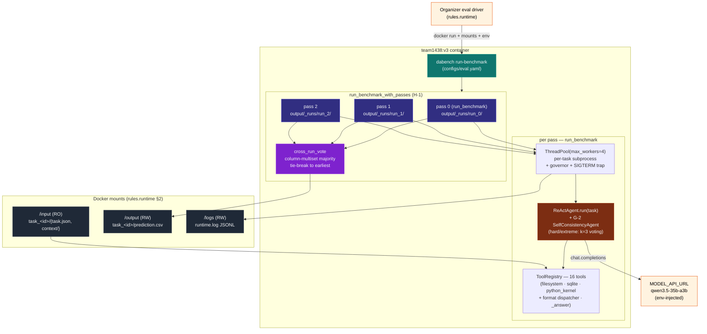
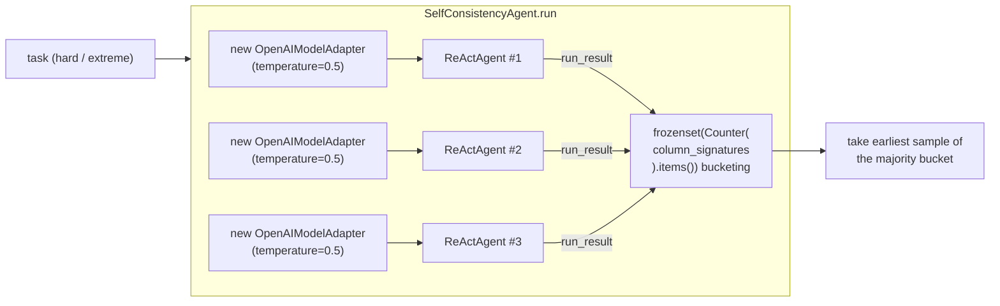

# DataAgent-Bench (team1438) — System Architecture

> 🌐 **Language**: **English** · [한국어](SYSTEM_ARCHITECTURE.ko.md) · [中文](SYSTEM_ARCHITECTURE.zh.md)

> One-screen view of the entire system as of the **v3 round** — a single consolidated build on top of v2 covering all of G-1~G-3 / H-1 / H-3 / K-1 / L-1 / M-1~M-5 / N-1~N-3.
> Last updated: 2026-05-11.
>
> For per-module code walk-through see [`ARCHITECTURE.md`](ARCHITECTURE.md); for sequence/flow diagrams see [`SYSTEM_FLOW.md`](SYSTEM_FLOW.md); for the layer-wise component graph and round-by-round change log see [`HARNESS_STRUCTURE.md`](HARNESS_STRUCTURE.md).

---

## 1. The whole system in one picture



One-line summary: **organizer → our container ENTRYPOINT → multi-pass orchestrator (3 pass × 50 task ReAct) → cross-run vote → /output flat layout**.

---

## 2. 7-Layer view (single-direction dependency)

```
Layer 7  Submission   tarball ≤ 10 GB · Drive · organizer email
Layer 6  Scoring      normalize · column-signature · name-equiv · cross_run_vote
Layer 5  Tools        16 tools (filesystem/sqlite/python_kernel/_answer + format dispatcher)
Layer 4  Agent        ReAct loop · prompt · parse-retry · SelfConsistencyAgent (G-2)
Layer 3  Runtime      subprocess isolation · ThreadPool · governor · SIGTERM · multi-pass orchestrator (H-1)
Layer 2  Model        OpenAIModelAdapter · JSON-mode probe · transient retry (G-1)
Layer 1  Infra        Docker linux/amd64 · UV_OFFLINE=1 · 16 vCPU/64 GB/12h
```

Each layer is unaware of layers above it and only depends on layers below. Changes only require lock-step updates to adjacent layers. Detailed mappings live in [`HARNESS_STRUCTURE.md`](HARNESS_STRUCTURE.md) §1.

---

## 3. v3 key new components

### 3.1 SelfConsistencyAgent (Layer 4 / G-2)

`agents/self_consistency.py`. Implements **per-task self-consistency** for hard / extreme difficulty:



- **Voting key**: `column_signature` (`scoring/normalize.py`) — same column-multiset semantics the official scorer uses.
- **Sample isolation**: each sample uses a **fresh OpenAIModelAdapter instance** (queue position reset, JSON-mode probe state refreshed).
- **k=1 collapse**: forced single ReActAgent via `repeat_max <= 1` or `DABENCH_DISABLE_SELF_CONSISTENCY=1` (test / opt-out path).
- **Tie-break**: among same-size buckets, the bucket containing the earliest sample wins → fully deterministic.

### 3.2 Multi-pass Orchestrator (Layer 3 / H-1)

`run/runner.py:run_benchmark_with_passes`. Runs the same task set N times then cross-run votes:

```
master_output_dir = /output (flat)
├── _runs/
│   ├── run_0/task_<id>/{prediction.csv, trace.json}
│   ├── run_1/...
│   └── run_2/...
└── task_<id>/prediction.csv  ← voted final, judged here
```

#### Adaptive budget guard

```
for pass_idx in range(repeat_max):
    pass_started = perf_counter()
    run_benchmark(pass_config)
    last_pass_duration = perf_counter() - pass_started

    if pass_idx + 1 >= repeat_max: break
    if budget is None: continue
    elapsed_total = perf_counter() - multi_pass_started
    if (budget − elapsed_total) < last_pass_duration × pass_safety_margin:
        log multi_pass_early_stop; break
```

- The first pass **always** completes — therefore the system is **regression-proof** vs single-pass.
- `pass_safety_margin = 1.3`: 30% slack so the next pass can overrun without busting the budget.
- `repeat_max = 3` (eval.yaml). Comfortable on a 50-task hidden set inside 12h; auto-degrades to 1–2 passes for very heavy hidden sets.

#### Voter fallback

If `vote_across_runs` raises, `_fallback_copy_pass(pass_outputs[0], master_output_dir)` copies pass 0's `prediction.csv` directly into the master tree. → **a voter bug also gracefully degrades to single-pass.**

### 3.3 cross_run_vote module (Layer 6)

`scoring/cross_run_vote.py`. Given two or more prediction trees:

1. For each task, load every available `prediction.csv` from each root.
2. Compute per-column `column_signature` → `Counter(col_sigs)` → `frozenset` bucket key.
3. Pick the largest bucket (tie → bucket containing the earliest pass).
4. Flat-copy the chosen prediction into `output_dir`.
5. Tasks missing in every root remain missing in the voted tree.

Also exposed as a CLI (used to measure host-side ensemble ceilings):

```bash
uv run python -m data_agent_baseline.scoring.cross_run_vote \
    --predictions-roots run_A/output run_B/output run_C/output \
    --output-dir voted/output
```

---

## 4. External communication — single-channel policy (unchanged)

```mermaid
flowchart LR
    container["team1438:v3"]
    qwen["MODEL_API_URL<br/>(qwen3.5-35b-a3b)"]
    pypi["pypi.org<br/>~~blocked by UV_OFFLINE=1~~"]
    other["Other LLM APIs"]

    container -->|allowed (rules.runtime §4)| qwen
    container -.->|UV_OFFLINE=1| pypi
    container -.->|0 grep hits in src/| other
```

Verification greps all return zero (rules.prohibitions §1, §3 satisfied):
- `requests` / `urllib` / `httpx` / `aiohttp`
- External LLM SDKs (anthropic, cohere, together)
- socket / curl / wget subprocess
- `os.environ[MODEL_*] = …` env mutation

The only legitimate outbound call is the `openai` SDK in `agents/model.py` — and only to `MODEL_API_URL`.

---

## 4c. v3 memory layer (M-1~M-5 + N-1~N-3)

`memory/` is the leaderboard-independent self-improvement substrate. Two persistent JSON files are bundled inside the container:

- `memory/learnings.json` (M-3) — shape-keyed `ShapePolicy` entries (timeout / max_steps multipliers, prompt hints, preferred / avoided tools).
- `memory/error_patterns.json` (N-1) — shape-keyed `(action, error_signature)` entries with hints, populated by the recorder from past `trace.json` failures. The runner injects the matching advisories into the task prompt at start so the agent doesn't repeat known failure modes.

Three runtime hooks consume the memory:

1. **`memory/task_shape.classify_task`** classifies each task into a hashable `TaskShape`.
2. **`memory/policies.resolve_policy`** picks the best matching `ShapePolicy` from `learnings.json` and surfaces timeout / max_steps multipliers + prompt hints.
3. **`memory/error_patterns.resolve_advisories`** picks matching error advisories from `error_patterns.json` and renders them as a one-paragraph hint block.

Plus two operational helpers in the same round:

- **`memory/task_brief.build_task_brief`** (N-3) — does a deterministic context-tree scan (CSV columns + row peek, SQLite tables / row counts, knowledge.md presence, join-key candidates derived from question token overlap). The output is inlined into the task prompt as a **Pre-flight task brief**, saving 1–2 early discovery steps.
- **`agents/react._last_consecutive_error_signature`** (N-2) — at every step the ReActAgent checks the tail of the trace; when ≥ 2 consecutive tool calls share the same error signature it inserts a one-line circuit-breaker into the next prompt: *"REPEATED ERROR: do NOT retry the same approach …"*. This breaks the loop where the agent keeps re-issuing the same broken SQL or Python expression.

Host-side recorder loop (after each public-set benchmark):

```
public-set run → trace.json
  → recorder collects per-task outcomes + step_errors
  → cluster_by_shape  → policy suggestions (numeric bumps = low-risk auto)
  → aggregate_error_patterns → merge into error_patterns.json
  → next container build picks both up automatically
```

No leaderboard signal is required — every public-set benchmark is a learning iteration.

---

## 5. What changed v2 → v3

| Area | v2 baseline | **v3** |
|---|---|---|
| Agent retry | `Connection error` / `Task timed out after` first-step retry only | + `Request timed out` (G-1), + tier-aware skip on hard/extreme subprocess timeouts (L-1) |
| Hard/extreme tier | single ReActAgent | **SelfConsistencyAgent k=3, temp=0.5** (G-2) |
| Knowledge.md | 3000-char cap, prefix truncation | 5000-char cap + question-keyword H2/H3 reorder (G-3) |
| Run mode | single pass | **multi-pass + cross-run vote** (`repeat_max=3`, `pass_safety_margin=1.1`, H-1) |
| Regression safety | none | **`_fallback_copy_pass` keeps pass 0 even if voter fails** — never worse than single-pass |
| Tools — large JSON | `read_json` (capped) only | **`streaming_json_*` (H-3)** via `ijson`, no size cap |
| Cross-task memory | no persistence | **`memory/learnings.json` + `memory/error_patterns.json`** bundled, recorder-fed |
| Runtime budget per task | static per-difficulty timeout | **shape-aware multipliers** from `ShapePolicy` (M-4) |
| In-loop error handling | observation feeds error back, but agent often retries the same broken call | **N-2 circuit-breaker** — 2 consecutive same-signature errors → "do NOT retry the same approach" cue before the next model turn |
| Pre-flight discovery | agent burns 1–2 early steps on `list_context` + schema reads | **`task_brief` (N-3)** runs a deterministic context-tree scan (CSV peek, SQLite tables, join-key candidates) and inlines a `Pre-flight task brief:` block before the question |
| Recorder | n/a | **`dabench update-learnings`** clusters per-task failures by shape and merges low-risk multiplier bumps + cross-task error patterns into the bundled JSONs |
| New runtime.log events | — | `multi_pass_{start,iteration_done,early_stop,vote_failed,end}` |

**v3 candidates rejected** (after forensic analysis):
- ~~"simulate the grader" cue~~: accelerated hallucinated commits — but post-revert measurements showed the regressions were just temperature=0 variance, not the patch itself. Removed.
- ~~strict 0-row override~~: blocked legitimate filter retries on case/whitespace mismatches. Removed.

Every future patch passes through multi-sample ablation before adoption — the round taught us that single-run comparisons mislead diagnosis when variance is ±3 perfect.

---

## 6. 12h compute budget allocation

eval.yaml:
```yaml
wall_clock_budget_seconds: 43200    # 12h total (rules.compute)
repeat_max: 3
pass_safety_margin: 1.1
```

Operating scenarios:

| Scenario | passes | reason |
|---|---|---|
| Hidden ≈ 50 tasks, normal pace (1 pass ≈ 1.5h) | **3** | 4.5h, governor stays asleep |
| Hidden ≈ 100 tasks, normal pace | 2-3 | pass 2 done at 6h; 3rd pass × 1.3 = 7.8h > 6h remaining → stop |
| Hidden very heavy (1 pass ≈ 6h) | **1** | 2nd pass × 1.3 = 7.8h > 6h remaining → stop. Equivalent to single-run. |
| Pass 1 itself triggers governor | 1 | governor cascades (v6: up to 3 halvings, re-evaluated every 5 tasks). Next pass not started (single-pass output preserved). |

Therefore the container **guarantees at least one full run for any hidden set + applies voting whenever feasible**.

---

## 7. Observability

### 7.1 RuntimeLogger events (`/logs/runtime.log`, JSONL)

```
multi_pass_start          { repeat_max, pass_safety_margin, wall_clock_budget }
benchmark_start           { run_id (per pass), wall_clock_budget }   ← repeated N times
task_done                 { task_id, succeeded, elapsed_seconds, failure_reason, wrote_prediction }
governor_engaged          { remaining, avg_seen_seconds, governor_level } ← each cascade (v6: ≤3)
sigterm_received          { signum }                                  ← on container shutdown
benchmark_end             { task_count, succeeded_task_count, ... }
multi_pass_iteration_done { pass_index, pass_duration_seconds, elapsed_total_seconds }
multi_pass_early_stop     { completed_passes, last_pass_duration, remaining_budget, safety_margin }
multi_pass_vote_failed    { error, fallback_pass }
multi_pass_end            { completed_passes, voted_tasks, unanimous_tasks, split_tasks, missing_in_all }
```

### 7.2 Visibility tools

```bash
# Single-trace colored step view + gold comparison
uv run dabench inspect-trace task_<id> \
    --predictions-root artifacts/eval_full_v3/output

# 50-task categorization + diff vs prior run
uv run dabench summarize-traces \
    --predictions-root artifacts/eval_full_v3/output \
    --gold-root data/public/output \
    --input-root data/public/input \
    --diff artifacts/eval_full_v2/output

# Cross-run host-side ensemble (in-container voting is automatic)
uv run python -m data_agent_baseline.scoring.cross_run_vote \
    --predictions-roots run_A/output run_B/output run_C/output \
    --output-dir voted/output
```

---

## 8. Rules compliance matrix (summary)

| Rule category | Where it is satisfied |
|---|---|
| `rules.runtime` (mounts/env/network) | Layer 1 (Dockerfile, configs/eval.yaml) |
| `rules.compute` (CPU/RAM/12h/SIGTERM/amd64) | Layer 1 + Layer 3 (governor + SIGTERM trap + adaptive multi-pass guard) |
| `rules.model` (qwen mandated, no hardcoding) | Layer 2 (env > YAML > default empty string + single-model policy) |
| `rules.submission` (image naming / ≤ 10 GB / 1/day) | Layer 7 (build_submission.sh + SUBMISSION_LOG.md) |
| `rules.output` (CSV / normalization / name-equiv) | Layer 6 (normalize + mock_scorer + cross_run_vote) + Layer 5 (`_answer` handler) |
| `rules.prohibitions` (no external calls / no probing) | All layers (code grep + every submission a real improvement) |

The verbatim matrix lives in [`../README.md`](../README.md) §3.

---

## 9. How to update this doc

This is the **single entry-point** for the system architecture. When a new round lands:

1. Add new component to the §1 mermaid (if applicable)
2. Add a new sub-section to §3 covering the round's new module
3. Add a row to the §5 table for v_n → v_{n+1}
4. Update [`HARNESS_STRUCTURE.md`](HARNESS_STRUCTURE.md) §8 (sha256 / score columns)
5. Update [`SYSTEM_FLOW.md`](SYSTEM_FLOW.md) if any sequence diagram is impacted
6. Add a build entry to [`SUBMISSION_LOG.md`](SUBMISSION_LOG.md)

Related docs (English):
- [`../README.md`](../README.md) — Project overview + verbatim rules-compliance matrix
- [`HARNESS_STRUCTURE.md`](HARNESS_STRUCTURE.md) — 7-Layer + component dependency graph + round-by-round change log
- [`SYSTEM_FLOW.md`](SYSTEM_FLOW.md) — Data/execution flow (8+ mermaid diagrams)
- [`ARCHITECTURE.md`](ARCHITECTURE.md) — Code walkthrough (human-oriented)
- [`DATA_ANALYSIS.md`](DATA_ANALYSIS.md) — 50-task statistics + failure modes
- [`SUBMISSION_LOG.md`](SUBMISSION_LOG.md) — Submission history + budget tracker
- [`../CLAUDE.md`](../CLAUDE.md) — Operating manual for AI assistants
- `.claude/skills/kddcup-*` — 12 KDD Cup skill packs
