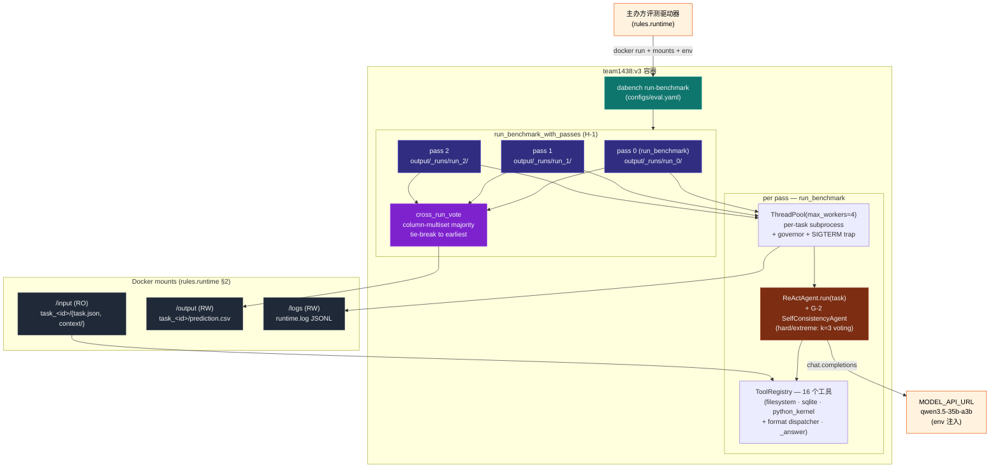
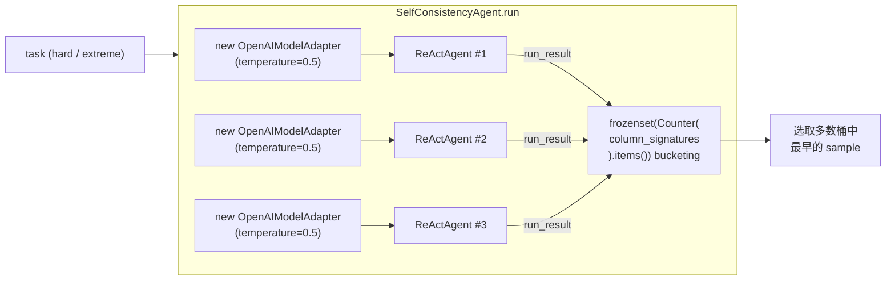

# DataAgent-Bench (team1438) — 系统架构

> 🌐 **Language**: [English](SYSTEM_ARCHITECTURE.md) · [한국어](SYSTEM_ARCHITECTURE.ko.md) · **中文**

> 一图概览整个系统,基于 **v3 轮次** (agent G/H/K/L + memory M + error N 修补集成)。
> 最近更新: 2026-05-11 — 包含记忆层加深:N-1 跨任务错误模式记忆、N-2 in-loop 重复错误熔断、N-3 确定性预飞 task brief。
>
> 模块级代码走读见 [`ARCHITECTURE.zh.md`](ARCHITECTURE.zh.md);时序/流程图见 [`SYSTEM_FLOW.zh.md`](SYSTEM_FLOW.zh.md);分层组件依赖图与轮次变更日志见 [`HARNESS_STRUCTURE.zh.md`](HARNESS_STRUCTURE.zh.md)。

---

## 1. 一张图看全系统



一句话总结:**主办方 → 我们的容器 ENTRYPOINT → multi-pass orchestrator (3 pass × 50 task ReAct) → cross-run vote → /output flat layout**。

---

## 2. 7 层视图(单向依赖)

```
Layer 7  Submission   tarball ≤ 10 GB · Drive · 主办方邮件
Layer 6  Scoring      normalize · column-signature · name-equiv · cross_run_vote
Layer 5  Tools        16 个工具 (filesystem/sqlite/python_kernel/_answer + format dispatcher)
Layer 4  Agent        ReAct loop · prompt · parse-retry · SelfConsistencyAgent (G-2)
Layer 3  Runtime      subprocess 隔离 · ThreadPool · governor · SIGTERM · multi-pass orchestrator (H-1)
Layer 2  Model        OpenAIModelAdapter · JSON-mode probe · transient retry (G-1)
Layer 1  Infra        Docker linux/amd64 · UV_OFFLINE=1 · 16 vCPU/64 GB/12h
```

每层不知上层、只依赖下层。变更时只需对相邻层做 lock-step 更新。详细映射见 [`HARNESS_STRUCTURE.zh.md`](HARNESS_STRUCTURE.zh.md) §1。

---

## 3. v3 关键新组件

### 3.1 SelfConsistencyAgent (Layer 4 / G-2)

`agents/self_consistency.py`。在 hard / extreme 难度任务上实现 **task 级 self-consistency**:



- **投票键**:`column_signature` (`scoring/normalize.py`) — 与官方评分器使用的 column-multiset 语义一致。
- **Sample 隔离**:每个 sample 使用 **新的 OpenAIModelAdapter 实例** (queue position 重置、JSON-mode probe 状态刷新)。
- **k=1 collapse**:通过 `repeat_max <= 1` 或 `DABENCH_DISABLE_SELF_CONSISTENCY=1` 强制单 ReActAgent (测试 / opt-out)。
- **Tie-break**:同 size 桶之间,包含最早 sample 的桶胜 → 完全确定性。

### 3.2 Multi-pass Orchestrator (Layer 3 / H-1)

`run/runner.py:run_benchmark_with_passes`。把同一个 task set 跑 N 遍后做 cross-run vote:

```
master_output_dir = /output (flat)
├── _runs/
│   ├── run_0/task_<id>/{prediction.csv, trace.json}
│   ├── run_1/...
│   └── run_2/...
└── task_<id>/prediction.csv  ← voted final,评分器从这里读取
```

#### 自适应预算 guard

```
for pass_idx in range(repeat_max):
    pass_started = perf_counter()
    run_benchmark(pass_config)
    last_pass_duration = perf_counter() - pass_started

    if pass_idx + 1 >= repeat_max: break
    if budget is None: continue
    elapsed_total = perf_counter() - multi_pass_started
    if (budget − elapsed_total) < last_pass_duration × pass_safety_margin:
        log multi_pass_early_stop; break
```

- 第一个 pass **总是**完成 — 因此对 single-pass **不可能回归**。
- `pass_safety_margin = 1.1`:10% 余量,允许下一 pass 超时少量。
- `repeat_max = 3` (eval.yaml)。在 12h 内对 50-task hidden set 舒适完成 3 次;遇到极重的 hidden set 自动降级到 1-2 次。

#### Voter fallback

如果 `vote_across_runs` 抛异常,`_fallback_copy_pass(pass_outputs[0], master_output_dir)` 会把 pass 0 的 `prediction.csv` 直接复制到 master 树中。→ **voter bug 也优雅降级到 single-pass。**

### 3.3 cross_run_vote 模块 (Layer 6)

`scoring/cross_run_vote.py`。给定两个或多个 prediction tree:

1. 对每个 task,从每个 root 加载所有可用的 `prediction.csv`。
2. 计算每列的 `column_signature` → `Counter(col_sigs)` → `frozenset` bucket key。
3. 选最大的桶 (tie → 包含最早 pass 的桶)。
4. 把选中的 prediction flat-copy 到 `output_dir`。
5. 在所有 root 都缺失的 task,在 voted tree 中也缺失。

也可作为 CLI 使用 (用于测量 host-side ensemble 上限):

```bash
uv run python -m data_agent_baseline.scoring.cross_run_vote \
    --predictions-roots run_A/output run_B/output run_C/output \
    --output-dir voted/output
```

---

## 4. 外部通信 — 单通道策略 (未变)

```mermaid
flowchart LR
    container["team1438:v3"]
    qwen["MODEL_API_URL<br/>(qwen3.5-35b-a3b)"]
    pypi["pypi.org<br/>~~UV_OFFLINE=1 阻断~~"]
    other["其它 LLM API"]

    container -->|允许 (rules.runtime §4)| qwen
    container -.->|UV_OFFLINE=1| pypi
    container -.->|src/ grep 命中数=0| other
```

验证 grep 全部为 0 (满足 rules.prohibitions §1, §3):
- `requests` / `urllib` / `httpx` / `aiohttp`
- 外部 LLM SDK (anthropic, cohere, together)
- socket / curl / wget subprocess
- `os.environ[MODEL_*] = …` env 篡改

唯一合法的对外调用是 `agents/model.py` 中的 `openai` SDK — 且只能调用 `MODEL_API_URL`。

---

## 5. v2 → v3 变更

| 领域 | v2 baseline | **v3** |
|---|---|---|
| Agent retry | `Connection error` / `Task timed out after` first-step retry | + `Request timed out` (G-1), hard/extreme tier 跳过 subprocess 重试 (L-1) |
| Hard/extreme tier | 单一 ReActAgent | **SelfConsistencyAgent k=3, temp=0.5** (G-2) |
| Knowledge.md | 3000 字符 cap, prefix 截断 | 5000 字符 cap + question-keyword H2/H3 重排 (G-3) |
| Run mode | 单 pass | **multi-pass + cross-run vote** (`repeat_max=3`, H-1) |
| Heavy reader | 内存撑爆风险 | streaming JSON via ijson (H-3) + size-aware chunking (K-1) |
| Memory | 无 | TaskShape 分类 + ShapePolicy + learnings.json + recorder (M-1~M-5) |
| Error pattern | 无 | `error_patterns.json` 跨任务聚合 + circuit-breaker + pre-flight brief (N-1~N-3) |
| 回归安全 | 无 | `_fallback_copy_pass` 即使 voter 失败也保留 pass 0 |
| 新增 runtime.log 事件 | — | `multi_pass_{start,iteration_done,early_stop,vote_failed,end}` |

**被驳回的 v3 候选** (经法医分析后):
- ~~G-4 simulate-grader cue~~:加速幻觉提交 — 但去掉后回归相同任务,所以原因是 temperature=0 variance,不是该 patch 本身。移除。
- ~~G-6 强制 0-row cue~~:阻断了大小写/空格不匹配的合法 filter retry。移除。

---

## 6. 12h 计算预算分配

eval.yaml:
```yaml
wall_clock_budget_seconds: 43200    # 12h 合计 (rules.compute)
repeat_max: 3
pass_safety_margin: 1.1
```

运行场景:

| 场景 | passes | 原因 |
|---|---|---|
| Hidden ≈ 50 task,正常步速 (1 pass ≈ 1.5h) | **3** | 4.5h, governor 不触发 |
| Hidden ≈ 100 task,正常步速 | 2-3 | 第 2 pass 6h 完成;第 3 pass × 1.3 = 7.8h > 6h 剩余 → stop |
| Hidden 非常重 (1 pass ≈ 6h) | **1** | 第 2 pass × 1.3 = 7.8h > 6h 剩余 → stop。等同于 single-run。 |
| Pass 1 自身触发 governor | 1 | governor 把 max_steps + timeout 减半。下一 pass 不开始 (single-pass 输出保留)。 |

因此容器对任意 hidden set **保证至少跑完一次 + 在可行时进行 voting**。

---

## 7. 可观测性

### 7.1 RuntimeLogger 事件 (`/logs/runtime.log`, JSONL)

```
multi_pass_start          { repeat_max, pass_safety_margin, wall_clock_budget }
benchmark_start           { run_id (per pass), wall_clock_budget }   ← 重复 N 次
task_done                 { task_id, succeeded, elapsed_seconds, failure_reason, wrote_prediction }
governor_engaged          { remaining, avg_seen_seconds, governor_level } ← 每次级联触发 (v6: ≤3)
sigterm_received          { signum }                                  ← 容器关停时
benchmark_end             { task_count, succeeded_task_count, ... }
multi_pass_iteration_done { pass_index, pass_duration_seconds, elapsed_total_seconds }
multi_pass_early_stop     { completed_passes, last_pass_duration, remaining_budget, safety_margin }
multi_pass_vote_failed    { error, fallback_pass }
multi_pass_end            { completed_passes, voted_tasks, unanimous_tasks, split_tasks, missing_in_all }
```

### 7.2 可观测工具

```bash
# 单一 trace 彩色 step view + gold 对比
uv run dabench inspect-trace task_<id> \
    --predictions-root artifacts/eval_full_v3/output

# 50-task 分类 + 与之前 run 的 diff
uv run dabench summarize-traces \
    --predictions-root artifacts/eval_full_v3/output \
    --gold-root data/public/output \
    --input-root data/public/input \
    --diff artifacts/eval_full_v2/output

# Cross-run host-side ensemble (容器内自动 voting)
uv run python -m data_agent_baseline.scoring.cross_run_vote \
    --predictions-roots run_A/output run_B/output run_C/output \
    --output-dir voted/output
```

---

## 8. 规则合规矩阵 (摘要)

| 规则类别 | 满足位置 |
|---|---|
| `rules.runtime` (mounts/env/network) | Layer 1 (Dockerfile, configs/eval.yaml) |
| `rules.compute` (CPU/RAM/12h/SIGTERM/amd64) | Layer 1 + Layer 3 (governor + SIGTERM trap + adaptive multi-pass guard) |
| `rules.model` (强制 qwen,禁硬编码) | Layer 2 (env > YAML > default 空字符串 + 单一模型政策) |
| `rules.submission` (镜像命名 / ≤ 10 GB / 1 次/天) | Layer 7 (build_submission.sh + SUBMISSION_LOG.md) |
| `rules.output` (CSV / 归一化 / name-equiv) | Layer 6 (normalize + mock_scorer + cross_run_vote) + Layer 5 (`_answer` handler) |
| `rules.prohibitions` (禁外部调用 / 禁探测) | 所有层 (代码 grep 验证 + 每次提交都是真实改进) |

verbatim 矩阵见 [`../README.zh.md`](../README.zh.md) §3。

---

## 9. 如何更新本文档

本文是系统架构的 **唯一入口图**。新轮次合并时:

1. 在 §1 mermaid 中添加新组件 (如适用)
2. 在 §3 中为该轮次的新模块添加一个子节
3. 在 §5 表中为 v_n → v_{n+1} 添加一行
4. 更新 [`HARNESS_STRUCTURE.zh.md`](HARNESS_STRUCTURE.zh.md) §8 (sha256 / 分数列)
5. 如果时序图受影响,更新 [`SYSTEM_FLOW.zh.md`](SYSTEM_FLOW.zh.md)
6. 在 [`SUBMISSION_LOG.zh.md`](SUBMISSION_LOG.zh.md) 中添加 build 条目

相关文档 (中文):
- [`../README.zh.md`](../README.zh.md) — 项目概览 + verbatim 规则合规矩阵
- [`HARNESS_STRUCTURE.zh.md`](HARNESS_STRUCTURE.zh.md) — 7-Layer + 组件依赖图 + 轮次变更日志
- [`SYSTEM_FLOW.zh.md`](SYSTEM_FLOW.zh.md) — 数据/执行流 (8+ mermaid 图)
- [`ARCHITECTURE.zh.md`](ARCHITECTURE.zh.md) — 代码走读 (面向人)
- [`DATA_ANALYSIS.zh.md`](DATA_ANALYSIS.zh.md) — 50-task 统计 + 失败模式
- [`SUBMISSION_LOG.zh.md`](SUBMISSION_LOG.zh.md) — 提交历史 + 预算追踪
- [`../CLAUDE.zh.md`](../CLAUDE.zh.md) — AI 助手运维手册
- `.claude/skills/kddcup-*` — 12 个 KDD Cup skill 包
