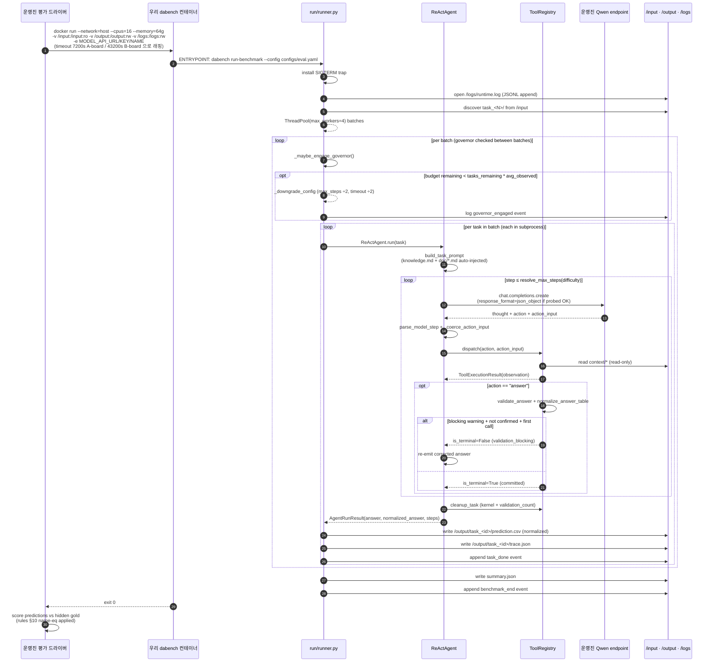
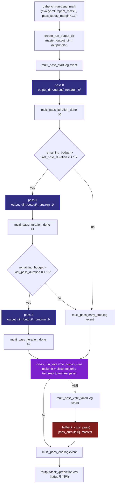
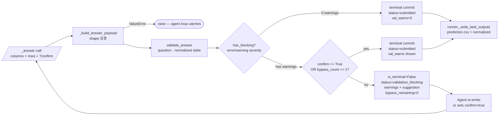
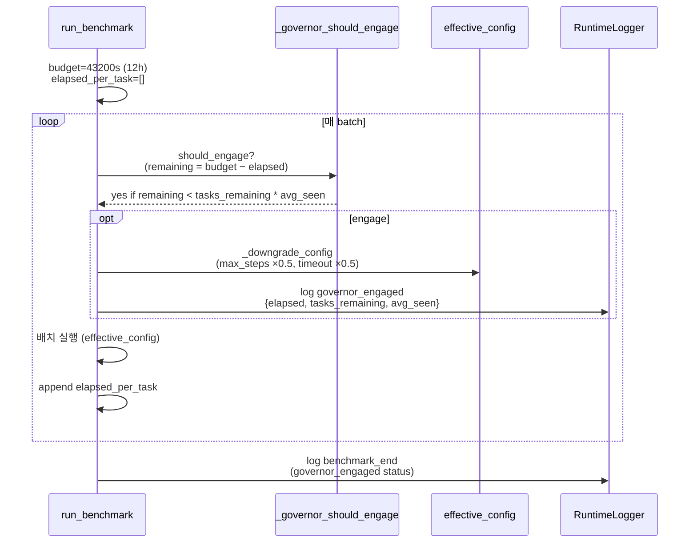
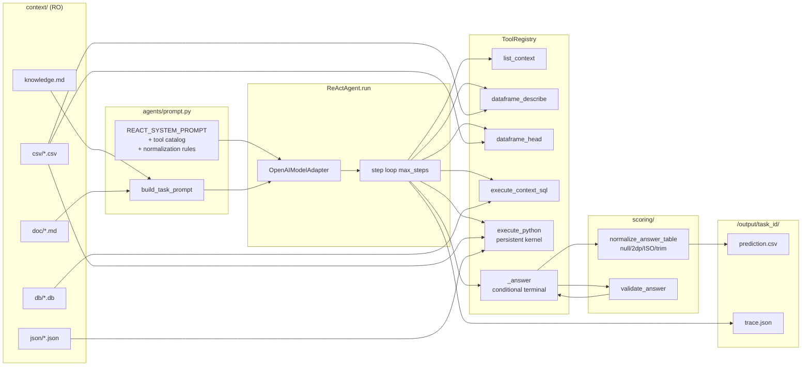
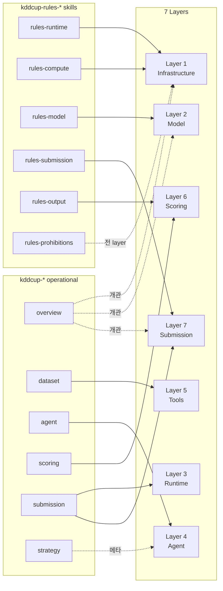
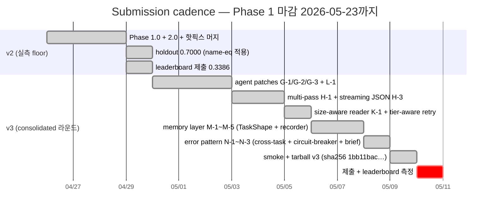
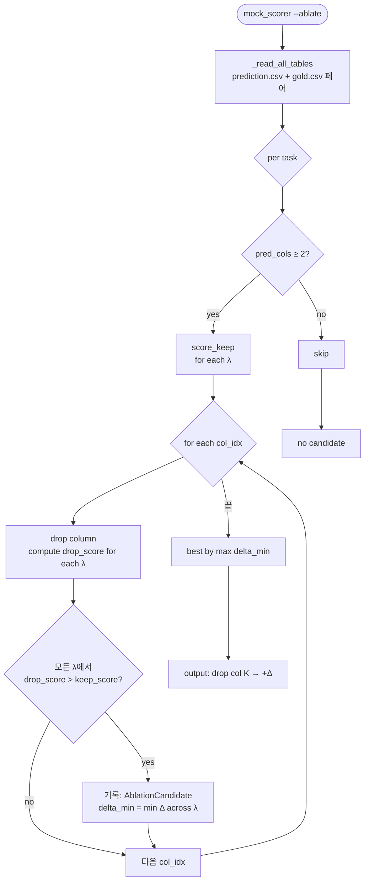

# DataAgent-Bench — System Flow & Agent Diagrams

> 🌐 **Language**: [English](SYSTEM_FLOW.md) · **한국어** · [中文](SYSTEM_FLOW.zh.md)

KDD Cup 2026 DataAgent-Bench 챌린지를 푸는 우리 ReAct 에이전트 하네스의 **전체 시스템 흐름**을 다이어그램으로 정리한 문서. 코드 세부는 `[ARCHITECTURE.ko.md](ARCHITECTURE.ko.md)`, 한 장면 architecture는 `[SYSTEM_ARCHITECTURE.ko.md](SYSTEM_ARCHITECTURE.ko.md)`, 실측 데이터·점수는 `[DATA_ANALYSIS.ko.md](DATA_ANALYSIS.ko.md)`, 제출 이력은 `[SUBMISSION_LOG.ko.md](SUBMISSION_LOG.ko.md)`, 운영 매뉴얼은 `[../CLAUDE.ko.md](../CLAUDE.ko.md)`.

> 마지막 갱신: 2026-05-11 (v3 라운드 — agent G/H/K/L + memory M + error N 패치 통합). 신규 변경 시 §10의 mermaid 블록부터 갱신.

---

## 1. 문서 지도


| 질문                        | 참조 문서                                                                    |
| ------------------------- | ------------------------------------------------------------------------ |
| "지금 코드 어떤 함수가 어디 있나"      | `docs/ARCHITECTURE.md`                                                   |
| "공개 50 task 통계 + 실패 모드"   | `docs/DATA_ANALYSIS.md`                                                  |
| "제출 이력 + budget + 점수 추이"  | `docs/SUBMISSION_LOG.md`                                                 |
| "vLLM endpoint 점검 결과"     | `docs/qwen_endpoint_capabilities.md`                                     |
| **"전체 시스템 한 장면 + 모든 흐름"** | **이 문서 (SYSTEM_FLOW.md)**                                                |
| "v3 라운드 단계별 설계"         | `~/.claude/plans/library-cloudstorage-onedrive-001-docum-zippy-peach.md` |
| "전체 우승 전략"                | `~/.claude/plans/fuzzy-yawning-porcupine.md`                             |
| 룰 컴플라이언스 (verbatim)       | skills `kddcup-rules-`*                                                  |
| 운영 코드 vocabulary          | skills `kddcup-overview/dataset/agent/scoring/submission/strategy`       |


---

## 2. 7-Layer 시스템 아키텍처

```mermaid
flowchart TB
    classDef infra fill:#1f2937,color:#f3f4f6,stroke:#374151
    classDef model fill:#312e81,color:#f3f4f6,stroke:#4338ca
    classDef runtime fill:#0f766e,color:#f3f4f6,stroke:#0d9488
    classDef agent fill:#7c2d12,color:#f3f4f6,stroke:#9a3412
    classDef tools fill:#7e22ce,color:#f3f4f6,stroke:#9333ea
    classDef scoring fill:#a16207,color:#f3f4f6,stroke:#ca8a04
    classDef submit fill:#9f1239,color:#f3f4f6,stroke:#be123c

    L1["<b>Layer 1 — Infrastructure</b><br/>Docker (python:3.10-slim)<br/>/input RO · /output RW · /logs RW<br/>16 vCPU · 64 GB · 12h<br/>network: MODEL_API_URL only"]:::infra
    L2["<b>Layer 2 — Model</b><br/>OpenAIModelAdapter<br/>JSON-mode probe + transient retry (G-1)<br/>qwen3.5-35b-a3b (eval)<br/>env-injected URL/KEY/NAME"]:::model
    L3["<b>Layer 3 — Runtime</b><br/>per-task subprocess<br/>ThreadPool batches<br/>Cascading wall-clock governor (12h)<br/>SIGTERM trap · RuntimeLogger<br/><b>+ run_benchmark_with_passes (H-1)</b>"]:::runtime
    L4["<b>Layer 4 — Agent</b><br/>ReAct loop · JSON contract<br/>parse-retry · action_input coercion<br/>plan-then-execute<br/>difficulty-aware max_steps<br/><b>+ SelfConsistencyAgent k=3 (G-2)</b>"]:::agent
    L5["<b>Layer 5 — Tools</b><br/>filesystem · sqlite · python_kernel<br/>dataframe_describe/head<br/>knowledge.md (5000자, keyword reorder)<br/>+ doc/*.md auto-inject<br/>_answer (conditional terminal)"]:::tools
    L6["<b>Layer 6 — Scoring</b><br/>normalize.py (null/2dp/ISO/trim)<br/>column-signature multiset<br/>name-equivalence (rules §10)<br/>mock_scorer + holdout split<br/><b>+ cross_run_vote (H-1 voter)</b>"]:::scoring
    L7["<b>Layer 7 — Submission</b><br/>build_submission.sh<br/>team1438:v<N> / .tar.gz ≤ 10 GB<br/>local_eval.sh container reproduction<br/>Drive + email + SUBMISSION_LOG"]:::submit

    L7 --> L6 --> L5 --> L4 --> L3 --> L2 --> L1
```




각 레이어는 위 레이어를 모르고 아래 레이어만 의존한다. 변경 시 인접 레이어만 lockstep으로 갱신.

---

## 3. 운영진 평가 시점 — End-to-End 흐름




---

## 3b. Multi-pass Orchestration (H-1)

`run_benchmark_with_passes` (`run/runner.py`)는 운영진 평가 시점의 **outer loop** — 같은 task set을 N번 풀고 voter가 task별 majority answer를 선택해서 channel 1개의 prediction tree로 합친다.




**회귀 안전성 보장**:

- 첫 pass는 **항상** 완료 (그 결과가 fallback) → 어떤 hidden set에서도 single-pass 결과 이상 보장
- voter 예외 시 `_fallback_copy_pass`로 graceful degrade — judge가 보는 `/output/task_<id>/prediction.csv`는 절대 비지 않음
- Pass 도중 governor 발동: 다음 pass 안 시작 (단일 pass voted output)

---

## 4. ReAct 에이전트 step 루프 (단일 task 내부)

```mermaid
flowchart TD
    start([Task 시작]) --> build_prompt[build_system_prompt + build_task_prompt<br/>knowledge.md + doc/*.md 자동 인젝션]
    build_prompt --> resolve_max[resolve_max_steps task.difficulty<br/>easy=8 / medium=12 / hard=20 / extreme=28]
    resolve_max --> step_loop{step ≤ max_steps?}
    step_loop -- no --> max_fail([failure: max_steps 초과])

    step_loop -- yes --> complete[_complete_and_parse]
    complete --> llm_call[model.complete<br/>response_format if probed OK]
    llm_call --> parse_try{parse_model_step OK?}
    parse_try -- raise --> retry{retry < 2?}
    retry -- yes --> add_correction[append corrective<br/>PARSE_RETRY_REMINDER]
    add_correction --> llm_call
    retry -- no --> error_step[StepRecord: __error__<br/>parse_attempts=3]
    error_step --> step_loop

    parse_try -- ok --> coerce[_coerce_action_input<br/>string→{code} or {path}]
    coerce --> dispatch{action 종류?}
    dispatch -- 정상 툴 --> tool_exec[ToolRegistry.execute]
    tool_exec --> step_record[append StepRecord]
    step_record --> step_loop

    dispatch -- answer --> validate[validate_answer<br/>+ normalize_answer_table]
    validate --> blocking{has_blocking AND<br/>not confirm AND<br/>bypass_count == 0?}
    blocking -- yes --> soft_reject[is_terminal=False<br/>warnings as observation<br/>bypass_count += 1]
    soft_reject --> step_loop
    blocking -- no --> commit[is_terminal=True<br/>state.answer/normalized_answer]
    commit --> finally_cleanup

    max_fail --> finally_cleanup[finally: tools.cleanup_task<br/>(kernel + validation_count)]
    finally_cleanup --> done([AgentRunResult])
```


**불변식 (변경 시 lockstep 필요):**

1. 모델 응답은 단일 fenced `json` 블록, keys = {thought, action, action_input}
2. `action_input`은 dict (string은 `_coerce_action_input`이 wrap)
3. `_answer`만 terminal — conditional terminal 도입 후에도 결국 commit 함
4. context 경로는 항상 상대경로 (resolve_context_path가 escape 거부)
5. 모든 finally에서 `cleanup_task` 호출 (persistent kernel + validation counter)

---

## 5. Conditional Terminal — `_answer` 흐름




**Severity 등급:**

- `error` — 빈 답·빈 컬럼 (반드시 수정)
- `warning` — all-null column (수정 권장)
- `info` — 단수 질문 + 다중 행, dup rows, column_count_mismatch (참고만)

`info`만 있는 케이스는 blocking이 아니라 **첫 호출에 commit**한다.

---

## 6. Wall-Clock Governor (Layer 3)




**최저 floor:**

- max_steps ≥ 1 (`_GOVERNOR_MIN_MAX_STEPS`)
- task_timeout ≥ 60 s (`_GOVERNOR_MIN_TIMEOUT_SECONDS`)
- 한 번 engage하면 그대로 유지 (반복 toggle 방지)

**SIGTERM trap (메인 스레드만):**

- handler가 `sigterm_received` 이벤트를 log_file에 기록 + close
- `SystemExit(143)` raise → finally 블록 실행 (kernel cleanup 등) 후 종료
- 30초 안에 SIGKILL 오기 전까지 graceful flush

---

## 7. 점수 측정 — 매칭 3-Phase (Layer 6)

```mermaid
flowchart TD
    pred[/prediction.csv/] --> norm_p[normalize_answer_table]
    gold[/gold.csv/] --> norm_g[normalize_answer_table]
    norm_p --> sigs_p[_column_signatures<br/>frozenset of (val, count)]
    norm_g --> sigs_g[_column_signatures]

    sigs_p --> phase1{Phase 1<br/>direct one-to-one}
    sigs_g --> phase1
    phase1 -- match --> add_m1[matched += 1<br/>used_pred + used_gold]
    phase1 -- some unmatched --> phase2{Phase 2<br/>gold single ⇄ pred pair join<br/>rules §10 name-eq}

    phase2 -- match --> add_m2[matched += 1<br/>used_pred += 2<br/>used_gold + 1]
    phase2 -- some unmatched --> phase3{Phase 3<br/>pred single ⇄ gold pair join<br/>rules §10 name-eq reverse}

    phase3 -- match --> add_m3[matched += 2<br/>used_gold += 2<br/>used_pred + 1]
    phase3 -- done --> compute[compute Score]
    add_m1 --> phase2
    add_m2 --> phase3
    add_m3 --> compute

    compute --> formula[Recall = matched / gold_cols<br/>Extra = pred_cols - len used_pred<br/>Score = max 0, Recall − λ·(Extra/pred_cols)]
    formula --> output([TaskScore])
```


**Phase 2/3 양쪽 순서 시도:** `_pair_signature_matches`는 `(idx_a, idx_b)`와 `(idx_b, idx_a)` 두 순서를 모두 검사. 룰 §10 "FirstName + LastName" → "FirstName LastName"이 어느 컬럼이 first/last인지 명시 안 함.

**ExtraCols 정확도:** `pred_cols - len(used_pred)` (이전 `pred_cols - matched`는 Phase 3에서 over-count).

---

## 8. 단일 task 데이터 플로우 (입력 → 답)




---

## 9. 14 Skills ↔ Layer 매핑

설계할 때 어디 layer를 만지면 어느 skill을 reference로 봐야 하는가:




**룰 컴플라이언스를 검증하려면**: `kddcup-rules-`* 6개를 layer별로 매칭. 자세한 매트릭스는 `~/.claude/plans/library-cloudstorage-onedrive-001-docum-zippy-peach.md` §4.

---

## 10. v2 → v3 Submission Cadence (현재 위치 표시)




**현재 위치 (2026-05-11):** v3 빌드 완료 (`team1438_v3.tar.gz`, sha256 `1bb11bac…`). multi-pass + cross-run vote, 메모리 레이어, 에러 패턴 집계까지 모두 컨테이너에 박혀있고 49-task smoke로 통합 검증 (0.7254 평균, perfect 31). **v3 제출 완료** — 운영진 4~5일 지연 후 leaderboard 측정 대기 중.

---

## 11. Ablation Diagnostic 흐름 (`mock_scorer --ablate`)




**보수적 정책:** 단일 λ가 아니라 `{0.05, 0.10, 0.20}` 모두에서 `drop > keep`이어야 추천. λ 추정 오류에 강건.

**진단 only:** prediction.csv를 자동 수정하지 않음. 정보로만 활용 (예: v2 holdout에서 task_355 — `member_name` drop이 +0.025 추천되어 gold가 split form임을 발견).

---

## 12. 진입점 한 줄 매핑


| 다이어그램 영역             | 진입 함수/파일                                              |
| -------------------- | ----------------------------------------------------- |
| 컨테이너 spec            | `Dockerfile`, `configs/eval.yaml`                     |
| Runtime entry        | `run/runner.py:run_benchmark`                         |
| ReAct entry          | `agents/react.py:ReActAgent.run`                      |
| step 루프              | `agents/react.py:_complete_and_parse`                 |
| Conditional terminal | `tools/registry.py:_make_answer_handler`              |
| Validator            | `scoring/answer_validator.py:validate_answer`         |
| Wall-clock governor  | `run/runner.py:_governor_should_engage`               |
| Scoring (3-phase 매칭) | `scoring/mock_scorer.py:score_one`                    |
| Name-pair signature  | `scoring/mock_scorer.py:_name_pair_signature`         |
| Ablation             | `scoring/column_ablation.py:propose_column_ablation`  |
| Knowledge·Doc 인젝션    | `agents/prompt.py:_load_knowledge_md`, `_load_doc_md` |


---

## 13. 다음 변경 영향 예측


| 변경                           | 영향 받는 layer                              | 갱신 필요 다이어그램              |
| ---------------------------- | ---------------------------------------- | ------------------------ |
| Self-consistency (G-2)       | Layer 4 (agent) + Layer 3 (runtime cost) | §4 ReAct 루프, §6 governor |
| Multi-modal readers (K-1)    | Layer 5 (tools)                          | §8 단일 task 데이터 플로우       |
| Lenient task.json            | Layer 5 (tools) — `benchmark/dataset.py` | §3 end-to-end            |
| Network glitch retry         | Layer 2 (model)                          | §3 end-to-end (LLM call) |
| Answer validator severity 강화 | Layer 5 — validator                      | §5 conditional terminal  |


각 변경 머지 시 **이 문서의 해당 §부터 갱신**한 뒤 ARCHITECTURE.md / SUBMISSION_LOG.md 동기화.