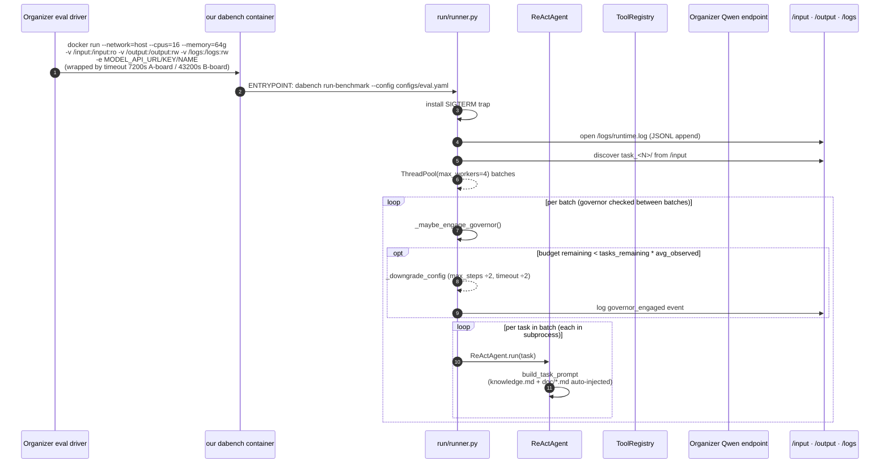
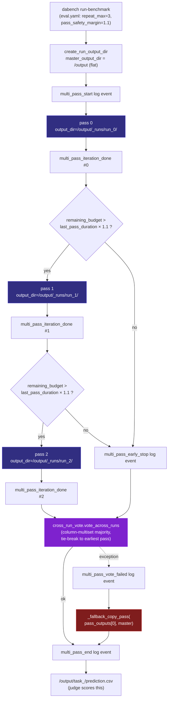
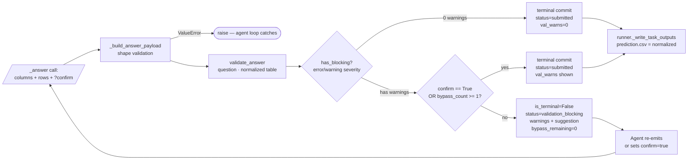
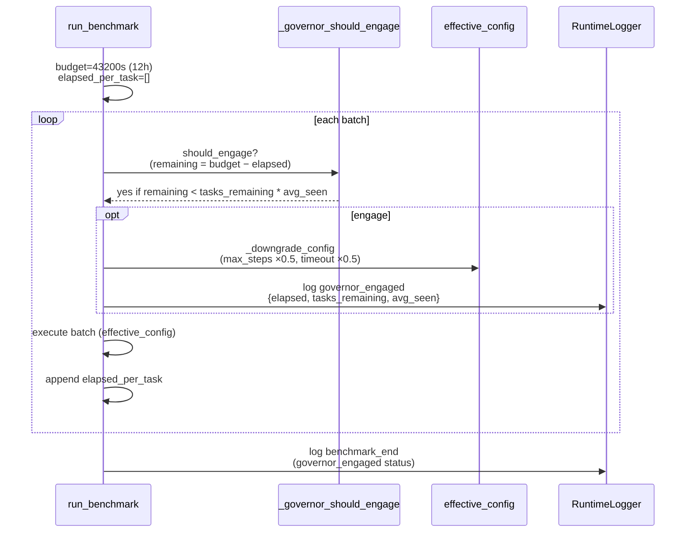
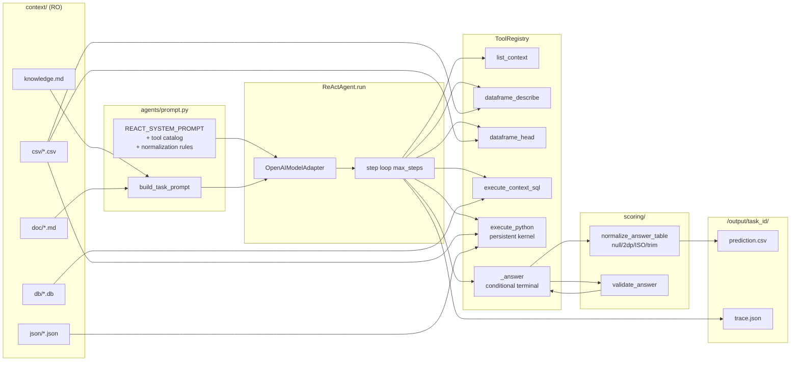
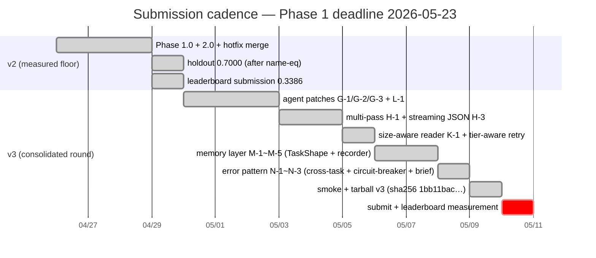
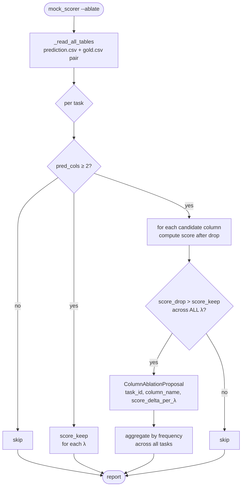

# DataAgent-Bench — System Flow & Agent Diagrams

> 🌐 **Language**: **English** · [한국어](SYSTEM_FLOW.ko.md) · [中文](SYSTEM_FLOW.zh.md)

A diagram-driven document covering the **end-to-end system flow** of our ReAct agent harness for the KDD Cup 2026 DataAgent-Bench challenge. For per-module code see `[ARCHITECTURE.md](ARCHITECTURE.md)`; for a one-screen architecture see `[SYSTEM_ARCHITECTURE.md](SYSTEM_ARCHITECTURE.md)`; for measurements and scores see `[DATA_ANALYSIS.md](DATA_ANALYSIS.md)`; for submission history see `[SUBMISSION_LOG.md](SUBMISSION_LOG.md)`; operating manual at `[../CLAUDE.md](../CLAUDE.md)`.

> Last updated: 2026-05-11 (v3 round — agent G/H/K/L + memory M + error N patches consolidated). When changes land, update §10's mermaid blocks first.

---

## 1. Document map


| Question                                      | Reference doc                                                    |
| --------------------------------------------- | ---------------------------------------------------------------- |
| "Where does which function live in the code?" | `[ARCHITECTURE.md](ARCHITECTURE.md)`                             |
| "Public 50-task statistics + failure modes"   | `[DATA_ANALYSIS.md](DATA_ANALYSIS.md)`                           |
| "Submission history + budget + score trend"   | `[SUBMISSION_LOG.md](SUBMISSION_LOG.md)`                         |
| "vLLM endpoint capabilities"                  | `[qwen_endpoint_capabilities.md](qwen_endpoint_capabilities.md)` |
| **"Whole system in one frame + every flow"**  | **This document (SYSTEM_FLOW.md)**                               |
| Rules compliance (verbatim)                   | skills `kddcup-rules-`*                                          |


---

## 2. 7-Layer system architecture

```mermaid
flowchart TB
    classDef infra fill:#1f2937,color:#f3f4f6,stroke:#374151
    classDef model fill:#312e81,color:#f3f4f6,stroke:#4338ca
    classDef runtime fill:#0f766e,color:#f3f4f6,stroke:#0d9488
    classDef agent fill:#7c2d12,color:#f3f4f6,stroke:#9a3412
    classDef tools fill:#7e22ce,color:#f3f4f6,stroke:#9333ea
    classDef scoring fill:#a16207,color:#f3f4f6,stroke:#ca8a04
    classDef submit fill:#9f1239,color:#f3f4f6,stroke:#be123c

    L1["<b>Layer 1 — Infrastructure</b><br/>Docker (python:3.10-slim)<br/>/input RO · /output RW · /logs RW<br/>16 vCPU · 64 GB · 12h<br/>network: MODEL_API_URL only"]:::infra
    L2["<b>Layer 2 — Model</b><br/>OpenAIModelAdapter<br/>JSON-mode probe + transient retry (G-1)<br/>qwen3.5-35b-a3b (eval)<br/>env-injected URL/KEY/NAME"]:::model
    L3["<b>Layer 3 — Runtime</b><br/>per-task subprocess<br/>ThreadPool batches<br/>Cascading wall-clock governor (12h)<br/>SIGTERM trap · RuntimeLogger<br/><b>+ run_benchmark_with_passes (H-1)</b>"]:::runtime
    L4["<b>Layer 4 — Agent</b><br/>ReAct loop · JSON contract<br/>parse-retry · action_input coercion<br/>plan-then-execute<br/>difficulty-aware max_steps<br/><b>+ SelfConsistencyAgent k=3 (G-2)</b>"]:::agent
    L5["<b>Layer 5 — Tools</b><br/>filesystem · sqlite · python_kernel<br/>dataframe_describe/head<br/>knowledge.md (5000 chars, keyword reorder)<br/>+ doc/*.md auto-inject<br/>_answer (conditional terminal)"]:::tools
    L6["<b>Layer 6 — Scoring</b><br/>normalize.py (null/2dp/ISO/trim)<br/>column-signature multiset<br/>name-equivalence (rules §10)<br/>mock_scorer + holdout split<br/><b>+ cross_run_vote (H-1 voter)</b>"]:::scoring
    L7["<b>Layer 7 — Submission</b><br/>build_submission.sh<br/>team1438:v<N> / .tar.gz ≤ 10 GB<br/>local_eval.sh container reproduction<br/>Drive + email + SUBMISSION_LOG"]:::submit

    L7 --> L6 --> L5 --> L4 --> L3 --> L2 --> L1
```




Each layer is unaware of layers above it and depends only on layers below. Changes only require lock-step updates to adjacent layers.

---

## 3. Organizer eval moment — end-to-end flow




---

## 3b. Multi-pass orchestration (H-1)

`run_benchmark_with_passes` (`run/runner.py`) is the **outer loop** that wraps the eval-time entrypoint — runs the same task set N times then voter selects the per-task majority answer to compose the single prediction tree the judge consumes.




**Regression-safety guarantees**:

- Pass 0 *always* completes (it's the fallback) → guarantees ≥ single-pass results on any hidden set.
- On voter exception, `_fallback_copy_pass` graceful-degrades — the judge's `/output/task_<id>/prediction.csv` is never empty.
- Governor mid-pass: next pass not started → single voted output preserved.

---

## 4. ReAct agent step loop (inside one task)

```mermaid
flowchart TD
    start([Task start]) --> build_prompt[build_system_prompt + build_task_prompt<br/>knowledge.md + doc/*.md auto-injected]
    build_prompt --> resolve_max[resolve_max_steps task.difficulty<br/>easy=8 / medium=12 / hard=24 / extreme=32]
    resolve_max --> step_loop{step ≤ max_steps?}
    step_loop -- no --> max_fail([failure: max_steps exceeded])

    step_loop -- yes --> complete[_complete_and_parse]
    complete --> llm_call[model.complete<br/>response_format if probed OK]
    llm_call --> parse_try{parse_model_step OK?}
    parse_try -- raise --> retry{retry < 2?}
    retry -- yes --> add_correction[append corrective<br/>PARSE_RETRY_REMINDER]
    add_correction --> llm_call
    retry -- no --> error_step[StepRecord: __error__<br/>parse_attempts=3]
    error_step --> step_loop

    parse_try -- ok --> coerce[_coerce_action_input<br/>execute_python str→{code:str}<br/>read_csv str→{path:str}]
    coerce --> tool_exec[ToolRegistry.execute<br/>action, action_input]
    tool_exec --> append[StepRecord append]
    append --> terminal{is_terminal?}
    terminal -- yes --> done([AgentRunResult])
    terminal -- no --> step_loop
```


**Invariants (require lockstep changes):**

1. Model response is a single fenced `json` block, keys = {thought, action, action_input}
2. `action_input` is a dict (strings get wrapped by `_coerce_action_input`)
3. Only `_answer` is terminal — even with conditional terminal, eventually it commits
4. context paths are always relative (`resolve_context_path` rejects escape)
5. Every `finally` calls `cleanup_task` (persistent kernel + validation counter)

---

## 5. Conditional terminal — `_answer` flow




**Severity levels:**

- `error` — empty answer / empty column (must fix)
- `warning` — all-null column (fix recommended)
- `info` — singular question + multiple rows, dup rows, column_count_mismatch (advisory)

`info`-only cases are non-blocking and **commit on the first call**.

---

## 6. Wall-Clock Governor (Layer 3)




**Floor:**

- max_steps ≥ 1 (`_GOVERNOR_MIN_MAX_STEPS`)
- task_timeout ≥ 60s (`_GOVERNOR_MIN_TIMEOUT_SECONDS`)
- **v6 cascading**: up to `_GOVERNOR_MAX_CASCADES = 3` halvings, re-evaluated every `_GOVERNOR_RECHECK_TASK_INTERVAL = 5` tasks. Each cascade applies on top of the previous (so timeout=900s → 450 → 225 → 112 with the floor clamping at 60).

**SIGTERM trap (main thread only):**

- Handler logs `sigterm_received` event + closes log_file
- Raises `SystemExit(143)` → `finally` blocks run (kernel cleanup etc.) before exit
- Graceful flush within the 30s window before SIGKILL

---

## 7. Scoring — 3-phase matching (Layer 6)

```mermaid
flowchart TD
    pred[/prediction.csv/] --> norm_p[normalize_answer_table]
    gold[/gold.csv/] --> norm_g[normalize_answer_table]
    norm_p --> sigs_p[_column_signatures<br/>frozenset of (val, count)]
    norm_g --> sigs_g[_column_signatures]

    sigs_p --> phase1{Phase 1<br/>direct one-to-one}
    sigs_g --> phase1
    phase1 -- match --> add_m1[matched += 1<br/>used_pred + used_gold]
    phase1 -- some unmatched --> phase2{Phase 2<br/>gold single ⇄ pred pair join<br/>rules §10 name-eq}

    phase2 -- match --> add_m2[matched += 1<br/>used_pred += 2<br/>used_gold + 1]
    phase2 -- some unmatched --> phase3{Phase 3<br/>pred single ⇄ gold pair join<br/>rules §10 name-eq reverse}

    phase3 -- match --> add_m3[matched += 2<br/>used_gold += 2<br/>used_pred + 1]
    phase3 -- done --> compute[compute Score]
    add_m1 --> phase2
    add_m2 --> phase3
    add_m3 --> compute

    compute --> formula[Recall = matched / gold_cols<br/>Extra = pred_cols − len used_pred<br/>Score = max 0, Recall − λ·Extra/pred_cols]
    formula --> output([TaskScore])
```


**Two-direction Phase 2/3:** `_pair_signature_matches` checks both `(idx_a, idx_b)` and `(idx_b, idx_a)` orderings — rules §10 ("FirstName + LastName" → "FirstName LastName") doesn't fix which column is first/last.

**ExtraCols accuracy:** `pred_cols - len(used_pred)` (the older `pred_cols - matched` over-counted in Phase 3).

---

## 8. Single-task data flow (input → answer)




---

## 9. Skills ↔ Layer mapping

Which skill to consult when touching a layer:


| Layer                    | Primary skills                                             |
| ------------------------ | ---------------------------------------------------------- |
| Layer 1 — Infrastructure | rules-runtime, rules-compute                               |
| Layer 2 — Model          | rules-model                                                |
| Layer 3 — Runtime        | rules-compute                                              |
| Layer 4 — Agent          | overview, agent, strategy                                  |
| Layer 5 — Tools          | overview, agent, dataset                                   |
| Layer 6 — Scoring        | scoring, rules-output                                      |
| Layer 7 — Submission     | submission, rules-submission, rules-prohibitions, strategy |


---

## 10. v2 → v3 submission cadence (current location marked)




**Current (2026-05-11):** v3 build complete (`team1438_v3.tar.gz`, sha256 `1bb11bac…`). Multi-pass + cross-run vote, memory layer, and error pattern aggregation are all baked in and validated by 49-task smoke (0.7254 mean, 31 perfect). v3 has been submitted; leaderboard measurement is pending the 4-5 day organizer delay.

---

## 11. Ablation diagnostic flow (`mock_scorer --ablate`)




**Use case:** finding columns that systematically hurt the score across λ values. Rare on the public set (most predictions have ≤ 5 columns).

---

## 12. Entry-point one-line mapping


| Question                             | Answer                                                                                                  |
| ------------------------------------ | ------------------------------------------------------------------------------------------------------- |
| How is a single task run?            | `cli.py:run_task_command` → `runner.run_single_task` → `ReActAgent.run`                                 |
| How is a benchmark run?              | `cli.py:run_benchmark_command` → `runner.run_benchmark_with_passes` → `runner.run_benchmark` (per pass) |
| How are predictions scored?          | `mock_scorer.py:score_run` → `score_one` → 3-phase matching                                             |
| How is multi-pass voting computed?   | `runner.run_benchmark_with_passes` → `cross_run_vote.vote_across_runs`                                  |
| How is a Docker submission built?    | `scripts/build_submission.sh` → `Dockerfile` (`linux/amd64`) → `gzip` → sha256                          |
| Eval container ENTRYPOINT?           | `Dockerfile`: `uv run dabench run-benchmark --config configs/eval.yaml`                                 |
| `multi_pass_`* events written where? | `runner.run_benchmark_with_passes` → `RuntimeLogger.log_event` → `/logs/runtime.log`                    |


---

## 13. Predicting downstream impact for the next change

When changing some layer X, here's what is likely affected:


| Layer changed                                        | Direct impact                         | Lockstep update                      | Test                                    |
| ---------------------------------------------------- | ------------------------------------- | ------------------------------------ | --------------------------------------- |
| Layer 1 (Dockerfile / eval.yaml)                     | image build, eval container behaviour | scripts/build_submission.sh, configs | rebuild + smoke `local_eval.sh`         |
| Layer 2 (model.py)                                   | LLM call shape, JSON-mode             | agents/prompt.py contract            | `tests/agents/test_model_retry.py`      |
| Layer 3 (runner.py)                                  | parallelism, governor, multi-pass     | configs/eval.yaml                    | `tests/run/test_runner_*.py`            |
| Layer 4 (react.py / prompt.py / self_consistency.py) | step loop, JSON contract, voting      | tools/registry.py descriptions       | `tests/agents/test_*`                   |
| Layer 5 (tools/)                                     | observation shape, terminal logic     | agents/prompt.py tool catalog        | `tests/tools/test_*`                    |
| Layer 6 (scoring/)                                   | normalization, scorer logic, voter    | _answer handler, summarize-traces    | `tests/scoring/test_*`                  |
| Layer 7 (build / submission)                         | image manifest, naming                | docs/SUBMISSION_LOG.md               | `bash scripts/build_submission.sh v<N>` |


The Korean / Chinese full historical narrative versions of this document are linked at the top.