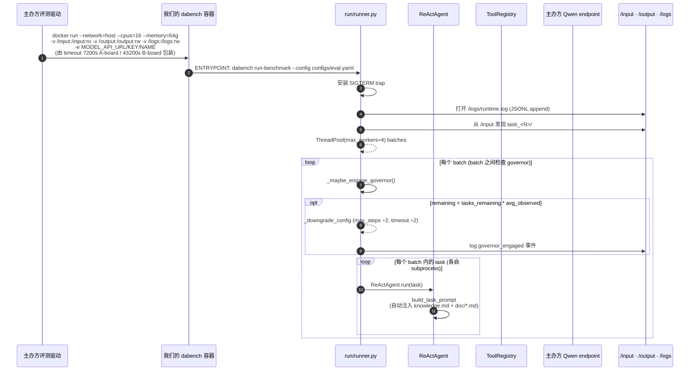
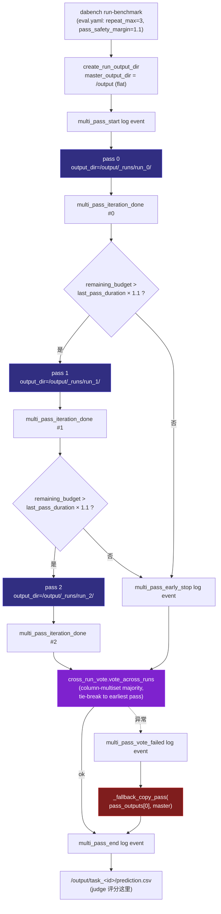
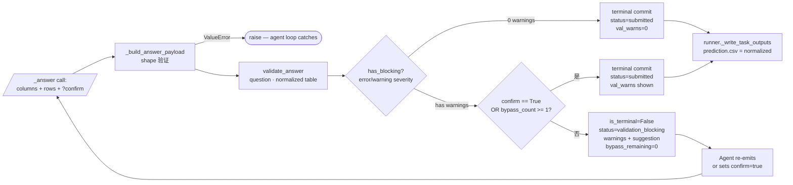
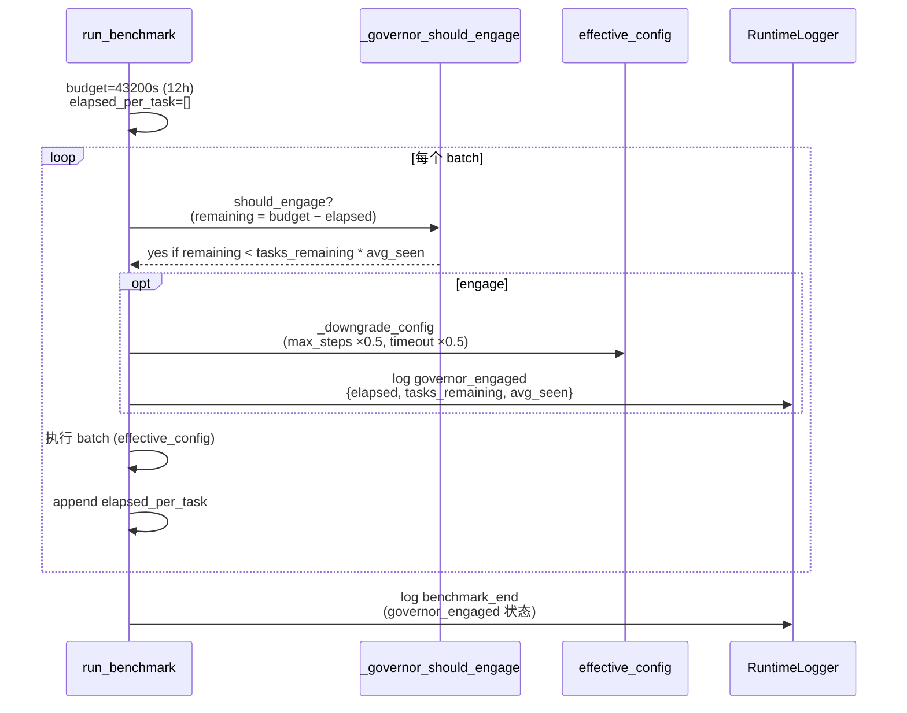
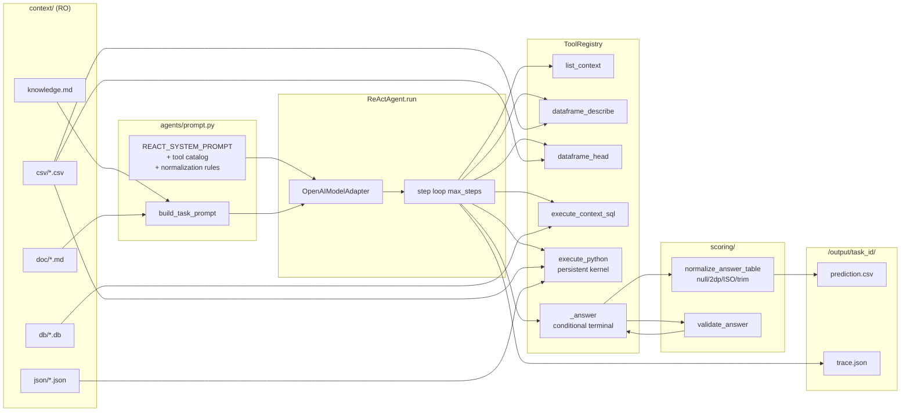
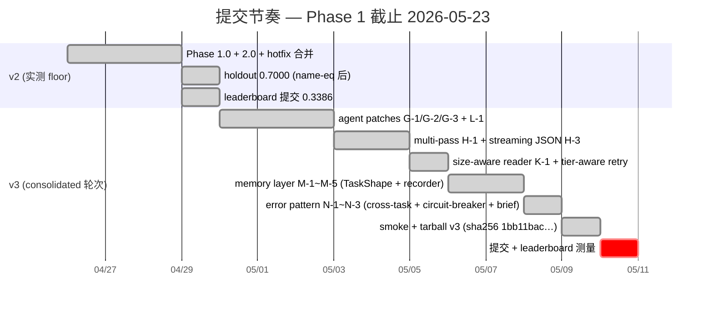
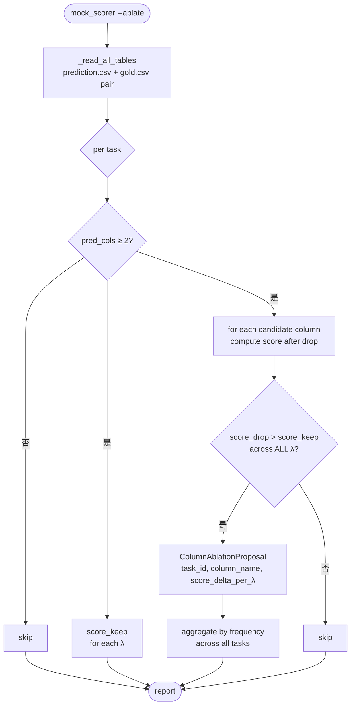

# DataAgent-Bench — 系统流程 & 智能体图

> 🌐 **Language**: [English](SYSTEM_FLOW.md) · [한국어](SYSTEM_FLOW.ko.md) · **中文**

以图为主的文档,涵盖 KDD Cup 2026 DataAgent-Bench 挑战 ReAct 智能体框架的 **端到端系统流程**。模块代码见 [`ARCHITECTURE.zh.md`](ARCHITECTURE.zh.md);一图概览见 [`SYSTEM_ARCHITECTURE.zh.md`](SYSTEM_ARCHITECTURE.zh.md);测量与分数见 [`DATA_ANALYSIS.zh.md`](DATA_ANALYSIS.zh.md);提交历史见 [`SUBMISSION_LOG.zh.md`](SUBMISSION_LOG.zh.md);运维手册 [`../CLAUDE.zh.md`](../CLAUDE.zh.md)。

> 最近更新: 2026-05-11 (v3 轮次 — agent G/H/K/L + memory M + error N 修补集成)。变更落地时先更新 §10 的 mermaid 块。

---

## 1. 文档地图

| 问题 | 参考文档 |
|---|---|
| "代码里哪个函数在哪里?" | [`ARCHITECTURE.zh.md`](ARCHITECTURE.zh.md) |
| "公开 50 任务统计 + 失败模式" | [`DATA_ANALYSIS.zh.md`](DATA_ANALYSIS.zh.md) |
| "提交历史 + 预算 + 分数趋势" | [`SUBMISSION_LOG.zh.md`](SUBMISSION_LOG.zh.md) |
| "vLLM endpoint 能力" | [`qwen_endpoint_capabilities.zh.md`](qwen_endpoint_capabilities.zh.md) |
| **"整个系统一图 + 所有流"** | **本文档 (SYSTEM_FLOW.zh.md)** |
| 规则合规 (verbatim) | skills `kddcup-rules-*` |

---

## 2. 7-Layer 系统架构

```mermaid
flowchart TB
    classDef infra fill:#1f2937,color:#f3f4f6,stroke:#374151
    classDef model fill:#312e81,color:#f3f4f6,stroke:#4338ca
    classDef runtime fill:#0f766e,color:#f3f4f6,stroke:#0d9488
    classDef agent fill:#7c2d12,color:#f3f4f6,stroke:#9a3412
    classDef tools fill:#7e22ce,color:#f3f4f6,stroke:#9333ea
    classDef scoring fill:#a16207,color:#f3f4f6,stroke:#ca8a04
    classDef submit fill:#9f1239,color:#f3f4f6,stroke:#be123c

    L1["<b>Layer 1 — Infrastructure</b><br/>Docker (python:3.10-slim)<br/>/input RO · /output RW · /logs RW<br/>16 vCPU · 64 GB · 12h<br/>network: MODEL_API_URL only"]:::infra
    L2["<b>Layer 2 — Model</b><br/>OpenAIModelAdapter<br/>JSON-mode probe + transient retry (G-1)<br/>qwen3.5-35b-a3b (eval)<br/>env-injected URL/KEY/NAME"]:::model
    L3["<b>Layer 3 — Runtime</b><br/>per-task subprocess<br/>ThreadPool batches<br/>Cascading wall-clock governor (12h)<br/>SIGTERM trap · RuntimeLogger<br/><b>+ run_benchmark_with_passes (H-1)</b>"]:::runtime
    L4["<b>Layer 4 — Agent</b><br/>ReAct loop · JSON contract<br/>parse-retry · action_input coercion<br/>plan-then-execute<br/>difficulty-aware max_steps<br/><b>+ SelfConsistencyAgent k=3 (G-2)</b>"]:::agent
    L5["<b>Layer 5 — Tools</b><br/>filesystem · sqlite · python_kernel<br/>dataframe_describe/head<br/>knowledge.md (5000 字符, keyword reorder)<br/>+ doc/*.md auto-inject<br/>_answer (conditional terminal)"]:::tools
    L6["<b>Layer 6 — Scoring</b><br/>normalize.py (null/2dp/ISO/trim)<br/>column-signature multiset<br/>name-equivalence (rules §10)<br/>mock_scorer + holdout split<br/><b>+ cross_run_vote (H-1 voter)</b>"]:::scoring
    L7["<b>Layer 7 — Submission</b><br/>build_submission.sh<br/>team1438:v&lt;N&gt; / .tar.gz ≤ 10 GB<br/>local_eval.sh container reproduction<br/>Drive + email + SUBMISSION_LOG"]:::submit

    L7 --> L6 --> L5 --> L4 --> L3 --> L2 --> L1
```



每层不知上层、只依赖下层。变更只需相邻层 lock-step 更新。

---

## 3. 主办方评测时点 — 端到端流



---

## 3b. Multi-pass 编排 (H-1)

`run_benchmark_with_passes` (`run/runner.py`) 是 **外层循环**,包装评测时入口 — 把同一 task set 跑 N 次,然后 voter 选每个 task 的多数答案,合成 judge 看到的单一 prediction tree。



**回归安全保证**:
- Pass 0 *始终* 完成 (作为 fallback) → 任何 hidden set 上结果都 ≥ single-pass。
- voter 异常时 `_fallback_copy_pass` 优雅降级 — judge 看到的 `/output/task_<id>/prediction.csv` 不会为空。
- 中途 governor: 不开始下一 pass → 单一 voted output 保留。

---

## 4. ReAct 智能体 step 循环 (单一 task 内)

```mermaid
flowchart TD
    start([Task 开始]) --> build_prompt[build_system_prompt + build_task_prompt<br/>自动注入 knowledge.md + doc/*.md]
    build_prompt --> resolve_max[resolve_max_steps task.difficulty<br/>easy=8 / medium=12 / hard=24 / extreme=32]
    resolve_max --> step_loop{step ≤ max_steps?}
    step_loop -- 否 --> max_fail([failure: 超过 max_steps])

    step_loop -- 是 --> complete[_complete_and_parse]
    complete --> llm_call[model.complete<br/>response_format if probed OK]
    llm_call --> parse_try{parse_model_step OK?}
    parse_try -- raise --> retry{retry &lt; 2?}
    retry -- 是 --> add_correction[append corrective<br/>PARSE_RETRY_REMINDER]
    add_correction --> llm_call
    retry -- 否 --> error_step[StepRecord: __error__<br/>parse_attempts=3]
    error_step --> step_loop

    parse_try -- ok --> coerce[_coerce_action_input<br/>execute_python str→{code:str}<br/>read_csv str→{path:str}]
    coerce --> tool_exec[ToolRegistry.execute<br/>action, action_input]
    tool_exec --> append[StepRecord append]
    append --> terminal{is_terminal?}
    terminal -- 是 --> done([AgentRunResult])
    terminal -- 否 --> step_loop
```

**不变量 (变更需 lockstep):**
1. 模型响应是单一 fenced ```json``` 块, keys = {thought, action, action_input}
2. `action_input` 是 dict (string 由 `_coerce_action_input` wrap)
3. 仅 `_answer` 是 terminal — 即使 conditional terminal,最终也会 commit
4. context 路径始终是相对路径 (`resolve_context_path` 拒绝 escape)
5. 每个 `finally` 调 `cleanup_task` (persistent kernel + validation counter)

---

## 5. Conditional Terminal — `_answer` 流



**Severity 级别:**
- `error` — 空答案 / 空列 (必须修)
- `warning` — all-null 列 (建议修)
- `info` — 单数问题 + 多行, dup rows, column_count_mismatch (仅供参考)

仅 `info` 的情况非阻塞 — **第一次调用即 commit**。

---

## 6. Wall-Clock Governor (Layer 3)



**底线:**
- max_steps ≥ 1 (`_GOVERNOR_MIN_MAX_STEPS`)
- task_timeout ≥ 60s (`_GOVERNOR_MIN_TIMEOUT_SECONDS`)
- 一旦 engage 就保持 (不来回切换)

**SIGTERM trap (仅主线程):**
- Handler 把 `sigterm_received` 事件写入 log_file + 关闭
- 抛 `SystemExit(143)` → `finally` 块运行 (kernel cleanup 等) 后退出
- 30 秒 SIGKILL 来临前 graceful flush

---

## 7. 打分 — 3-phase matching (Layer 6)

```mermaid
flowchart TD
    pred[/prediction.csv/] --> norm_p[normalize_answer_table]
    gold[/gold.csv/] --> norm_g[normalize_answer_table]
    norm_p --> sigs_p[_column_signatures<br/>frozenset of (val, count)]
    norm_g --> sigs_g[_column_signatures]

    sigs_p --> phase1{Phase 1<br/>direct one-to-one}
    sigs_g --> phase1
    phase1 -- match --> add_m1[matched += 1<br/>used_pred + used_gold]
    phase1 -- some unmatched --> phase2{Phase 2<br/>gold single ⇄ pred pair join<br/>rules §10 name-eq}

    phase2 -- match --> add_m2[matched += 1<br/>used_pred += 2<br/>used_gold + 1]
    phase2 -- some unmatched --> phase3{Phase 3<br/>pred single ⇄ gold pair join<br/>rules §10 name-eq reverse}

    phase3 -- match --> add_m3[matched += 2<br/>used_gold += 2<br/>used_pred + 1]
    phase3 -- done --> compute[compute Score]
    add_m1 --> phase2
    add_m2 --> phase3
    add_m3 --> compute

    compute --> formula[Recall = matched / gold_cols<br/>Extra = pred_cols − len used_pred<br/>Score = max 0, Recall − λ·Extra/pred_cols]
    formula --> output([TaskScore])
```

**双向 Phase 2/3:** `_pair_signature_matches` 检查 `(idx_a, idx_b)` 和 `(idx_b, idx_a)` 两个顺序 — rules §10 ("FirstName + LastName" → "FirstName LastName") 不固定哪一列是 first/last。

**ExtraCols 准确性:** `pred_cols - len(used_pred)` (旧式 `pred_cols - matched` 在 Phase 3 over-count)。

---

## 8. 单一 task 数据流 (输入 → 答案)



---

## 9. Skills ↔ Layer 映射

修改某层时该参考哪些 skill:

| Layer | 主要 skills |
|---|---|
| Layer 1 — Infrastructure | rules-runtime, rules-compute |
| Layer 2 — Model | rules-model |
| Layer 3 — Runtime | rules-compute |
| Layer 4 — Agent | overview, agent, strategy |
| Layer 5 — Tools | overview, agent, dataset |
| Layer 6 — Scoring | scoring, rules-output |
| Layer 7 — Submission | submission, rules-submission, rules-prohibitions, strategy |

---

## 10. v2 → v3 提交节奏 (当前位置)



**当前 (2026-05-11):** v3 构建完成 (`team1438_v3.tar.gz`, sha256 `1bb11bac…`)。Multi-pass + cross-run vote、记忆层与错误模式聚合全部嵌入容器,通过 49-task smoke 验证 (均值 0.7254, perfect 31)。**v3 已提交** — 等候主办方 4-5 天延迟后的 leaderboard 测量。

---

## 11. Ablation 诊断流 (`mock_scorer --ablate`)



**用例:** 找出在所有 λ 上系统性损害分数的列。在公开集少见 (大多数预测列 ≤ 5)。

---

## 12. 入口点单行映射

| 问题 | 答案 |
|---|---|
| 单一 task 怎么跑? | `cli.py:run_task_command` → `runner.run_single_task` → `ReActAgent.run` |
| benchmark 怎么跑? | `cli.py:run_benchmark_command` → `runner.run_benchmark_with_passes` → `runner.run_benchmark` (per pass) |
| 预测怎么打分? | `mock_scorer.py:score_run` → `score_one` → 3-phase matching |
| Multi-pass voting 怎么算? | `runner.run_benchmark_with_passes` → `cross_run_vote.vote_across_runs` |
| Docker submission 怎么构建? | `scripts/build_submission.sh` → `Dockerfile` (`linux/amd64`) → `gzip` → sha256 |
| 评测容器 ENTRYPOINT? | `Dockerfile`: `uv run dabench run-benchmark --config configs/eval.yaml` |
| `multi_pass_*` 事件写在哪? | `runner.run_benchmark_with_passes` → `RuntimeLogger.log_event` → `/logs/runtime.log` |

---

## 13. 预测下次变更的下游影响

修改某层 X 时,可能受影响的位置:

| 修改的层 | 直接影响 | Lockstep 更新 | 测试 |
|---|---|---|---|
| Layer 1 (Dockerfile / eval.yaml) | image build, 评测容器行为 | scripts/build_submission.sh, configs | rebuild + smoke `local_eval.sh` |
| Layer 2 (model.py) | LLM 调用形态, JSON-mode | agents/prompt.py contract | `tests/agents/test_model_retry.py` |
| Layer 3 (runner.py) | 并行, governor, multi-pass | configs/eval.yaml | `tests/run/test_runner_*.py` |
| Layer 4 (react.py / prompt.py / self_consistency.py) | step 循环, JSON contract, voting | tools/registry.py 描述 | `tests/agents/test_*` |
| Layer 5 (tools/) | observation 形态, terminal 逻辑 | agents/prompt.py 工具目录 | `tests/tools/test_*` |
| Layer 6 (scoring/) | 归一化, scorer 逻辑, voter | _answer handler, summarize-traces | `tests/scoring/test_*` |
| Layer 7 (build / submission) | 镜像 manifest, 命名 | docs/SUBMISSION_LOG.md | `bash scripts/build_submission.sh v<N>` |

韩文 / 英文完整历史叙述见本文档顶部链接。
